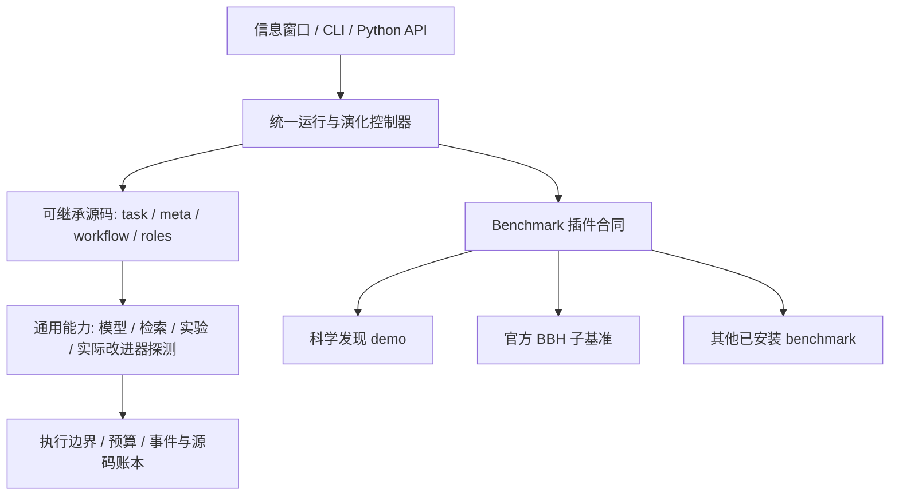

# Nexgent

**可运行 benchmark、演化智能体源码与改进程序的通用 RSI 框架。**

Nexgent 的目标是框架本身。科学发现是独立 demo；它的方程、工具、提示和评分不进入核心。第二个独立插件接入官方 BIG-Bench Hard 的两个任务，用于验证同一运行器、控制器和账本能运行不同领域。

用户选择任务基准、提出目标并设定预算，在信息窗口观察证据、实验、版本谱系与改进器效能。智能体运行自己的 `improve`，改写任务程序、改进程序和多智能体编排；后代从独立进程加载继承的代码。

## 架构边界



| 核心负责 | 插件负责 |
| --- | --- |
| 源码身份、继承、实际 solve/improve/select_parent 执行 | 公开问题、提交合同、合理的初始任务程序 |
| 模型与研究能力、多智能体请求及依赖证据 | 领域工具、公开领域指导与文献 |
| 预算、停止恢复、冻结实现、程序版本 | 数据、划分、独立评分和资源单位 |
| 实际改进器探测、独立后代评测、跨 benchmark 改进器迁移 | 插件源码、依赖与数据版本摘要 |

核心包不导入参考插件，不依赖 NumPy 或 SciPy。插件独立安装，通过 `nexgent.benchmarks` entry point 注册。没有插件时窗口仍可启动，并显示接入提示。

## 安装与信息窗口

Python 3.11+；本机使用独立 Python 3.12 环境。Windows 使用本项目解释器，避免其他项目的 Qt/Conda 动态库混用。

```powershell
python -m venv .venv
.venv\Scripts\python.exe -m pip install -e '.[dev]'

# 选择安装所需 demo / benchmark
.venv\Scripts\python.exe -m pip install -e benchmarks/scientific_discovery
.venv\Scripts\python.exe -m pip install -e benchmarks/bbh
.venv\Scripts\nexgent-bbh-download.exe --destination .nexgent/benchmarks/bbh

.\start.ps1
```

本机环境、两项插件和 BBH 数据已准备。模型读取被 Git 忽略的 `models.json` / `.env`；示例见 [models.example.json](models.example.json) 和 [.env.example](.env.example)。凭证留在模型请求宿主，不进入智能体源码进程。

窗口包含进度、资料、实验、源码谱系、改进器效能和结论。开发探测、独立评测、固定程序成绩及未执行结果分别显示。查看或导出不会启动新的研究。

## 统一 benchmark 与 RSI 接口

```powershell
.venv\Scripts\python.exe -m nexgent benchmarks

# 固定程序跑 benchmark；省略 --program 时使用插件的强基线，不执行 improve
.venv\Scripts\python.exe -m nexgent evaluate --benchmark bbh --seeds 101 202
.venv\Scripts\python.exe -m nexgent evaluate --benchmark scientific_discovery --seeds 101

# 通用研究程序在指定 benchmark 上演化
.venv\Scripts\python.exe -m nexgent research '改善实际后代效用与研究组织' --benchmark scientific_discovery --generations 2 --seed 43
.venv\Scripts\python.exe -m nexgent research '检验程序改进与成本' --benchmark bbh --generations 2 --seed 43

# 冻结两版实际改进器，从相同任务起点生成后代
.venv\Scripts\python.exe -m nexgent meta-evaluate STUDY_ID --seeds 401 502 --k 1

# 将两版改进器迁到另一 benchmark 的共同任务起点
.venv\Scripts\python.exe -m nexgent meta-evaluate STUDY_ID --benchmark bbh --seeds 401 --k 1

.venv\Scripts\python.exe -m nexgent list
.venv\Scripts\python.exe -m nexgent show STUDY_ID
.venv\Scripts\python.exe -m nexgent resume STUDY_ID
.venv\Scripts\python.exe -m nexgent export STUDY_ID
```

`full` 允许全部源码演化并探索档案；`task_only` 冻结非任务文件；`greedy` 仍允许全部文件变化，但只扩展当前部署程序。没有不同可执行改进器时，不付费比较同一程序的两次随机抽样。

## 可执行的自改进循环

源码包包含 `task.py`、`meta.py` 和可选 `workflow.py`、`roles.json`。算法、函数、控制流、角色分工及父代选择均可修改，不从固定策略表选参数；模型权重保持固定。

初始通用研究程序读取领域合同、自身源码、实际开发结果和有来源的失败。遇到停滞时，可以提出改进程序变更，通过 `broker.probe_improver` 从共同任务起点实际运行参考/候选 `improve`、生成并评价后代，再使用开发证据继续研究。每次外层执行最多一次探测，内层不能再次探测，所有请求与实验计入同一账本。

探测后再修改的改进程序不能继承旧测量的效力。源码自述与宿主核实的证据状态分开。部署冠军和探索版本分别保存，未晋升的改进程序仍可被后代实际执行。

独立评测冻结两版改进器，保持共同任务起点与预算；开发选择后才打开迁移数据。跨 benchmark 迁移替换任务基线和领域合同，保留被测改进器源码。这检验具体程序、任务分布和预算下的能力，不自动证明通用或持续加速的 RSI。

## 接入新 benchmark

插件实现 [Benchmark 合同](src/nexgent/benchmarks/__init__.py)：`spec` 声明领域、任务合同、工具 API、工具类入口与成本单位；`initial_files()` 提供任务基线；`research_context()` 只提供公开领域信息；`snapshot()` 冻结源码/依赖/数据版本；`evaluate(...)` 使用传入运行器执行源码，由宿主持有答案和评分。

参考：[科学发现插件](benchmarks/scientific_discovery/README.md)、[BBH 插件](benchmarks/bbh/README.md)。BBH 仅覆盖 boolean_expressions 和 word_sorting，不称为完整 23 任务成绩。

## 当前证据

六组科学 demo 研究和 36 次独立确认全部保留。一个任务程序获得确认平均增益 +0.012351；两个 full 组均未改变改进程序，**该批没有建立改进器能力增强的证据**。这些反例用于后续机制设计，不能改称框架已完成 RSI 验收。

官方 BBH 两任务固定强基线通过 500/500 例，0 模型调用。这验证接入、实际执行与评分，也说明准确率已饱和；它不是演化成果。

执行边界为能力受限 Python、独立进程、审计钩子和内存/指令/工具/请求预算，不是完整操作系统容器。领域工作单位只在同一 benchmark 内解释；模型 tokens、缓存与实际工作分别记录。停止和缺测保留收据，不自动重试付费请求。

## 开发与研究材料

安装两项插件后运行 `.venv\Scripts\python.exe -m pytest tests -q`。

- [分阶段协作计划与 PR](REFACTOR_PLAN.md)
- [框架、插件和实际递归评测的架构合同](docs/architecture.md)
- [RSI 一手文献与实现判断](docs/research/reboot-rsi-mechanisms.md)
- [源码机制审查和探测设计](docs/research/source-mechanism-review-20260916.md)
- [六组科学 demo 完整结果](docs/research/source-batch-results-20260916.md)
- [源码、配对数据与确认收据](docs/research/source-batch-evidence-20260916.json)
- [运行与恢复](docs/operations.md)

```text
src/nexgent/                      通用 RSI 核心与信息窗口
benchmarks/scientific_discovery/   独立科学发现 demo 包
benchmarks/bbh/                    独立公开 benchmark 包
tests/                            核心合同、继承、账本及插件验证
docs/research/                    文献、预登记、结果及失败分析
```

旧 Harness 已退出活动产品，保留在 Git 历史及本机仓库外快照。重构与研究验证按阶段推送到同一个 Draft PR。
