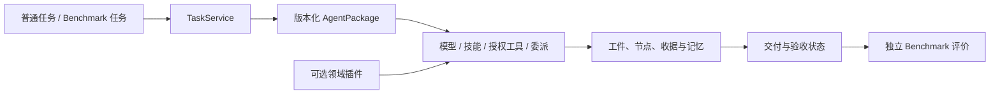

# Nexgent 0.9

**通用 RSI 智能体框架：自主组织任务执行，从反馈中改进技能、协作和工作方式，并能运行 benchmark 检验效果。**

Nexgent 本身是产品。科学发现与 OpenFOAM 是独立 demo，领域工具、任务、数据和评分不能进入核心。OpenFOAM 不成为框架的默认任务定义；同一核心必须能执行非 CFD 任务与 benchmark。

## 定位与当前状态

0.9 完成了 P1 的任务执行、交付评审与恢复基础及产品入口整合，实现了独立 P2 OpenFOAM smoke demo、P3 反馈驱动任务包演化控制面，以及 P4 递归改进器的确定性机制闭环。普通目标和 benchmark 共享 `TaskService`；任务智能体 `A` 与改进器 `R` 使用独立版本通道。默认 GUI 是任务空间；0.8 研究窗口和原有 CLI 命令继续保留。

P3 已实现 `FeedbackBundle → 冻结独立 R0 → BehaviorPatch(O/M/S) → paired selection → task channel → guard/rollback`。`rsi-generate` 现在默认运行框架内置、领域无关的 `reference-os-v1`：它用配置的模型读取脱敏反馈，只允许对一个 O（编排）或 S（技能/提示协议）组件做一次 `replace`，也可以改为显式 improver 包或已部署 improver channel。P4 又实现 `R0 真实自更新为 R1 → R0/R1 从共同 A0 产生后代 → 下游效用元评测 → 独立 R channel 部署 → R1 产生 R2 → 后代效用 guard → 回滚并重新加载 R0`。评价、权限、预算、晋升和回滚仍由可信宿主掌握。内置 R0 只补齐可直接运行的候选生成基线，不会自动晋升。**当前完成的是工程机制；真实模型候选的独立效果和统计 RSI 效益仍待闭合。**

通用 `MemoryService` 现提供一个最小 M-data 生命周期：记忆 policy/data 分离、候选隔离、宿主冻结 selection、accepted/rejected/retired 状态、版本父系、CAS release 晋升/回滚，以及 Episode 创建时的原子快照。公开视图不包含记忆正文、私有任务或 evaluator 证据。它仍是单可信宿主内的工程出口，尚未实现 principal 权限与 M-policy/M-data 的独立因果评测，因此不构成 M-RSI 闭环。完整边界见 [MemoryService lifecycle](docs/design/memory-service-lifecycle.md)。

真实 Provider 验证已经执行：2026-09-21 的 MiMo 普通任务用 3 次模型调用完成 schema 合法交付，证明 P1 模型驱动交付路径可用；同日 Workbench development 仍在 20 次调用后耗尽预算且没有交付或独立评价。此前 Qwen 因账户欠费被供应商拒绝，Gemini 最小探针连接失败。仓库不把普通任务交付、Workbench 失败、确定性控制面测试或 P2 求解器运行写成 RSI 效益。

| 内容 | 状态 |
| --- | --- |
| P1 通用任务运行器、AgentPackage、交付评审、工具/技能、工件、记忆、预算和恢复 | 0.9 基础已实现并通过确定性合同测试；真实 MiMo 普通任务已形成 schema 合法交付，独立 Workbench 仍失败 |
| P1 普通任务与 benchmark 的统一入口 | 0.9 已接入 CLI、默认 GUI 和插件合同；BBH 两任务已提供 canonical TaskService adapter 与无模型 reference package |
| P2 OpenFOAM 方腔 demo | 独立插件与 Re=10、20×20×1 smoke 已实现；真实 WSL2/Foundation 8 求解、U/p 解析、固定无模型 TaskService 受控恢复和隐藏评价已通过 |
| P3 跨任务行为更新 | 反馈绑定候选生成、内置 `reference-os-v1`、显式/通道 improver、配对门控、通道晋升、监测/回滚及脱敏机制证据导出已实现；真实模型候选效果与统计效益待检验 |
| P4 改进过程可更新与递归执行 | 独立 R archive/channel、自更新、真实后代元评测、预登记 guard 与自动回滚已形成确定性机制闭环；真实模型与统计效益待检验 |
| P5 冻结研究和完整产品验收 | 通用 final-holdout 配对研究执行器、预注册 schema 与脱敏信息窗已实现；正式外部多任务族研究尚未登记或执行 |
| 0.8 源码执行、自修改、历史 benchmark 与研究窗口 | 保留；其证据不替代 0.9 P1 或 P2–P5 验收 |

### 设计阅读入口

- [定位与重构决策](docs/design/product-and-refactor-decision.md)：固定用户不变要求和框架边界。
- [vNext 智能体架构](docs/design/agent-architecture-vnext.md)：真实任务执行、技能/编排/记忆和反馈驱动更新。
- [论文方法到设计与实验](docs/research/agent-orchestration-rsi-synthesis-20260916.md)：AutoSci、ADAS、AFlow、DGM、Hyperagents、STOP 的采用方式与边界。
- [P3 反馈演化控制面](docs/design/p3-feedback-evolution-control-plane.md)：当前实现对象、完整状态流、CLI/GUI、信任边界和证据等级。
- [P4 递归改进器控制面](docs/design/p4-recursive-improver-control-plane.md)：R 自更新、后代效用元评测、独立通道、guard 与结论边界。
- [P5 预注册 RSI 研究](docs/research/p5-preregistered-rsi-study.md)：证据等级、实验臂、外部 benchmark 矩阵、防泄漏、缺测与统计职责。
- [Task benchmark SDK 与 BBH 迁移](docs/design/benchmark-sdk.md)：TaskService 插件的显式 descriptor、隔离发现、JSON 合同、BBH canonical 路径与 legacy 兼容边界。
- [P3 跨任务 RSI 研究设计](docs/research/p3-cross-task-rsi-design-20260920.md)：一手论文方法、可证伪假设、对照和冻结试验协议。
- [P1 真实 Provider 验证](docs/research/task-runtime-validation-20260920.md)：实际 episode、token 与节点用量、供应商失败、重复调用阻断和未通过项。
- [OpenFOAM 独立 demo](docs/demos/openfoam-cfd-design.md)、[本机环境](docs/demos/openfoam-environment-20260916.md)、[真实 smoke 验证](docs/demos/openfoam-smoke-validation-20260920.md)与[机器可读收据摘要](docs/demos/openfoam-smoke-receipt-20260920.json)：任务设计、版本适配、实际执行证据和结论边界。
- [分阶段重构计划](REFACTOR_PLAN.md)：依赖、责任和验收条件。

### 当前 0.9 P1 执行路径



任务窗口展示目标、节点、交付物、失败、调用收据和记忆版本；“RSI 与版本”页分别只读展示 task-agent channel 与 recursive-improver channel，以及经过字段白名单过滤的审计事件。

### 从任务底座到 RSI

后续自进化的对象是版本化智能体行为，而不是宿主评价器或领域答案：任务编排与角色交接、技能实现和提示协议、记忆写入与检索策略，以及用于诊断和产生改进的策略。真实任务的交付质量、独立 benchmark 分数、评审缺陷、工具错误、恢复结果、回归和资源成本共同构成反馈；代理自评只能作为其中一项有来源的信号。

闭环依次留下可核查证据：只从当前通道父包的 development Episode 捕获 `FeedbackBundle`；独立、版本化且冻结的 `R0` 只能输出声明式 `BehaviorPatch`；可信宿主验证补丁只改变编排 O、记忆策略 M 或技能/提示协议 S，并构造不可变 child `AgentPackage`；冻结候选在 selection 任务上与父包交错配对，按预登记政策形成 decision；只有由 `GenerationService` 真实执行 R0 并闭合生成收据的 eligible candidate 才有部署资格，受控导入的 candidate 只进入研究 archive；显式 compare-and-swap 晋升必须绑定预登记 monitor plan；guard plan 的完整任务多重集只能消费一次，缺项、重复项或 usage 不完整均 fail closed，并可沿部署边回滚。未通过的候选和缺测全部保留。

paired plan 冻结宿主能够重算的 execution environment、工具描述、运行时实现摘要和 arm schedule。当前计划对象不会预先完整冻结实际 provider/model；二者由每次模型调用的 receipt 证明，正式实验再核验这些收据是否符合预登记配置。选择门中的 `cost` 是由模型调用、charged completion tokens、工具调用和节点用量构成的透明 normalized work unit，便于同一协议内比较，不代表供应商货币费用。

这条链有三种不同证据等级。确定性测试可以证明身份、隔离、门控、递归版本、真实运行路径、加载和回滚等**机制**；真实 provider Episode 才能证明模型确实产生并执行了行为变化；多个冻结任务、重复和对照才能支持**统计 RSI 效益**。当前状态只完成第一层的工程实现，后两层仍待实验。

这个边界来自[编排与 RSI 研究综合](docs/research/agent-orchestration-rsi-synthesis-20260916.md)：持久化、实际执行和有效必须分别检查，且“失败证据 → 候选变化 → 验证 → 后续实际加载 → 结果”缺一不可。0.8 的[框架验证](docs/research/framework-validation-20260916.md)、[v1 机制审查](docs/research/framework-mechanism-v1-review.md)和[v2 机制审查](docs/research/framework-mechanism-v2-review.md)记录过机制未激活、契约错误和实际后代零增益，因此源码变化、记忆写入或候选数量都不能单独作为 RSI 成功证据。P1 实跑记录格式见[任务运行时验证模板](docs/research/task-runtime-validation-20260920.md)。

## 0.9 安装与任务入口

Python 3.11+；本机使用独立 Python 3.12 环境。Windows 使用本项目解释器，避免其他项目的 Qt/Conda 动态库混用。

```powershell
python -m venv .venv
.venv\Scripts\python.exe -m pip install -e '.[dev]'

# 选择安装所需 demo / benchmark
.venv\Scripts\python.exe -m pip install -e benchmarks/workbench
.venv\Scripts\python.exe -m pip install -e benchmarks/openfoam
.venv\Scripts\python.exe -m pip install -e benchmarks/scientific_discovery
.venv\Scripts\python.exe -m pip install -e benchmarks/bbh
.venv\Scripts\nexgent-bbh-download.exe --destination .nexgent/benchmarks/bbh

.\start.ps1
```

本机环境、workbench、openfoam、scientific_discovery、BBH 四项插件和 BBH 数据已准备。模型读取被 Git 忽略的 `models.json` / `.env`；示例见 [models.example.json](models.example.json) 和 [.env.example](.env.example)。凭证留在模型请求宿主，不进入智能体源码进程。

`nexgent gui` 和 `nexgent-gui` 默认打开任务空间。任务创建、恢复、查看和导出使用同一个 `.nexgent` 持久存储：

```powershell
# 默认创建后执行；--input 接受内联 JSON、JSON 文件路径或 @file
.venv\Scripts\python.exe -m nexgent task "整理输入资料并交付结果" --input inputs.json
.venv\Scripts\python.exe -m nexgent task "只登记" --register-only --max-calls 4 --max-completion-tokens 12000

.venv\Scripts\python.exe -m nexgent task-list
.venv\Scripts\python.exe -m nexgent task-show EPISODE_ID
.venv\Scripts\python.exe -m nexgent task-resume EPISODE_ID
.venv\Scripts\python.exe -m nexgent task-export EPISODE_ID --output delivery.json

# 让普通任务或 benchmark 使用通道当前已晋升包；不能同时传 --package
.venv\Scripts\python.exe -m nexgent task "执行后续任务" --package-channel general
.venv\Scripts\python.exe -m nexgent task-benchmark workbench --split selection --seed 19 --package-channel general

# 只读查看通道当前版本与字段过滤后的审计事件
.venv\Scripts\python.exe -m nexgent rsi-status general
.venv\Scripts\python.exe -m nexgent rsi-events general --limit 50
.venv\Scripts\python.exe -m nexgent rsi-improver-status recursive
.venv\Scripts\python.exe -m nexgent rsi-improver-events recursive --limit 50
.venv\Scripts\python.exe -m nexgent rsi-study-list --limit 20

# 显式、分阶段执行 P3 闭环；每一步输出下一步所需的不可变 ID/digest
.venv\Scripts\python.exe -m nexgent rsi-register general --package parent-package.json
.venv\Scripts\python.exe -m nexgent rsi-feedback general EPISODE_ID --expected-revision 0
# 默认使用内置、模型驱动的 reference-os-v1；示例策略只开放默认任务包的 O/S 组件
.venv\Scripts\python.exe -m nexgent rsi-generate general FEEDBACK_ID --mutation-policy examples/rsi/reference-os-mutation-policy.json --expected-revision 0
# 可选：显式冻结包，或从独立 R channel 解析已部署版本
.venv\Scripts\python.exe -m nexgent rsi-generate general FEEDBACK_ID --improver-package improver.json --mutation-policy mutation-policy.json --expected-revision 0
.venv\Scripts\python.exe -m nexgent rsi-generate general FEEDBACK_ID --improver-channel recursive --expected-improver-revision 0 --mutation-policy mutation-policy.json --expected-revision 0
.venv\Scripts\python.exe -m nexgent rsi-plan CANDIDATE_ID workbench --split selection --seed 19 --policy promotion-policy.json
.venv\Scripts\python.exe -m nexgent rsi-run-plan PLAN_ID workbench
.venv\Scripts\python.exe -m nexgent rsi-assess TRIAL_ID
.venv\Scripts\python.exe -m nexgent rsi-plan-monitor CANDIDATE_ID workbench --split guard --seed 23
.venv\Scripts\python.exe -m nexgent rsi-promote CANDIDATE_ID DECISION_ID MONITOR_PLAN_ID
.venv\Scripts\python.exe -m nexgent rsi-run-monitor general workbench
.venv\Scripts\python.exe -m nexgent rsi-monitor general GUARD_EPISODE_ID

# 产品化 cycle：一次冻结并推进同样的 feedback→selection→promotion→guard 门控
.venv\Scripts\python.exe -m nexgent rsi-cycle-start general workbench DEVELOPMENT_EPISODE_ID --expected-revision 0 --mutation-policy examples/rsi/reference-os-mutation-policy.json
# 可选：让已部署的递归改进器 R 承担本轮候选生成，并冻结其 revision
.venv\Scripts\python.exe -m nexgent rsi-cycle-start general workbench DEVELOPMENT_EPISODE_ID --expected-revision 0 --improver-channel recursive --expected-improver-revision 0 --mutation-policy mutation-policy.json
.venv\Scripts\python.exe -m nexgent rsi-cycle-show RSI_CYCLE_ID
.venv\Scripts\python.exe -m nexgent rsi-cycle-resume RSI_CYCLE_ID

# workbench 是 P1 的纯 Python 可选插件；此命令仍会使用配置的模型供应商
.venv\Scripts\python.exe -m nexgent task-benchmark workbench --split development --seed 0 --max-calls 20

# OpenFOAM 插件目前只接受冻结的 smoke/seed=0/Re=10 场景；需要本机 Foundation 8
.venv\Scripts\python.exe -m nexgent task-benchmark openfoam_cavity --split smoke --seed 0 --max-calls 20

# 打开保留的 0.8 研究窗口
.venv\Scripts\python.exe -m nexgent gui --legacy-research
```

`--capability` 可重复授予已安装工具；`--package` 接受 AgentPackage JSON，`--package-channel` 在任务创建时原子解析当前 active 包，两者互斥。预算选项包括 `--max-calls`、`--max-completion-tokens`、`--max-tool-calls` 和 `--max-nodes`。没有传入时使用运行器的有界默认值。输入、包和任务合同无效时，命令会在执行前失败。

工具可在输入 JSON Schema 中用 `x-nexgent-artifact-ref: true` 声明工件引用。运行器只接受宿主提供或先前动作实际返回的 `artifact-…` 身份，并在调用工具前核验该工件对当前 Episode 可见；`pending` 等占位符会以协议错误失败，且不会消耗工具调用预算。这个合同属于通用核心，Workbench 与 OpenFOAM 只是使用它的独立插件。

正式 final-holdout 比较使用 `rsi-study-plan` 冻结两个包、宿主私有 benchmark snapshot、显式统计单位/来源 cluster、seed、provider/model revision、执行环境、完整预算与统计政策，再依次执行 `rsi-study-run` 和 `rsi-study-assess`。统计检验按独立 cluster 聚合；模型供应商只返回滚动别名时，报告保持时间窗口内的 benchmark 局部结论。`rsi-study-list` 与 GUI 只显示脱敏摘要。当前没有外部多任务族正式结果；确定性 study pilot 只验证研究控制面。

内置 `reference-os-v1` 是通用参考 R0，不包含科学发现、OpenFOAM 或任何 benchmark 的答案与评分逻辑。首版主动收窄为单文件 `replace` 且只处理 O/S；M（记忆策略）、多文件修改和增删文件继续由显式研究包探索。模型返回 abstain、非法 patch、调用失败或预算耗尽时，generation 持久记录为 missing。生成 candidate 后仍必须完成 paired selection、显式 promotion 和 guard，默认命令不会自动部署。

P3 的每个写操作都有独立 CLI 和 Python API；P4 的递归写操作保留为显式 Python 控制面，必须依次形成 meta feedback、R self-generation、meta trial/decision、guard plan 和 promotion，不能“一键跳过门控”。GUI 的“RSI 与版本”页保持只读。`rsi-*` 输出不暴露 AgentPackage 源文件、私有任务内容或 evaluator 实现。操作顺序见[运行与恢复](docs/operations.md)，完整合同见[P3 控制面设计](docs/design/p3-feedback-evolution-control-plane.md)与[P4 递归控制面](docs/design/p4-recursive-improver-control-plane.md)。

`RSICycleService` 把一次任务智能体改进的 feedback、generation、paired selection、guard plan、promotion 与 monitor 串成持久状态机。CLI 提供 `rsi-cycle-start/resume/show/recover`，默认使用内置参考 R0，也可冻结并执行独立 R channel 的指定 revision；信息窗口可按 cycle ID 查看脱敏状态。R channel 在 Episode 创建前和真正启动前都会重新核验，漂移时不会发起模型调用。它减少调用方手工传递记录 ID，但不会跳过独立评价或自动放宽晋升条件；硬中断中无法确定外部动作是否提交时会进入 `recovery_required`，CLI 返回非零。合同见[可恢复 RSI Cycle 服务](docs/design/rsi-cycle-service.md)。

## 保留的 0.8 benchmark 与源码研究接口

```powershell
.venv\Scripts\python.exe -m nexgent benchmarks

# 固定程序跑 benchmark；省略 --program 时使用插件的强基线，不执行 improve
.venv\Scripts\python.exe -m nexgent evaluate --benchmark bbh --seeds 101 202
.venv\Scripts\python.exe -m nexgent evaluate --benchmark scientific_discovery --seeds 101

# 通用研究程序在指定 benchmark 上演化
.venv\Scripts\python.exe -m nexgent research '改善实际后代效用与研究组织' --benchmark scientific_discovery --generations 2 --seed 43
.venv\Scripts\python.exe -m nexgent research '检验程序改进与成本' --benchmark bbh --generations 2 --seed 43

# 冻结两版实际改进器，从相同任务起点生成后代
.venv\Scripts\python.exe -m nexgent meta-evaluate STUDY_ID --seeds 401 502 --k 1

# 将两版改进器迁到另一 benchmark 的共同任务起点
.venv\Scripts\python.exe -m nexgent meta-evaluate STUDY_ID --benchmark bbh --seeds 401 --k 1

.venv\Scripts\python.exe -m nexgent list
.venv\Scripts\python.exe -m nexgent show STUDY_ID
.venv\Scripts\python.exe -m nexgent resume STUDY_ID
.venv\Scripts\python.exe -m nexgent export STUDY_ID
```

`full` 允许全部源码演化并探索档案；`task_only` 冻结非任务文件；`greedy` 仍允许全部文件变化，但只扩展当前部署程序。没有不同可执行改进器时，不付费比较同一程序的两次随机抽样。

## 0.8 已实现的源码自修改循环

源码包包含 `task.py`、`meta.py` 和可选 `workflow.py`、`roles.json`。算法、函数、控制流、角色分工及父代选择均可修改，不从固定策略表选参数；模型权重保持固定。

初始通用研究程序读取领域合同、自身源码、实际开发结果和有来源的失败。遇到停滞时，可以提出改进程序变更，通过 `broker.probe_improver` 从共同任务起点实际运行参考/候选 `improve`、生成并评价后代，再使用开发证据继续研究。每次外层执行最多一次探测，内层不能再次探测，所有请求与实验计入同一账本。

探测后再修改的改进程序不能继承旧测量的效力。源码自述与宿主核实的证据状态分开。部署冠军和探索版本分别保存，未晋升的改进程序仍可被后代实际执行。

独立评测冻结两版改进器，保持共同任务起点与预算；开发选择后才打开迁移数据。跨 benchmark 迁移替换任务基线和领域合同，保留被测改进器源码。这检验具体程序、任务分布和预算下的能力，不自动证明通用或持续加速的 RSI。

## 0.8 benchmark 接口

插件实现 [Benchmark 合同](src/nexgent/benchmarks/__init__.py)：`spec` 声明领域、任务合同、工具 API、工具类入口与成本单位；`initial_files()` 提供任务基线；`research_context()` 只提供公开领域信息；`snapshot()` 冻结源码/依赖/数据版本；`evaluate(...)` 使用传入运行器执行源码，由宿主持有答案和评分。

参考：[科学发现插件](benchmarks/scientific_discovery/README.md)、[BBH 插件](benchmarks/bbh/README.md)。BBH 仅覆盖 boolean_expressions 和 word_sorting，不称为完整 23 任务成绩。

## 0.8 历史证据与结论边界

0.8 基线通过 282 项本地检查，配置 Windows/Ubuntu × Python 3.11/3.12 四项 CI（[当前检查](https://github.com/csxq0605/Nexgent/pull/1/checks)）；独立核心安装无需科学依赖，也能运行窗口和通用源码。实际模型研究、两个插件的独立改进器比较与完整成本见 [框架验证报告](docs/research/framework-validation-20260916.md)。

本轮先后登记的两次机制 pilot 与独立比较共 44 次模型请求。原轮观察到改变后的改进器继承执行，同时暴露并修复了长查询接口缺陷。修复轮的独立比较实际生成并评测 5 个任务后代，3 个配对效应均为 0；**尚无改进器能力增强的证据**。错误父代选择、未通过源码准入的提议和无效修订均保留，不能用源码 diff 或生成槽位数代替成功后代。

六组科学 demo 研究和 36 次独立确认全部保留。一个任务程序获得确认平均增益 +0.012351；两个 full 组均未改变改进程序，**该批没有建立改进器能力增强的证据**。这些反例用于后续机制设计，不能改称框架已完成 RSI 验收。

官方 BBH 两任务固定强基线通过 500/500 例，0 模型调用。这验证接入、实际执行与评分，也说明准确率已饱和；它不是演化成果。

执行边界为能力受限 Python、独立进程、审计钩子和内存/指令/工具/请求预算，不是完整操作系统容器。领域工作单位只在同一 benchmark 内解释；模型 tokens、缓存与实际工作分别记录。停止和缺测保留收据，不自动重试付费请求。

## 开发与研究材料

安装 workbench、openfoam、scientific_discovery 和 BBH 四项插件后运行 `.venv\Scripts\python.exe -m pytest tests -q`。默认测试验证 OpenFOAM 插件合同并使用模拟进程；真实求解器测试必须显式设置 `NEXGENT_OPENFOAM_REAL_TEST=1`，且只在已配置的 Foundation 8 环境运行。

- [分阶段协作计划与 PR](REFACTOR_PLAN.md)
- [当前设计与历史实现的架构入口](docs/architecture.md)
- [RSI 一手文献与实现判断](docs/research/reboot-rsi-mechanisms.md)
- [P3 反馈演化控制面](docs/design/p3-feedback-evolution-control-plane.md)
- [P3 跨任务 RSI 研究设计](docs/research/p3-cross-task-rsi-design-20260920.md)
- [源码机制审查和探测设计](docs/research/source-mechanism-review-20260916.md)
- [六组科学 demo 完整结果](docs/research/source-batch-results-20260916.md)
- [通用框架的真实机制验证与交付](docs/research/framework-validation-20260916.md)
- [v1 源码机制审查](docs/research/framework-mechanism-v1-review.md)、[v2 源码机制审查](docs/research/framework-mechanism-v2-review.md)
- [源码、配对数据与确认收据](docs/research/source-batch-evidence-20260916.json)
- [运行与恢复](docs/operations.md)

```text
src/nexgent/                      通用 RSI 核心、P3 包演化控制面与信息窗口
benchmarks/workbench/             P1 工件式数据核对任务与 benchmark 插件
benchmarks/openfoam/              P2 Foundation 8 方腔 smoke 插件
benchmarks/scientific_discovery/   独立科学发现 demo 包
benchmarks/bbh/                    独立公开 benchmark 包
tests/                            核心合同、继承、账本及插件验证
docs/research/                    文献、预登记、结果及失败分析
```

旧产品保留在 Git 历史及本机仓库外快照。vNext 重构继续使用同一个 Draft PR，按阶段更新实际完成状态。
