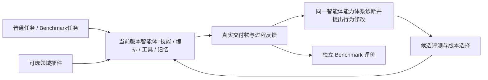

# Nexgent

**通用 RSI 智能体框架：自主组织任务执行，从反馈中改进技能、协作和工作方式，并能运行 benchmark 检验效果。**

Nexgent 本身是产品。科学发现与 OpenFOAM 是独立 demo，领域工具、任务、数据和评分不能进入核心。OpenFOAM 不成为框架的默认任务定义；同一核心必须能执行非 CFD 任务与 benchmark。

## 定位与当前状态

2026-09-16 重新固定设计。现有 **0.8 代码是源码执行、自修改与评测基础**，尚未完成完整任务多智能体架构与有效编排进化。新的 **vNext 目前仅为设计文档**；本轮未实现新运行器、OpenFOAM 插件或启动仿真/模型实验。

| 内容 | 状态 |
| --- | --- |
| 通用插件、实际源码执行、预算/版本、0.8 信息窗口 | 已实现，有历史软件与运行证据 |
| 完整任务规划、技能协作、工件/记忆与跨任务行为更新 | 本轮重新设计，待实现 |
| 改进流程本身可更新且带来递归效用 | 设计目标；0.8 未建立正面效果证据 |
| OpenFOAM 方腔 demo | 设计已形成；本机 Foundation 8 已只读确认，插件和算例验证未执行 |

### 设计阅读入口

- [定位与重构决策](docs/design/product-and-refactor-decision.md)：固定用户不变要求和框架边界。
- [vNext 智能体架构](docs/design/agent-architecture-vnext.md)：真实任务执行、技能/编排/记忆和反馈驱动更新。
- [论文方法到设计与实验](docs/research/agent-orchestration-rsi-synthesis-20260916.md)：AutoSci、ADAS、AFlow、DGM、Hyperagents、STOP 的采用方式与边界。
- [OpenFOAM 独立 demo](docs/demos/openfoam-cfd-design.md)与[本机环境](docs/demos/openfoam-environment-20260916.md)：任务、物理验证、版本适配及未执行项目。
- [分阶段重构计划](REFACTOR_PLAN.md)：依赖、责任和验收条件。

### 目标架构（待实现）



任务内调整、跨任务保留的改进、改进过程自身的递归更新分别验证；不要求每代修改某个元文件。信息窗口展示目标、进展、交付物、失败和采用的改进，内部执行基础设施由框架管理。

## 0.8 安装与信息窗口

以下命令仅适用于现有 0.8，不是 vNext 或 OpenFOAM 的启动说明。[0.8 架构快照](docs/architecture-0.8.md)保留当前接口边界。

Python 3.11+；本机使用独立 Python 3.12 环境。Windows 使用本项目解释器，避免其他项目的 Qt/Conda 动态库混用。

```powershell
python -m venv .venv
.venv\Scripts\python.exe -m pip install -e '.[dev]'

# 选择安装所需 demo / benchmark
.venv\Scripts\python.exe -m pip install -e benchmarks/scientific_discovery
.venv\Scripts\python.exe -m pip install -e benchmarks/bbh
.venv\Scripts\nexgent-bbh-download.exe --destination .nexgent/benchmarks/bbh

.\start.ps1
```

本机环境、两项插件和 BBH 数据已准备。模型读取被 Git 忽略的 `models.json` / `.env`；示例见 [models.example.json](models.example.json) 和 [.env.example](.env.example)。凭证留在模型请求宿主，不进入智能体源码进程。

窗口包含进度、资料、实验、源码谱系、改进器效能和结论。开发探测、独立评测、固定程序成绩及未执行结果分别显示。查看或导出不会启动新的研究。

## 0.8 benchmark 与源码研究接口

```powershell
.venv\Scripts\python.exe -m nexgent benchmarks

# 固定程序跑 benchmark；省略 --program 时使用插件的强基线，不执行 improve
.venv\Scripts\python.exe -m nexgent evaluate --benchmark bbh --seeds 101 202
.venv\Scripts\python.exe -m nexgent evaluate --benchmark scientific_discovery --seeds 101

# 通用研究程序在指定 benchmark 上演化
.venv\Scripts\python.exe -m nexgent research '改善实际后代效用与研究组织' --benchmark scientific_discovery --generations 2 --seed 43
.venv\Scripts\python.exe -m nexgent research '检验程序改进与成本' --benchmark bbh --generations 2 --seed 43

# 冻结两版实际改进器，从相同任务起点生成后代
.venv\Scripts\python.exe -m nexgent meta-evaluate STUDY_ID --seeds 401 502 --k 1

# 将两版改进器迁到另一 benchmark 的共同任务起点
.venv\Scripts\python.exe -m nexgent meta-evaluate STUDY_ID --benchmark bbh --seeds 401 --k 1

.venv\Scripts\python.exe -m nexgent list
.venv\Scripts\python.exe -m nexgent show STUDY_ID
.venv\Scripts\python.exe -m nexgent resume STUDY_ID
.venv\Scripts\python.exe -m nexgent export STUDY_ID
```

`full` 允许全部源码演化并探索档案；`task_only` 冻结非任务文件；`greedy` 仍允许全部文件变化，但只扩展当前部署程序。没有不同可执行改进器时，不付费比较同一程序的两次随机抽样。

## 0.8 已实现的源码自修改循环

源码包包含 `task.py`、`meta.py` 和可选 `workflow.py`、`roles.json`。算法、函数、控制流、角色分工及父代选择均可修改，不从固定策略表选参数；模型权重保持固定。

初始通用研究程序读取领域合同、自身源码、实际开发结果和有来源的失败。遇到停滞时，可以提出改进程序变更，通过 `broker.probe_improver` 从共同任务起点实际运行参考/候选 `improve`、生成并评价后代，再使用开发证据继续研究。每次外层执行最多一次探测，内层不能再次探测，所有请求与实验计入同一账本。

探测后再修改的改进程序不能继承旧测量的效力。源码自述与宿主核实的证据状态分开。部署冠军和探索版本分别保存，未晋升的改进程序仍可被后代实际执行。

独立评测冻结两版改进器，保持共同任务起点与预算；开发选择后才打开迁移数据。跨 benchmark 迁移替换任务基线和领域合同，保留被测改进器源码。这检验具体程序、任务分布和预算下的能力，不自动证明通用或持续加速的 RSI。

## 0.8 benchmark 接口

插件实现 [Benchmark 合同](src/nexgent/benchmarks/__init__.py)：`spec` 声明领域、任务合同、工具 API、工具类入口与成本单位；`initial_files()` 提供任务基线；`research_context()` 只提供公开领域信息；`snapshot()` 冻结源码/依赖/数据版本；`evaluate(...)` 使用传入运行器执行源码，由宿主持有答案和评分。

参考：[科学发现插件](benchmarks/scientific_discovery/README.md)、[BBH 插件](benchmarks/bbh/README.md)。BBH 仅覆盖 boolean_expressions 和 word_sorting，不称为完整 23 任务成绩。

## 0.8 历史证据与结论边界

0.8 基线通过 282 项本地检查，配置 Windows/Ubuntu × Python 3.11/3.12 四项 CI（[当前检查](https://github.com/csxq0605/Nexgent/pull/1/checks)）；独立核心安装无需科学依赖，也能运行窗口和通用源码。实际模型研究、两个插件的独立改进器比较与完整成本见 [框架验证报告](docs/research/framework-validation-20260916.md)。

本轮先后登记的两次机制 pilot 与独立比较共 44 次模型请求。原轮观察到改变后的改进器继承执行，同时暴露并修复了长查询接口缺陷。修复轮的独立比较实际生成并评测 5 个任务后代，3 个配对效应均为 0；**尚无改进器能力增强的证据**。错误父代选择、未通过源码准入的提议和无效修订均保留，不能用源码 diff 或生成槽位数代替成功后代。

六组科学 demo 研究和 36 次独立确认全部保留。一个任务程序获得确认平均增益 +0.012351；两个 full 组均未改变改进程序，**该批没有建立改进器能力增强的证据**。这些反例用于后续机制设计，不能改称框架已完成 RSI 验收。

官方 BBH 两任务固定强基线通过 500/500 例，0 模型调用。这验证接入、实际执行与评分，也说明准确率已饱和；它不是演化成果。

执行边界为能力受限 Python、独立进程、审计钩子和内存/指令/工具/请求预算，不是完整操作系统容器。领域工作单位只在同一 benchmark 内解释；模型 tokens、缓存与实际工作分别记录。停止和缺测保留收据，不自动重试付费请求。

## 开发与研究材料

安装两项插件后运行 `.venv\Scripts\python.exe -m pytest tests -q`。

- [分阶段协作计划与 PR](REFACTOR_PLAN.md)
- [当前设计与历史实现的架构入口](docs/architecture.md)
- [RSI 一手文献与实现判断](docs/research/reboot-rsi-mechanisms.md)
- [源码机制审查和探测设计](docs/research/source-mechanism-review-20260916.md)
- [六组科学 demo 完整结果](docs/research/source-batch-results-20260916.md)
- [通用框架的真实机制验证与交付](docs/research/framework-validation-20260916.md)
- [v1 源码机制审查](docs/research/framework-mechanism-v1-review.md)、[v2 源码机制审查](docs/research/framework-mechanism-v2-review.md)
- [源码、配对数据与确认收据](docs/research/source-batch-evidence-20260916.json)
- [运行与恢复](docs/operations.md)

```text
src/nexgent/                      通用 RSI 核心与信息窗口
benchmarks/scientific_discovery/   独立科学发现 demo 包
benchmarks/bbh/                    独立公开 benchmark 包
tests/                            核心合同、继承、账本及插件验证
docs/research/                    文献、预登记、结果及失败分析
```

旧产品保留在 Git 历史及本机仓库外快照。vNext 重构继续使用同一个 Draft PR，按阶段更新实际完成状态。
