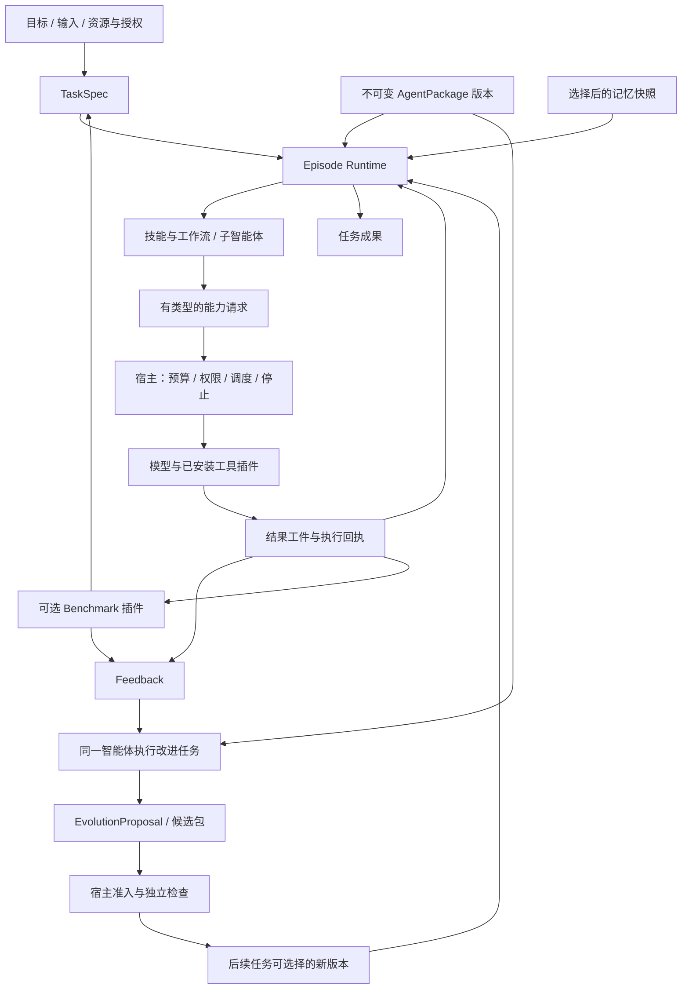

# Nexgent vNext：通用任务智能体与递归改进架构

日期：2026-09-16；范围说明更新于 2026-09-23。状态：**0.9 实现基线与早期设计合同；效果验证仍在进行。新的能力内核目标见 [RSI 能力内核](rsi-capability-kernel.md)，本文不规定新后端或固定执行策略。** 任务运行、已安装 DomainPack／benchmark 插件发现、版本化 AgentPackage、反馈生成、配对选择、晋升、guard/rollback 与冻结研究控制面已有实现；模型动态开发和装载工具／服务插件尚未实现，真实模型改进效果与统计 RSI 结论仍未建立。产品边界见 [定位决策](product-and-refactor-decision.md)，阶段出口和证据边界见 [重构计划](../../REFACTOR_PLAN.md)。0.8 的历史实现与既有结果仍以 [0.8 架构快照](../architecture-0.8.md) 和 [框架验证报告](../research/framework-validation-20260916.md) 为准。

## 1. 产品定位与这次需要改变的中心

Nexgent 应首先是一个能完成真实任务的通用智能体：理解目标，使用已有资料和工具，按需组织多个智能体，交付可使用的成果，并从反馈中改善以后的工作。Benchmark 用于测量这些能力；自改进用于改变承担工作的智能体。二者都不能取代任务执行本身。

当前 AgentPackage/ExecutablePlan 是可保留或适配的版本化执行载体。新的[能力内核目标](rsi-capability-kernel.md)扩展到工具／服务插件、执行循环、代码策略和上下文管理；DAG 是一种后端，任务专一团队是可选组织方式。任务与进化状态仍须显式持久化。

例如，用户可以要求它比较一组候选方案、处理一批有冲突的数据、完成带验证的程序任务，或通过已安装工具操作一个受限环境。一个 Episode 的成果可以是决策及依据、处理后的数据、通过检验的程序、环境中的目标状态。不能把所有目标都改写为“生成一份 task.py，然后刷分”。

默认交互是目标、输入资料、资源上限和成果窗口。系统自行规划与委派；只有目标缺少必要信息、既有授权范围不足或需要用户作价值取舍时才请求介入。用户可以查看中间证据和工作流，但不必操作角色、补丁或代际循环才能获得结果。

**领域知识由插件与 AgentPackage 提供。** OpenFOAM 仅是一个拟议的独立 demo 插件：案例模板、求解器适配、流体概念、网格检查、数值验证和领域评价都由插件承担。核心没有流体变量，也没有“文献—假说—实验—论文”五阶段状态机。既有科学发现和 BBH 插件继续作为独立基准；它们的存在不决定核心的任务形态。

优先级是：完整任务闭环 → 可执行的协作与记忆 → 可继承的能力更新 → 改进过程的自应用 → 正式效果比较。可追踪身份、预算与最小执行记录随闭环一起建设；不先扩张一套大型证据平台，再补任务代理。

## 2. 三个不同层次的变化

| 层次 | 发生什么 | 持久对象 | 可以据此声称什么 |
| --- | --- | --- | --- |
| 任务内自适应 | 根据当前结果改计划、增减子任务、切换技能、重试或停止 | Episode 的计划修订与临时工作记忆 | 本次任务具有反馈控制；不等于跨任务学习 |
| 跨任务持久进化 | 将经检查的技能、工作流、代码或经验作为新版本用于后续任务 | AgentPackage 和显式 MemorySnapshot | 能力发生持久变化；效用是否提高需另测 |
| 可变改进过程 | 修改诊断、提案、试验选择、组织协作或采用候选的方法，并由新版本实际承担后续改进 | 同一 AgentPackage 中的改进入口及其依赖 | 改进过程具有递归可变性；不自动证明递归增强 |

任务执行不必触发进化，每次进化也不必修改改进器。任务技能、工作流、记忆策略和改进策略可以分别变化。没有“每代必须改 meta”的规则；不把更换文件名、更新注释或新增角色标签记为能力增强。

这里的“递归”是软件能力的自应用，默认不涉及模型权重训练，也不要求无界嵌套调用。某次修改可以在下一个独立 Episode 才被执行。

## 3. 整体结构：可变智能体与稳定宿主



图中的宿主处理可执行请求和状态转换，不代替智能体选择领域方法、写候选源码或决定必须调用哪些角色。它仍可拒绝越权、超预算、无效引用及不符合接口的请求。智能体可以建议候选采用和分支扩展；宿主依据预先确定的采用规则执行，避免被测对象同时修改评分依据。

### 3.1 职责划分

| 部分 | 负责 | 可以随 AgentPackage 变化的内容 |
| --- | --- | --- |
| Task Runtime | 加载指定包，恢复 Episode，执行已准入的计划节点，管理工件和子任务 | 0.9 运行算法仍为宿主实现；新目标将执行／调度策略抽成可替换能力，证据与授权边界保持稳定 |
| AgentPackage | 目标解释、规划、调用技能、委派、综合、诊断、自改进 | 技能、角色规则、工作流、受控代码、改进入口、记忆选择策略 |
| Capability Broker | 校验请求，原子预扣资源，调用已授权模型或工具，返回结构化结果 | 包可改变调用的内容与顺序，不能扩大能力授权 |
| Memory Service | 按范围检索与保存有来源的经验，提供一致快照 | 检索、压缩与巩固策略可以变；访问控制和私有评价隔离不变 |
| Evaluation Service | 执行任务验收或 benchmark 评分，产生独立反馈 | 包可请求公开开发检查，不能替换宿主使用的最终评分器 |
| 信息窗口 | 提交任务、查看成果/活动/记忆/版本，停止、恢复、导出 | 视图来自实际记录，不暗示未执行的工作流 |

核心的固定边界是协议、权限、资源计账、版本完整性和独立检查。固定边界不应扩大成固定科研路线，也不应为了“全可变”把密钥、评分器或授权规则交给候选程序。

## 4. 建议的领域中立接口

以下为接口草案，不是已有 Python API。字段名称可以在实现时调整；身份、权限和数据流语义应保持。所有引用解析均由宿主完成，模型写出的 ID 只有在存在、可访问且类型兼容时才有效。

### 4.1 TaskSpec 与 Episode

```text
TaskSpec
  id, schema_version, objective
  input_artifact_refs[]
  deliverables[]: {name, schema_ref, acceptance_ref?}
  constraints: {deadline?, quality_requirements[], allowed_effects[]}
  capability_profile_ref
  budget_policy_ref
  context: {domain_ref?, benchmark_registration_ref?, parent_task_ref?}
  evaluation_ref?                 # 普通任务可以没有 benchmark 或数值分数

Episode
  id, task_ref, package_digest, memory_snapshot_ref
  parent_episode_ref?, assigned_skill_ref?
  status, revision, current_plan_ref, plan_history_refs[]
  attempts[], input_refs[], output_refs[]
  child_episode_refs[], budget_account_ref, last_event_sequence
  outcome: {delivery_status, acceptance_status, limitations[]}
```

TaskSpec 是用户需求与已确认约束的版本化快照。子任务由智能体提出，宿主把原授权收窄后形成新的 TaskSpec；不能借委派扩大权限。用户后来补充目标时生成任务修订，已经产生的成果仍关联其实际输入版本。

Episode 是一次具体执行，不是“第几代”的别名。它可以完成工作而没有创建新包，也可以作为改进任务产出候选。状态建议为 `ready/running/waiting_input/paused/completed/failed/cancelled`。`completed` 仅表示执行收尾；`acceptance_status` 另行区分通过、未通过、未测及缺测，避免“完成且缺测”显示为成功。

### 4.2 AgentPackage、Skill、Workflow 与 operator

```text
AgentPackage
  digest, manifest_version, parent_refs[], component_origins{}
  entries: {execute: entry_ref, improve?: entry_ref}
  skills{}, workflows{}, modules{}, resources{}
  memory_policy_ref?, model_preferences_ref?
  required_capabilities[], compatibility
  lineage: {proposal_ref?, produced_by_episode_ref?, producer_package_digest?}

Skill
  id, version, purpose
  inputs: {port: schema_ref}, outputs: {port: schema_ref}
  implementation: {kind: prompt_protocol | workflow | controlled_code, ref}
  preconditions[], postconditions[], required_capabilities[]
  failure_contract, memory_scope

Workflow
  id, version, input_ports{}, output_ports{}
  nodes[]: {id, operator_ref, bindings, output_ports, local_limits}
  control_edges[]: {from, to, condition_ref?}
  artifact_edges[]: {producer_node, output_port, consumer_node, input_port}
  loop_specs[], join_policies[], failure_routes[]

operator
  id, version, input_schema, output_schema, effect_class
  invoke(input_refs, context, capability_lease) -> result_refs + execution_status
```

**AgentPackage 是开放的版本化文件树，而不是四个固定文件。** manifest 暴露少量入口与组件引用，允许新增、拆分、合并或删除包内模块。包的内容摘要与谱系 ID 分开：相同内容可能有不同来源；重组包保留各组件来源。模型配置偏好也不能越过宿主可用模型和预算范围。

Skill 既可以是有类型端口的提示协议，也可以是工作流或受限代码。提示协议会影响执行，因此和代码一样参与版本身份；它不会被直接当作具有宿主权限的 shell 指令。代码扩展可表达新的函数、算法、分支、循环与编排规则，不限于替换提示或选择预设策略。

operator 是最小调度单元，例如模型请求、工具调用、技能调用、子任务、校验、路由与合并。`reviewer` 之类的角色不是独立进程存在的证据：只有产生具体 node/attempt、输入工件和执行结果，才记录为实际角色调用。一个任务可以由单智能体完成；多智能体是按问题需要组织的执行方式。

### 4.3 TypedArtifact、Memory 与 Feedback

```text
TypedArtifact
  id, content_digest, schema_ref, media_type, content_ref
  producer: {episode_id, node_id, attempt_id, package_digest}
  input_artifact_refs[], created_at, visibility_scope
  validation: {schema_status, checker_ref?, result_ref?}

MemoryItem
  id, kind: experience | procedure | factual_note | preference
  content_ref, evidence_refs[], applies_to[], counterexamples[]
  status: candidate | accepted | disputed | superseded
  source_episode_refs[], version, access_scope

MemorySnapshot
  id, item_version_refs[], retrieval_policy_digest, query_context_ref

Feedback
  id, episode_ref, subject_refs[]
  source: user | environment | deterministic_check | benchmark | agent_review
  observations[], metrics[], failure_class?, evidence_refs[]
  validity: {measured | claimed | unavailable}, evaluator_ref?, scope
```

工件类型描述接口，例如带引用的比较表、测试结果、程序提交、工具作业结果；并不强制是科学假说或数值实验。类型匹配只证明数据格式兼容，不证明内容真实。`agent_review` 的结论始终保留为自述，除非独立检查提供对应证据。

长期记忆保存可检索的知识与经验，账本保存发生过什么。二者可以共享存储基础设施，但不能互相替代。保存了 event 或源码 diff，不等于后续智能体读取并使用了经验。每次 Episode 记录实际检索的条目版本；程序版本与记忆快照分别固定，才能区分代码变化和上下文积累。

### 4.4 EvolutionProposal

```text
EvolutionProposal
  id, producer_episode_ref, producer_package_digest
  target_package_digest, evidence_refs[], diagnosis, predicted_effect
  changes[]: {component_ref, change_kind, candidate_content_ref}
  candidate_package_digest?, memory_changes[]
  compatibility_requirements[], development_check_plan
  status: proposed | admitted | evaluated | adopted | rejected | deferred
  results_refs[], adoption_scope, decision_reason
```

一次提案可以只更新工作流、技能、代码或记忆，也可以修改改进入口及其依赖。`producer_package_digest`、`target_package_digest` 与候选摘要必须分别记录：谁提出变更、修改谁、产出谁，是三个不同事实。提案中的预期效果是可检验预测，不是验收结论。

宿主先校验包与权限合同，再根据事先确定的检查要求决定可否进入试运行、探索档案或部署。保存到档案不等于部署；部署采用也不等于已建立统计上的效果。对危险外部副作用沿用用户已有授权范围，不因“自改进”自动扩大权限。

## 5. 执行过程：控制关系与数据关系分别建模

### 5.1 一个普通任务如何走完

1. 用户提交目标与输入，系统冻结 TaskSpec、选用的 AgentPackage 和记忆快照。
2. 包内的任务入口决定直接解答、使用某个技能，或形成工作流。宿主校验接口与能力需求，不替它生成固定角色清单。
3. 就绪节点读取明确绑定的输入工件；资源准入成功后发起模型、工具或子任务调用。外部响应按输出 schema 校验，保存真实工件或结构化失败。
4. 智能体根据反馈修订剩余计划，必要时形成独立子任务。检查失败可以进入修复分支，也可以诚实交付局限。
5. 生成用户需要的成果并执行适用的验收，返回交付状态、可用文件或环境结果；此时普通任务可以结束。
6. 若持续改进已在任务策略和授权范围内开启，可将适合复用的反馈排入后续改进任务；否则只保留当前任务结果。查看历史不会触发该队列执行。

任务策略决定“做什么、为何这样做”；宿主调度决定“哪些已准入请求现在可执行”。动态计划和代码都属于智能体能力，运行器只提供一致的执行语义。

### 5.2 工作流不限定为固定 DAG

初始实现可以用 DAG 表达无环子图，但合同要容纳条件分支、有限循环、动态子任务及显式 join。循环必须声明局部上限并受根预算约束；不能通过展开新节点规避总限制。任务策略可以替换某条路径，而不是只能改变预设节点的提示。

控制边表达执行条件，例如“只有 checker 返回不通过才进入修复”；工件边表达实际数据依赖，例如“review 使用 draft-v2 和 criteria-v1”。同一前序节点可能只决定是否执行而不提供数据；两名并行工作者也可能都读取同一个输入。不能由调用时间相邻推导依赖，也不能把全文聊天历史作为所有节点的隐式输入。

每次计划修订保存新的 `plan_ref`。已执行节点保持原计划与输入身份，未执行部分重新校验。正在运行的节点固定其包、技能和输入版本；新代码先形成候选包并经准入，在新 attempt 或子 Episode 中加载，不热改运行中的解释器。

允许智能体决定何时分支、合并与再规划，但需要明确并行失败语义：一个分支失败时是等待其他结果、部分交付、重试还是终止，由工作流的 failure/join 策略决定。所有已准入的并行请求都必须收尾记账，不能因先返回一个成功结果便遗失其他成本。

### 5.3 最小事件与恢复数据

建议事件链为 `task_registered → episode_started → plan_committed → node_admitted → node_finished/failed → artifact_published → feedback_recorded → episode_completed`。计划修订、子任务和提案复用同一套身份，不建立平行的科研专用事件系统。

每条事件至少带 `episode_id/sequence/causal_refs`，节点事件补充 `plan_ref/node_id/attempt_id/package_digest`。事件用于审计和恢复投影；运行快照用于界面快速读取；工件保存内容。初期只实现任务恢复和成果定位实际需要的事件，不要求先完成通用事件查询平台。

## 6. 自改进由同一个智能体承担

### 6.1 将改进作为一种任务

改进任务的输入是目标包、可公开的任务反馈、已有经验和资源上限；成果合同是 EvolutionProposal 及适用的验证结果。同一套规划、技能调用、工具、并行委派、综合与交付能力用于普通任务和改进任务。可以有不同的技能入口，不能另放一个永不变化的宿主“超级改进器”替候选思考。

```text
execute(P_t, ordinary_task, memory_t) -> deliverable, feedback
execute(P_t, improve_task(target=P_t, feedback), memory_t) -> proposal, P_candidate
host_admit_and_check(P_candidate) -> decision
execute(P_selected, later_task, selected_memory) -> actual result
execute(P_selected, later_improve_task(...), selected_memory) -> later proposal
```

这段关系是设计，不是已实现的调用签名。`P_t` 可以改进自身，也可以根据明确任务改进另一个包；两者都要记录 producer 与 target。只有新版本实际执行了后续改进入口或其已变更的依赖，才证明改进过程的变化得到继承。父子链接、文件 diff、外层循环次数都不能替代这一事实。

递归深度与累计成本由根任务约束。后代不能创建全新账户以重置额度，不能重写最终评分器；但可以选择不同的诊断实验、候选生成方法和资源分配方案。新版本退化时可以回到已知可用版本，探索档案保留原因；不要求强制部署每个后代。

### 6.2 反馈怎样成为后续能力

反馈先回答可观察的问题，例如“第二个子任务未得到上游数据”“生成器反复忽略输入 schema”“已有检查过早停止”。智能体可以比较竞争解释，再提出局部变更；也可以判断当前证据不足而不改。检查计划需说明预期改善什么、可能损害什么，以及复现该问题所需的输入。

持久化路径为：真实反馈 → 诊断与提案 → 不可变候选 → 合同检查与开发试运行 → 采用或保留 → 后续任务实际消费。任务内临时修复只有经明确提案才能进入共享技能库。失败总结成为 `MemoryItem(candidate)`，不能因为模型写得流畅就变成已验证知识。

修改改进过程时，检查应覆盖它是否确实改变诊断、试验选择、协作或生成结果。例子是把“看到失败就重写整包”改为“先检查输入绑定，再定位最小受影响技能”。是否更有效要通过实际后续任务或改进任务比较，不能以更多评论、更大的图或更长代码论证。

## 7. 记忆、资源与隔离的具体边界

### 7.1 可学习的记忆不等于无条件记住全部历史

- **工作记忆**属于 Episode，保存计划、假设和中间结果；恢复时重建，不默认全部跨任务继承。
- **经验记忆**包含可复用的成功条件、失败模式及反例，按任务类型和权限检索；每条结论关联原始证据。
- **程序性记忆**中可执行的技能与规则进入 AgentPackage 版本；被检索的文字建议仍标为资料，不能偷偷获得代码权限。
- **审计账本**保存全部必要的执行与用量记录，包括失败；不承担自动相关性检索。

记忆巩固可以由可变技能实现，但接受、覆盖与撤销都留下版本关系。互相矛盾的经验保留适用范围，不能用最新摘要抹去反例。用户偏好与隐藏评测数据有独立访问范围；最终评价结果在协议允许前不能进入开发记忆。

### 7.2 预算和停止恢复

根任务持有预算账户，Episode 和子任务只获得额度租约。模型调用数、输出 token 预留、供应商报告 token、墙钟时间、并发数以及插件定义的资源单位分列；不能把不同 benchmark 的 work units 相加当作同一计算量。

所有请求先在同一事务边界准入再外发；并发和递归共享根账户。恢复采用原 call/attempt ID 对账，不能创建新研究 ID 伪装免费重试。对于已经外发但结果未知的请求，保留 `unknown` 与保守预留；先尝试提供方支持的查询或幂等恢复，不假定网络请求可以 exactly-once。再次付费尝试必须成为可见的新 attempt，并服从原重试策略和剩余额度。

停止先阻止新准入，再取消或收尾已有作业，保存已得到的工件。恢复从已承诺的计划与节点状态出发：已完成且输入身份相同的节点可复用结果，副作用未知的工具作业必须先对账。插件应声明可取消性、幂等键和恢复方式；不具备这些能力时显示具体阻塞，不自动重放外部操作。

缓存键至少包含包及技能内容、计划相关版本、输入与记忆快照、工具/模型配置、插件与评价器身份、数据分区和随机性设置。正式实验还固定缓存政策与作用域；复用历史工件不等于本次实际执行过，也不等于零原始成本。

### 7.3 受控代码扩展

0.8 的受限 Python 工作进程、审计钩子、进程资源限制和宿主 RPC 是可复用起点，**不是完整操作系统沙箱**。vNext 的包内模块加载必须只解析已验证文件树，拒绝路径逃逸、隐式外部 import 和未声明能力；扩大文件组织方式不应同步扩大 I/O 权限。

纯算法与编排代码在受限进程中运行；需要文件、网络、外部求解器的任务经受信任能力插件执行，输入输出均为受管工件。OpenFOAM demo 的求解作业、工作目录和结果导入由其工具适配器管理；不能把任意 shell 权限授予生成的技能文本。

如果某类代码确实需要超出现有语言的能力，应单独设计更强的隔离执行后端和兼容合同，再声明其能力范围。宿主密钥、预算数据库、评价器和授权规则始终不进入可变包。对 CPython 或可信插件实现缺陷的风险不能仅靠 AST 检查消除。

## 8. Benchmark 和 demo 如何接入

普通 TaskSpec 不要求 benchmark。Benchmark 插件负责生成可重复的任务集合、提供公开合同和初始材料、固定数据/环境版本，以及在宿主侧检查 Episode 的交付物。插件不再必须把任务压缩成某个 Python 函数的返回值。

领域能力与基准评价分开：`DomainPack` 提供技能、工具、工件 schema、环境预检和公开知识，不持有隐藏评分权限；`BenchmarkAdapter` 提供受控任务分布和独立评价。二者可以由同一可选安装包分发，但不互相要求存在；没有评分器也可以用领域工具完成普通任务。建议在现有 `nexgent.benchmarks` 注册基础上演进出如下语义；这不是当前插件已经具有的接口：

```text
DomainPack
  id, version, required_runtime_capabilities
  skills[], tool_specs[], artifact_schemas[], public_guidance_refs[]
  environment_probe() -> availability / compatibility / concrete blockers
  snapshot() -> plugin / tool / environment identities

BenchmarkAdapter
  describe() -> metadata, supported_task_contracts, resource_units
  snapshot() -> plugin / data / environment identities
  tasks(split, seed) -> TaskSpec stream
  evaluate(task_ref, deliverable_refs, execution_view) -> EvaluationReport

EvaluationReport
  task_id, status, metrics[], score_available
  acceptance_result, evidence_refs[], resource_usage
  evaluator_digest, suite_digest, split_role, native_partition
```

模型看见公开任务输入及允许的开发反馈；私有答案与最终检查逻辑留在评价器。逻辑分区与原生数据池映射需明确，同一个池的两个别名不能充当独立验证。并非所有任务都有单一 [0, 1] 分数；保留可解释指标、失败状态和成本，由预先声明的比较协议决定是否需要标量聚合。

0.8 插件可以通过兼容适配器把 `solve_batch` 作为一种受控任务技能运行，沿用既有结果而不回写其历史身份。新的复杂环境插件则可以产生多步工具任务。插件缺失或环境不可用时报告不可运行；无插件的核心仍可执行只使用通用模型能力和用户工件的任务。

OpenFOAM demo 的验收范围由 [独立领域设计](../demos/openfoam-cfd-design.md) 规定：二维顶盖驱动方腔、输入案例、允许操作、作业成功条件、数值有效性、比较指标与总计算限制。本机 WSL2 / Ubuntu 20.04 / Foundation 8 的环境确认见 [环境记录](../demos/openfoam-environment-20260916.md)。此后已完成 [Re=10、20×20×1 的真实求解器 smoke](../demos/openfoam-smoke-validation-20260920.md)，包括无模型固定 AgentPackage 的 TaskService 恢复执行；这不证明模型自主完成 CFD、数值精度或 RSI 效果。任务是否完成、求解器是否正常退出以及物理结论是否成立分别表示，流体算法不进入本文的核心合同。

## 9. Main 对话与信息窗口围绕成果，而不是源码竞赛

默认入口是 Main 对话。用户先提交自然语言目标，系统在后台创建 Episode；任务合同、资源政策和能力选择由 Main 根据目标与项目上下文生成，只有缺少关键约束时才要求补充。原始字段和 RSI 控制面由高级控制台与 RSI Lab 展示，不要求普通用户先填写。

| 界面区域 | 用户首先看到什么 | 按需展开 |
| --- | --- | --- |
| Main 对话 | 用户目标、Main 的澄清/计划、执行状态和最终交付 | 使用的 AgentPackage、能力范围、原始 TaskSpec |
| 项目侧栏 | 新对话、最近任务、输入、知识、输出、运行态、历史 | 项目文件、模板与持久记忆 |
| 当前任务 | 交付状态、进行中的动作、需用户解决的具体问题 | 剩余预算、工作流修订、真实子任务与工件依赖 |
| 成果 | 可查看/导出的实际交付物，验收结果与局限 | 原始工具结果、检查器及来源 |
| 经验与能力 | 已采用技能/经验，以及何时被后续任务使用 | 候选、反例、记忆版本、包内容 |
| 改进活动 | 为什么改、改了什么、是否执行与采用 | 源码谱系、开发检查、独立效果比较 |

代数、哈希、改进器效能是高级检查信息，不是主卡片的任务成果。模型调用中的实时状态取自宿主收据，不从对话措辞推断。空状态分别写“未执行”“不适用”“执行失败”“缺测”，不能统一为 0 或成功。

选中的历史 Episode 与当前后台 Episode 使用独立快照；停止按钮指向实际运行对象。恢复继续原任务，继续任务可以复用已授权上下文，而“继续自改进”创建明确的改进 Episode，三者不能混用。查看、切换、导出都不会启动模型或工具。

独立 benchmark 和改进器比较按来源任务关联多个报告，显示目标基准、版本、种子和预算。一个新的跨领域报告不能覆盖较早报告；外部评测产生的后代不回填成主任务内已执行的继承链。关闭窗口执行停止/收尾策略，不能遗留失去控制的工作线程。

## 10. 对 0.8 的复用、改造与退出

下表描述迁移方向，不宣布代码已经迁移。现有报告与收据保留为 0.8 的历史结果；当前 [源码契约](../research/source-runtime-contract.md) 中四文件和早期科学模块的描述不作为 vNext 的接口规范。

| 当前路径或机制 | 处置 | vNext 的具体变化 |
| --- | --- | --- |
| [kernel/programs.py](../../src/nexgent/kernel/programs.py) 的规范化摘要、父代验证 | 复用基础，改造包合同 | 四文件白名单与共享命名空间退出；改为 manifest、文件树、组件接口、来源与内容身份 |
| [kernel/runner.py](../../src/nexgent/kernel/runner.py)、[kernel/worker.py](../../src/nexgent/kernel/worker.py) | 复用隔离基础，扩展执行单元 | 从固定 solve/improve 入口扩展到版本化技能与 operator；包内模块加载、节点取消及资源继承需新实现 |
| [models/gateway.py](../../src/nexgent/models/gateway.py)、models/worker.py | 复用并抽象请求能力 | 保留宿主密钥、预扣和未知用量处理；角色模型偏好成为可变包的受控请求参数 |
| [agents/broker.py](../../src/nexgent/agents/broker.py) | 改造为通用能力代理 | ask/parallel 等计账基础复用；增加 typed artifacts、技能/子任务和工具作业；experiment 不再只接受文件补丁 |
| [agents/seed.py](../../src/nexgent/agents/seed.py) | 初始策略退出核心调度 | 形成一个可替换的默认 AgentPackage；研究角色序列和补丁生成范式不能是所有任务的固定入口 |
| [evolution/controller.py](../../src/nexgent/evolution/controller.py) | 拆分并替换主执行模型 | 从 benchmark/代际循环中心改为 Task/Episode Runtime；进化作为任务；独立评价保留服务边界 |
| [kernel/store.py](../../src/nexgent/kernel/store.py) | 复用事务与内容存储，版本化迁移 | 不整库推倒；新增 Episode/节点/租约/记忆视图，旧 study 只读兼容；停止以一个巨大研究 state 代替所有运行对象 |
| [research/library.py](../../src/nexgent/research/library.py) 与 research/literature.py | 下移可替换知识与检索实现 | 通用检索能力留在能力层；RSI 文献卡和科研提示属于特定包/资料库，不自动注入每个普通任务 |
| [benchmarks 注册合同](../../src/nexgent/benchmarks/__init__.py) | 复用插件发现，增加 Episode 适配 | 保留安装边界与快照；固定程序插件兼容，普通任务不依赖 benchmark 已安装 |
| [evolution/meta_evaluation.py](../../src/nexgent/evolution/meta_evaluation.py) | 保留为可选研究协议 | 后续支持包/工作流/技能层比较；不让 every-task 强制先跑嵌套元评价 |
| [ui/window.py](../../src/nexgent/ui/window.py)、ui/meta_evidence.py | 复用状态与归属经验，重组主视图 | 成果优先；研究记录变为 Episode 的一种类型；历史/运行隔离、多来源报告和缺测呈现保留 |
| tests 中预算、隔离、来源、恢复与插件独立安装检查 | 按接口迁移 | 保留具有因果意义的失败场景；不原样锁死四文件、研究阶段和固定角色数量 |

明确退出 vNext 默认路径的内容：以 generation 作为全部产品进度、必须选择 benchmark 才能启动任务、每轮强制产生源码候选、把全部记忆塞进研究日志，以及仅靠文件变化判断递归成功。旧 coding harness 不恢复；领域 demo 不重新搬回 core。迁移应逐条替换运行路径，避免在旧 controller 上再叠一个命名不同的代理层。

## 11. 如何分别证明可用、继承和效用

### 11.1 先验证完整代理可用

软件验收应先回答：用户交付的输入是否真正用于任务，工具是否实际执行，成果是否可用，失败是否能定位，停止恢复是否保全状态。可用确定性模型替身与本地工具验证调度，但必须标记为合同测试，不宣称 LLM 自主解决了任务。

正式模型或仿真运行在用户已有授权和登记预算内执行，运行前固定输入、模型、包与插件。本轮文档不启动运行，不将文档交付当作实验启动指令。演示成功只说明该任务走通；两个插件走通只说明相应接入边界，不推出开放域通用能力。

### 11.2 再验证实际继承

记录新包的产生与采用，并让它从干净执行状态完成后续任务。若要证明改进过程可变，需要新版本实际执行已变更的改进组件，而非宿主回退到初始策略；同时记录选择与回退原因。修改提示协议同样可以是行为变化，不强制一定改 Python，但必须确认运行时消费了该协议。

这属于机制验收。即使通过，也可能产生更差结果；不能把一个二级后代当作效用证据。已有 [v2 审查](../research/framework-mechanism-v2-review.md) 展示了这种区分的必要性：源码变化、主流程继承和独立后代效果并不一致。

### 11.3 最后评价效果与归因

| 要回答的问题 | 合理比较 | 需要固定或明确记录 |
| --- | --- | --- |
| 任务技能是否更好 | 同一任务分布上的旧/新包实际执行 | 模型、输入、记忆、工具、预算与缓存政策 |
| 多智能体编排是否有用 | 单体更多计算、固定图、可变图 | 总调用/token/工具额度；并发延迟单列 |
| 长期记忆是否有用 | 固定代码下旧/新或关闭记忆 | 被检索条目与可见信息范围 |
| 改进过程是否更好 | 两版改进组件从共同任务包起点实际产生并测试后代 | 等预算、候选采用规则、开发与未见任务分开 |
| 是否持续递归增强 | 多个连续、实际继承的版本在后续任务上的改进效用 | 所有版本与失败、独立任务分布、总成本，而非只挑最好一代 |

组件互换需要公开兼容合同。无法移植的工作流或技能不能被静默丢弃；应报告不兼容及整包效果，避免归因只保留能运行的组合。记录源码与记忆的独立身份，为必要的互换实验提供条件，但不在产品第一阶段建设庞大的通用消融系统。

效用至少区分质量、失败率和成本；需要单一排名时预先声明聚合方法。候选无效、工具错误、超时、未知用量和资源缺测都进入结果。没有观察到收益应明确报告，不通过增加代数、自动重跑或重新命名指标制造成功。

## 12. 早期 P0–P5 设计阶段（历史）

下表保留 2026-09-16 的设计阶段及当时拟定的出口，不表示当前完成状态。实施过程及负结果已转入 [P0–P5 历史快照](../history/refactor-plan-p0-p5-20260923.md)；2026-09-23 起统一按 [重构计划 A–G](../../REFACTOR_PLAN.md) 执行。新计划要求实际工具／插件开发、可替换执行策略和任务来源采用，不能用旧阶段的机制完成标记代替。

| 阶段 | 一条可以交付的路径 | 最小验收及退出条件 |
| --- | --- | --- |
| P0：固定设计 | 定位 → 合同 → 方法 → 独立 demo → 文档交叉核查 | 新对象标记未实现；引用可解析；无代码、模型或仿真变化 |
| P1a：通用任务执行 | 输入资料 → 单一 AgentPackage → 通用能力 → 用户成果 | 不安装 benchmark 也可启动；停止恢复不丢成果；再把轻量非 CFD benchmark 接到同一执行器，先用明确标记的合同替身检查接口 |
| P1b：任务内协作 | 任务按需拆成并行子任务，检查失败后修订计划 | 控制边和工件边分别显示；分支失败、join、预算竞争与有界修复走通；初始记忆可检索且有访问边界；授权的真实执行核对实际模型/工具调用 |
| P2：独立 OpenFOAM demo | 已声明的领域 TaskSpec → 适配器作业 → 检查 → 可复现交付 | 核心无 CFD 依赖；工具状态与任务效果分开；非 CFD 任务继续运行；不把环境存在当算例通过 |
| P3：跨任务能力复用 | Episode 反馈 → 一次技能、图、代码或记忆策略更新 → 新任务实际使用 | 新旧身份独立；原任务保持；可以撤回采用；可与 P2 部分并行，完成验收需真实任务反馈；交付物是否更好另行报告 |
| P4：同一代理自应用 | 当前包执行改进任务，修改其改进技能/代码，再由后代执行下一次改进 | 能核对实际 producer/target/child 与加载版本；不强制每轮修改；不能回退 seed 后仍宣称继承；实际后代效用另行比较 |
| P5：冻结正式研究 | 固定任务、包与比较协议 → 独立运行 → 质量/成本/失败分析 | 依赖 P2–P4；在用户已有授权和登记预算内执行，本轮不启动；不使用最终数据调参；有无正收益都保留，跨域与域内结论分开 |

P1 的目标是一个可日常使用的任务智能体，不要求先证明 RSI 优势；P2 将其置于真实领域环境。P3/P4 证明持续变化与自应用确实发生，并开展开发检查；P5 才给出冻结协议下的正式效果结论。若 P1 尚未成立，暂停新增复杂元评价、谱系评分或实验仪表，优先修复任务交付。

## 13. AutoSci 来源、实现边界与借鉴范围

本节依据本轮只读核查，不运行上游技能或脚本。论文为 [AutoSci v1，arXiv:2605.31468](https://arxiv.org/abs/2605.31468v1)。官方使用 `paper` 分支和 `arxiv-v1` 标签；`paper/arxiv-v1` 不是一个分支名。`arxiv-v1` 对应提交 `6bc834a805a1744959a9983809e5d6f0263ef791`，下列代码链接固定到该提交；不能用后续 paper HEAD 或 main 的内容无说明地解释论文。

| 已核查事实 | 对本设计的影响 | 一手来源 |
| --- | --- | --- |
| main README 将稳定 Claude Code 版与完整四模块论文分支区分 | 区分产品发行边界、论文设计与实际代码版本 | [main README 固定提交](https://github.com/skyllwt/AutoSci/blob/31f5c303f6668b32dc24788eb45d4d98e13e3557/README.md)、[arxiv-v1 标签](https://github.com/skyllwt/AutoSci/tree/arxiv-v1) |
| SciFlow 的 `/research` 是由运行环境遵循的 skill 协议，Python 提供状态和门控；部分反馈路由明确只是建议 | 技能协议是可执行行为载体，但不要把协议描述成已实现独立端到端调度器 | [/research skill](https://github.com/skyllwt/AutoSci/blob/6bc834a805a1744959a9983809e5d6f0263ef791/i18n/en/skills/research/SKILL.md#L66-L102)、[建议式反馈路由](https://github.com/skyllwt/AutoSci/blob/6bc834a805a1744959a9983809e5d6f0263ef791/i18n/en/skills/research/SKILL.md#L332-L411) |
| SciDAG 确有 CLI 与 Python 执行器，从模板加载 DAG，按拓扑序执行并聚合输出；该版尚无条件边路由/early-stop 剪枝 | 采用可运行技能图的方向；明确区分控制语义已经实现与只是模板描述 | [CLI](https://github.com/skyllwt/AutoSci/blob/6bc834a805a1744959a9983809e5d6f0263ef791/scidag/cli.py#L74-L106)、[执行器](https://github.com/skyllwt/AutoSci/blob/6bc834a805a1744959a9983809e5d6f0263ef791/scidag/executor.py#L17-L65) |
| Forge 默认可把通过检查的补丁写入 SKILL.md；Morph 需要 apply 才修改模板/prompt | 借鉴反馈到持久行为载体的闭环；采用模式要清楚 | [Forge 写入](https://github.com/skyllwt/AutoSci/blob/6bc834a805a1744959a9983809e5d6f0263ef791/tools/research_wiki.py#L4407-L4438)、[Morph 写入](https://github.com/skyllwt/AutoSci/blob/6bc834a805a1744959a9983809e5d6f0263ef791/tools/research_wiki.py#L5374-L5434)、[Morph 开关](https://github.com/skyllwt/AutoSci/blob/6bc834a805a1744959a9983809e5d6f0263ef791/tools/research_wiki.py#L5671-L5684) |
| 已核查的应用路径验证已知 signal/pattern 引用、唯一行/章节定位和文本结构，随后落盘；没有在该路径先运行独立后代效用晋升检验 | 接口与补丁有效性检查要保留，但与行为效果比较分别命名 | [引用检查](https://github.com/skyllwt/AutoSci/blob/6bc834a805a1744959a9983809e5d6f0263ef791/tools/research_wiki.py#L4147-L4165)、[补丁检查](https://github.com/skyllwt/AutoSci/blob/6bc834a805a1744959a9983809e5d6f0263ef791/tools/research_wiki.py#L4226-L4270) |
| 作者把自动变异面定义为记忆、skill 协议、DAG 模板与 operator prompts，core runtime/schema 属更高风险路径 | 借鉴分层边界；Nexgent 另提出兼容受控代码和可变改进过程，不能说这是 AutoSci 已验证的递归增强结果 | [架构边界声明](https://github.com/skyllwt/AutoSci/blob/6bc834a805a1744959a9983809e5d6f0263ef791/runtime/schema/scievolve.yaml#L24-L51) |

AutoSci 支持“技能、编排与记忆是可持续更新的行为载体”这一设计参考；本次源码核查不证明其改进器修改后具有更强的后代生成能力。论文案例、自动审稿或框架运行成功，也不能替代 SciEvolve 的因果效果比较。上述借鉴与本方案新增的 Episode 合同、受控代码扩展及递归验收应分别归属，不能把组合描述成已经证明的新理论。

STOP、DGM、Hyperagents 等既有路线的阅读范围和本仓库既往判断见 [RSI 文献复核](../research/reboot-rsi-mechanisms.md)。本轮未重新验证其中全部论文的新版本；此链接用于保留已有研究脉络，不把旧文档中领域限定或未实现条目自动升级为 vNext 能力。

## 14. 设计收束

下一版的核心执行对象是 **带目标与成果合同的任务、实际执行 Episode，以及可版本化的智能体能力包**。技能图、代码和记忆共同影响行为；同一个智能体既完成用户任务，也能在既有授权与预算内完成改进自身的任务。宿主提供稳定执行、资源与评价边界。

本设计的通过标准首先是用户能得到可靠成果，其次是反馈真正进入后续行为，最后才是递归改进是否带来可重复的收益。OpenFOAM 和其他 benchmark 为这些问题提供具体环境，不定义框架本身。
