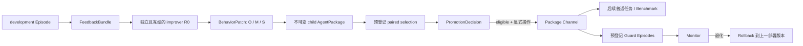

# P3 反馈驱动 AgentPackage 演化控制面

日期：2026-09-21
状态：工程控制面与内置参考 R0 已实现；真实模型候选的独立效果与统计 RSI 效益尚未建立。

## 1. 定位

Nexgent 是一个通用、可运行 benchmark 的 RSI task-agent framework。它的核心对象是能执行普通任务和 benchmark 的版本化 `AgentPackage`，核心职责是任务编排、能力准入、证据记录、反馈驱动候选、独立门控、部署与回滚。

科学发现、OpenFOAM、WorkBench 和 BBH 是独立插件或 demo。它们可以提供任务、工具、数据、环境和 evaluator，但不能定义核心如何生成候选、如何晋升或何时回滚。OpenFOAM 的真实 smoke 证明插件可接入通用运行器；它不是 Nexgent 的默认任务，也不是 RSI 效益证据。

P3 的目标是建立有限、可审计且可证伪的行为改进闭环：固定改进器 `R0` 根据真实开发反馈提出任务 agent 的行为变更，候选必须经过独立选择才可能进入后续任务。P3 不让 `R0` 改写自己。P4 才比较可更新的改进策略 `R`。

## 2. 当前闭环



可信宿主拥有反馈边界、补丁校验、benchmark/evaluator identity、预算核算、PromotionPolicy、channel 指针和 rollback。模型包只能在授权的任务执行面内运行，不能修改这些控制对象。

## 3. 更新对象与冻结对象

P3 把任务 agent 的可变行为面划分为：

| 类别 | 含义 | 例子 |
| --- | --- | --- |
| `O` | orchestration | 任务分解、角色交接、执行顺序、完成条件 |
| `M` | memory policy | 写入、检索、冲突处理、过期和消费策略 |
| `S` | skill / prompt protocol | 工具前后检查、工件发布协议、审阅与修订步骤 |

一个 `BehaviorPatch` 必须声明失败机制、预期行为、适用范围、可证伪条件、有限操作和激活探针。manifest v2 使用 BehaviorPatch v2：mutation policy 只列稳定 component id，宿主从父 manifest 解析 O/S class、kind、ref 与唯一文件，hypothesis/operation/probe 必须使用同一 id。manifest v1 保留明确标记的 path-v1 兼容合同。两者都按旧 digest 验证并从父包确定性构造完整 child；当前 v2 只允许单文件 replace，M 另行路由。

P3 冻结：

- 独立 improver package、`improve` entry 和完整包组件摘要；
- FeedbackBundle schema、BehaviorPatch v1/v2 schema、mutable path 或 stable component id、操作类型和大小上限；
- task sampler、split/seed、父子运行顺序规则、benchmark/evaluator snapshot；
- PromotionPolicy、guard plan、monitor 阈值和 rollback 实现；
- 可重算的 execution environment、工具描述、运行时实现摘要、任务预算和 candidate-generation 预算。provider/model 的预登记目标属于实验协议；实际身份由每次模型调用 receipt 证明，当前 plan 不声称在调用前完整冻结二者。

候选不得修改 evaluator、hidden answer、gate、权限、预算计账、manifest 控制字段或宿主控制代码。若 task agent 自身存在 `improve` entry，候选 admission 也要求该 entry 和入口文件保持不变。

## 4. 数据对象与不可变记录

| 对象 | 主要内容 | 作用 |
| --- | --- | --- |
| `FeedbackBundle` | channel revision、active parent、development Episode refs、公开评价指标、usage/artifact/event/memory digest | 证明提案来自真实、允许写回的反馈 |
| candidate generation | feedback、R0 identity/closure、mutation policy、improver Episode、patch digest 或 missing reason | 区分真实生成、失败和缺测 |
| candidate | parent/child identity、hypothesis、component delta/class、activation probe、evidence digest | 固定要检验的因果主张 |
| paired `TrialPlan` | suite、task refs、split role、snapshot、budget、policy、execution environment/tool/runtime snapshot、arm schedule、digest | 结果出现前冻结宿主可验证的比较协议；provider/model 由逐调用 receipt 证明 |
| paired trial | 父子 Episode、共同 memory seed、交错 arm order、评价与 usage | 保存完整配对及实际执行证据 |
| decision | 每任务 delta、缺测原因、质量/成功率/成本/回归/激活 gates | 将测量与是否 eligible 分开 |
| monitor plan | 独立 guard tasks、evaluator snapshot、budget、package identity | promotion 必需；在部署前冻结完整、一次性消费的监测任务多重集 |
| channel state | active package/digest、revision、promotion refs | 供后续任务原子解析部署版本 |
| hash-linked event | sequence、kind、previous digest、content digest | 提供候选到回滚的追加式审计链 |
| mechanism evidence | 已闭合记录 refs、digests、usage、gates、paired measurements、部署/回滚 Episode refs | 以脱敏、可重算形式导出机制证据；固定声明不包含统计效益 |

这些记录在 SQLite 中按内容摘要核验，已有 identity 不允许用不同内容覆盖。archive 保存失败、rejected、missing 和 eligible 分支；channel 只保存当前部署指针。研究 archive 不会自动选择部署版本。

## 5. 反馈与候选生成

`GenerationService.capture_feedback(channel, episode_ids, expected_revision)` 只接受：

- 当前本地存储中的真实 Episode；
- `completed` 或 `failed` 终态；
- task context 与 benchmark task ref 均明确属于 development；
- package id/digest 与当前 channel active parent 一致；
- 未超过事件、工件和 identity 数量边界。

FeedbackBundle 不把 task context、evaluator 私有诊断或答案直接传给 improver。它保留任务与私有 context digest、有限公开指标、工件引用和执行证据摘要，从而既绑定真实反馈，又缩小信息泄漏面。

`GenerationService.generate(...)` 要求独立版本化的 improver package 注册 `improve` entry。它通过普通 `TaskService` 和有界预算执行，不能获得工具权限，只能发布一个符合 schema 的 `behavior_patch` 工件。宿主随后验证执行 entry、loaded module、工件 producer、patch schema、stable component identity、旧摘要、patch 大小和激活探针，再构造并 admission child 包。v2 child 必须保留完整父 manifest，候选不能借 manifest 重定向组件或把 v1 谱系升级成 v2。

CLI 在未指定 improver 来源时加载框架内置 reference R0（`builtin:reference-os-v1` 仍是兼容入口名）。它读取有界、脱敏的 FeedbackBundle 与宿主归一化 mutation policy，通过 `rsi_improver` 产生声明式 patch；legacy policy 输出 v1，manifest component policy 输出 v2。v2 在 R0 内再次核验 descriptor 的 class/kind/ref/files，并拒绝 path/class 注入。源包没有 OpenFOAM、科学发现、Workbench 或其他 benchmark 分支。两条合同都限制为一个现有 O/S 组件的一次 `replace`，不修改 M、不增删文件，也不接触 evaluator、manifest、权限、gate 或宿主代码。

另外两种来源保持显式：`--improver-package` 接受调用方冻结的独立 R0；`--improver-channel` 与 `--expected-improver-revision` 从 P4 的独立 R channel 原子解析已部署 R。三种来源最终经过同一 `GenerationService`、补丁校验和 generation receipt，不改变可信宿主的门控职责。builtin 是可运行的参考实现，不是被框架硬编码的唯一改进算法。

provider 中断、预算耗尽、无交付、closure 缺失、非法补丁、并发 channel revision 变化等情况会形成持久的 `candidate_generation_missing`，不会被伪装为候选或零分结果。

`EvolutionService.propose(...)` 仍可 admission 外部构造的 child，用于低层合同、研究比较或受控导入；它同样要求非空 hypothesis、本地非 holdout 反馈、有效父子谱系、真实 component delta、冻结 improve entry 和 O/M/S 分类。其 `origin="imported"` 记录只进入研究/archive，没有 deployment authority。promotion 必须反查 `origin="generated"` candidate 的不可变 generation record，并闭合 FeedbackBundle、实际 R0 improver Episode、usage 和 patch receipt。

## 6. 配对选择与晋升

`plan_pair(...)` 在父子运行前冻结：benchmark id/snapshot、task rows、split role、seed/options、预算、`PromotionPolicy`、arm schedule，以及可重算的 Python/platform、TaskService 实现、gateway 类和工具描述快照。`run_pair(...)` 为每个 task ref 先创建父子 Episode，使二者获得同一初始 memory seed；再按冻结 schedule 交错 `parent→candidate` 与 `candidate→parent`，并在每个 arm 前后复核 evaluator 和 execution-environment snapshot。provider/model 不是由 plan 对象预先完整冻结，而由每次调用 receipt 证明；研究协议若要求固定 provider/model，必须核验所有 receipt 与预登记值一致。

允许的 trial role 是 `development`、`selection` 和 `guard`。final holdout 被拒绝。development 可以帮助诊断，但其 decision 永远不能 eligible；日常 promotion 只能使用 selection。

`assess(...)` 对每个完整配对分别检查：

- score 是否明确 available、有限且父子都有；
- accepted 是否为布尔值；
- execution error 与 usage 是否完整；
- candidate 相对 parent 的 score delta；
- 父代通过而候选失败或下降的 regression；
- 成功率、normalized work unit 的绝对/相对值和行为激活探针。

缺分、非法分数、缺 acceptance、usage 不完整或执行错误都会进入 failure reasons，并使 `measurement_complete` 失败。系统不会删除 candidate 缺测行后重新计算一个看似更好的均值。这里的 `cost` 是由模型调用、charged completion tokens、工具调用和节点构成的透明 normalized work unit；原始 usage 同时保留，但该数值不是供应商货币费用。

`eligible` 只是不可变 decision。`promote(candidate_id, decision_id, monitor_plan_id=...)` 是单独宿主操作，`monitor_plan_id` 必填；它还要验证 candidate 来自闭合的实际 R0 generation record，再检查 candidate/decision identity、包谱系、monitor plan identity 和 active parent。channel 更新使用 compare-and-swap，陈旧候选不能覆盖已经变化的部署。普通任务只在 `TaskService.create(..., package_channel=...)` 时解析一次 package id/digest/revision，之后不会被中途 channel 变化污染。

## 7. Guard monitor 与 rollback

`plan_monitor(...)` 必须在 promotion 前冻结非 development、非 selection、非 holdout 的 guard split、task rows、evaluator snapshot、package 和预算。promotion 同时冻结 decision policy 和 `monitor_min_score` / `monitor_min_success_rate`。

`run_monitor(...)` 只运行 active promotion 所引用的 plan，并在运行时重新核对 adapter、snapshot、package 和 plan digest。该 plan 由宿主原子领取且只能成功消费一次；重复请求返回同一不可变 monitor-run record 或被拒绝，不能追加样本后重新挑选结果。`monitor(...)` 要求提交 Episode 精确覆盖 plan 的完整 task 多重集，缺项和额外重复均 fail closed；它只接受本地真实 Episode，并验证：

- Episode 使用当前 channel revision 的 package id/digest；
- task context 带正确 monitor plan、task ref 和 `split_role=monitoring`；
- evaluation receipt 与冻结 evaluator/task identity 相符；
- score、accepted 和 usage 满足完整性要求。

缺测本身是退化，不能被解释为安全通过。达到预登记退化条件时，rollback 沿 promotion 记录中的部署边回到上一版本，只移动 channel 指针；候选、decision、trial、任务、工件和审计事件全部保留。在途 Episode 仍绑定创建时版本，回滚只影响之后创建的新 Episode。

## 8. CLI 与 GUI

当前 CLI 把 channel 接到普通任务与 benchmark，提供只读审计投影，并以独立命令暴露受门控的逐步写操作：

```powershell
# 使用 active channel package；与 --package 互斥
python -m nexgent task "完成目标" --package-channel general
python -m nexgent task-benchmark workbench --split selection --seed 19 --package-channel general

# 部署身份与事件摘要
python -m nexgent rsi-status general
python -m nexgent rsi-events general --limit 50

# 完整参数和顺序见 docs/operations.md
python -m nexgent rsi-feedback general EPISODE_ID --expected-revision 0
python -m nexgent rsi-generate general FEEDBACK_ID --mutation-policy examples/rsi/reference-os-mutation-policy.json --expected-revision 0
# 或显式选择冻结包 / 独立 R channel
python -m nexgent rsi-generate general FEEDBACK_ID --improver-package improver.json --mutation-policy mutation-policy.json --expected-revision 0
python -m nexgent rsi-generate general FEEDBACK_ID --improver-channel recursive --expected-improver-revision 0 --mutation-policy mutation-policy.json --expected-revision 0
python -m nexgent rsi-plan CANDIDATE_ID workbench --policy promotion-policy.json
python -m nexgent rsi-run-plan PLAN_ID workbench
python -m nexgent rsi-assess TRIAL_ID
python -m nexgent rsi-plan-monitor CANDIDATE_ID workbench
python -m nexgent rsi-promote CANDIDATE_ID DECISION_ID MONITOR_PLAN_ID
```

默认 GUI 的“RSI 与版本”页展示 active package id/digest、revision、promotion refs 和最近事件。`evolution_view` 对不同 event kind 使用固定字段白名单；AgentPackage 文件、FeedbackBundle 正文、private task payload 和 evaluator 实现不进入界面。

CLI 和 Python API 都按 FeedbackBundle、generation、TrialPlan、decision、monitor plan、promotion、monitor 与 rollback 分步执行。GUI 保持只读，没有把这些对象压缩成无法审查的“一键进化”。后续若增加 GUI 写按钮，也必须保持相同的权限和审计合同，不能绕过 gate。

## 9. 三种证据等级

| 等级 | 能证明什么 | 当前状态 |
| --- | --- | --- |
| mechanism proof | 身份、不可变记录、反馈边界、补丁准入、paired plan、fail-closed decision、CAS promotion、channel 加载、monitor/rollback 合同可执行 | 固定无模型 fixture 已闭合整条链；内置 `reference-os-v1` 及其单文件 O/S 边界已有工程合同，不涉及真实模型能力结论 |
| 真实模型行为证据 | 冻结 R0 实际读取 FeedbackBundle、产生合法 patch；candidate 在真实 provider Episode 中加载并激活预期行为；selection/guard 有真实 evaluator receipt | 正向 E1 exporter 与一次性 qualification runner 已实现并通过伪造反例审计；真实 MiMo generation 尚待外部 payload 导出授权，因而完整成功链仍未形成 |
| 统计 RSI 效益 | 在预登记多任务族、重复、对照和完整缺测报告下，候选或改进过程产生可估计、可复核的质量/成功率/成本改善 | 尚未执行；不能由单候选、单 demo 或机制测试替代 |

“候选生成成功”“包被晋升”和“RSI 有效”是三个不同命题。即使完整控制面工作正常，真实实验也可以得到零增益、负增益或全部 missing；这些都应作为结果保留，而不是降低门槛直到出现正数。

## 10. P3、P4 与最终研究的边界

P3 固定 `R0`，只改变 task agent 的 O/M/S。它回答：给定固定改进方法，Nexgent 能否从真实反馈提出受限行为变更，并通过独立门控安全地持久部署？

P4 才允许 `R` 的诊断、候选生成、archive parent selection、实验选择和预算分配成为变异对象。P4 的比较单位必须是两版冻结 R 从共同 task-agent parent、共同 feedback、同一 provider/model 和总预算出发后，在未写回 selection 上产生的后代效用，而不是 R 的自述或源码 diff。

最终统计主张还需要 P5：冻结 commit、任务族、重复、对照、费用口径和 holdout；报告所有候选与缺测；区分域内泛化、跨 benchmark 迁移和长期递归效用。OpenFOAM 可作为一个独立工具型 guard/demo，但不能单独承担通用 RSI 结论。

研究方法、论文映射、可证伪假设和最小试验见[P3 跨任务 RSI 研究设计](../research/p3-cross-task-rsi-design-20260920.md)。操作入口见[任务运行与恢复](../operations.md)。
