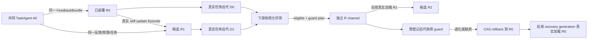

# P4 递归改进器控制面

日期：2026-09-20
状态：确定性机制闭环与可恢复 cycle 已实现；真实模型行为与统计递归效益尚未建立。

## 1. 定位与研究结论

Nexgent 的产品对象是通用任务智能体系统，不是代码修改 harness。任务智能体 `A` 执行普通任务和 benchmark；改进器 `R` 根据受限反馈产生新的 `A`。P4 进一步允许当前 `R0` 修改自己的 `improve` 行为，形成候选 `R1`，并用 `R0/R1` 实际产生的任务智能体后代效用决定是否部署。

这一设计综合了现有方法中不同层级的结论：

- AutoSci 的核心启发是让记忆、技能协议和编排图成为可持久更新、会被后续任务消费的行为载体；写入变化本身不等于效果成立。
- ADAS 与 AFlow 表明固定搜索器也可以发现有效 agent/workflow，它们是合理基线，不是递归改进证据。
- STOP 最接近本阶段的元效用定义：评价 improver 的依据是它改善下游程序后的结果，而不是 improver 对自己的评分。
- DGM 表明开放式 archive 与分支保留有价值，但其固定外层选择器不能自动算作一同自改。
- Hyperagents 强调冻结更新前后的 meta-agent，从共同任务起点、共同资源下比较其后代生成能力。

详细论文方法、限制和链接见[编排与 RSI 文献综合](../research/agent-orchestration-rsi-synthesis-20260916.md)。P4 落地的是其中最小可证伪机制，不声称提出上述概念，也不声称已经观察到真实模型递归提升。

## 2. 版本对象与信任边界



任务包与改进器包使用两套独立表、channel 和事件链。即使名称相同，也不能跨命名空间解析：

- task-agent channel 决定普通任务与 benchmark 加载哪个 `A`；
- improver channel 决定候选生成加载哪个 `R`；
- archive 保存全部候选、失败和分支；channel 只保存当前部署指针。

可信宿主固定并执行评价器、任务多重集、预算账本、能力边界、补丁验证、晋升门、guard 和 rollback。`R` 只能读取公开反馈和获准的自身组件，不能修改 manifest、benchmark、hidden answer、provider 凭据、权限、预算核算或宿主控制面。

## 3. R 的真实自更新

`ImproverService.register(...)` 登记 `R0`，冻结：

- `improve` entry 的路径和函数；
- 允许改变的实现文件；
- 允许的 replace/add/remove 操作与 patch 大小；
- 外层模型、token、工具和节点上限；
- 内置能力与副作用包络。当前递归 improver 不获得工具或外部副作用权限。

`capture_feedback(...)` 只接受当前 active R 实际产生的 P3 task-candidate generation，以及这些候选的独立 task-agent decision。私有 evaluator 内容不会进入 meta feedback。

`generate_candidate(...)` 使用当前 active R 作为真实 TaskService package，并调用其 `improve` entry。R 发布声明式 `ImproverPatch`；宿主校验 artifact producer、实际 execution package、loaded module、完整 usage、旧组件摘要、冻结入口和能力包络，再构造 R 的直接子代。手工导入的包没有这条 generation closure，因此不能取得部署权限。

晋升时会再次闭合 generation、candidate、archive version、本地 Episode、父子谱系和补丁记录，避免只信任首次 admission 时的结论。

## 4. 真实下游元评测

`MetaEvaluationService` 只接受同一个内置 `TaskMetaExecutor` 的两个绑定方法。它不能接收任意试验代码伪造 package 或 score。执行器实际调用：

1. `GenerationService.generate(...)` 运行冻结的 R0 或 R1；
2. 从本地不可变 generation/candidate/package/Episode 记录反查直接后代；
3. 为每个冻结 task ref 创建新的 TaskService Episode；
4. 运行后代 package，并用冻结 benchmark adapter 和 snapshot 评价；
5. 核对 `benchmark_evaluated` 事件、package identity、usage 和 provider/model receipt。

Meta plan 在执行前冻结共同 `A0`、同一 FeedbackBundle、task mutation policy、R0/R1、provider/model 要求、空 memory 起点、development/selection task、交错顺序、总预算和 host policy。当前显式只支持空 memory 起点，避免把尚未实际注入的 memory 描述伪装成共同起点。

每个 arm 先产生规定数量的真实后代，在 development 任务上选优，再在不写回的 selection 任务上比较。判定只使用后代的平均效用、成功率、回归和透明工作量；成本使用实际 charged completion tokens，而不是模型返回的低估值或名义 token 上限。缺测、非法 receipt、预算越界和 usage 不完整都会使测量失败。

Meta plan 只能消费一次；重复运行返回同一 trial，不产生新 Episode。这防止看到结果后追加样本或重抽一次更有利的运行。

## 5. 部署、通道加载与自动回滚

`ImproverService.promote(...)` 同时要求：

- 候选来自当前 active R 的真实 self-update；
- meta decision 精确绑定候选，且所有规定 gate 为真；
- guard plan 已在部署前登记、未消费并精确绑定该候选；
- expected revision、父 R 和冻结能力包络仍一致。

部署采用 compare-and-swap。之后的 task-candidate generation 可指定 `improver_channel` 与 expected revision；`GenerationService` 把解析到的 R id/digest/revision 写入 host-owned Episode context，运行结束前再次解析通道，发现 promotion/rollback 并发变化则保存 missing，不接纳候选。

`ImproverGuardService.run(...)` 只消费一次 plan。它必须从已部署 R channel 真实生成一个 task-agent 后代，再在冻结 guard task 多重集上真实执行与评价。任务缺失、Episode 重用、registration 不符、usage 不完整、平均效用或成功率低于阈值都会判为退化，并沿 promotion 保存的精确部署边 CAS rollback。run record、回滚、action、事件和 claim 完成状态在同一个数据库事务内提交；执行中持续刷新 3600 秒租约，进程终止且租约过期后，下次调用生成明确的缺测 run 并 fail closed 回滚。当前已部署版本的 guard 未完成并通过前，宿主拒绝继续晋升下一代 R。

回滚移动 R channel 指针，不删除 R1、R2、trial 或失败记录。回滚后的 recovery generation 必须以新 revision 再次通过 channel 实际执行 R0；仅读取指针不构成“R0 已重新加载”的证据。

## 6. 可恢复 cycle 与 durable admission

`RecursiveImproverCycleService` 冻结 R channel revision、共同 A0 与 task channel revision、两个 FeedbackBundle、任务集、adapter snapshot、provider/model、预算、meta policy 与 guard 阈值。状态机依次持久化 feedback、self-generation、meta plan/run/assessment、decision、guard plan、promotion 和 guard/rollback 的不可变引用。

每个阶段先登记唯一 action。R self-generation 的 invocation 与 action 在同一 SQLite 事务中预留，另有不进入公开投影的 claim token；重复或复制 invocation 不能创建第二个 Episode。terminal generation record、claim 完成状态与 event 原子提交，恢复直接从 claim 定位唯一证据，不按相似字段扫描全表。

Meta 与 guard 的每个外部边界都执行 admission check：TaskAgent generation 的 create/run、recursive R generation 的 create/run，以及 descendant evaluation 的 create/run/evaluate。检查重新加载 cycle action、R channel 与 A0 channel；漂移抛出 `AdmissionConflict` 并越过普通测量失败捕获，不写 trial、guard action 或 rollback。进入 `completed`/`rolled_back` 时，terminal status、evidence refs、`pending_action=None` 和 runner token 清理在同一 CAS 写入。

公开 `show` 只返回固定字段与标量类型；package source、任务正文、evaluator、policy、claim token 和嵌套任意对象都不会随未来私有字段自动暴露。`recover(confirm_no_external_commit=True)` 只用于宿主无法证明某个 running action 是否已经产生外部提交的场景；已闭合 claim 会被重用，不重放 Episode。

## 7. 确定性机制 pilot 的结果

`tests/test_recursive_improver_pilot.py` 使用无模型、无网络、无工具的完整真实控制面：

1. `A0` 下游效用为 `0.0`；
2. active `R0` 产生 `D0`，效用 `0.4`；
3. `R0` 根据真实 generation/decision feedback 修改自身，产生直接子代 `R1`；
4. R0/R1 从同一 A0、同一 FeedbackBundle 和相同预算分别真实产生 D0/D1；
5. selection 效用为 `0.4/0.8`，host meta gate 选择 R1；
6. R1 经独立 improver channel 部署，后续 generation receipt 证明实际加载 R1；
7. active R1 再次真实自更新产生 archive 中的 R2，但不部署 R2；
8. 预登记 guard 要求平均效用至少 `0.9`，R1 后代实测 `0.8`，自动回滚到 R0；
9. 新 revision 的 recovery generation 证明实际重新加载 R0；
10. meta plan 和 guard plan 重放均不增加 Episode。

`build_recursive_improver_evidence(...)` 会重新闭合上述不可变记录，只导出 package/episode/plan/decision/guard 的 identity、digest、聚合测量、usage 和事件链；package 源码、任务正文和 evaluator 私有 canary 不进入结果。

这证明递归版本、实际执行、下游元效用、部署、下一代自更新和退化回滚机制闭合。分数来自确定性 fixture，不能证明真实模型下 R1 优于 R0，也不能证明持续改进、加速增长或跨任务泛化。

## 8. 产品入口

普通任务和 benchmark 继续使用 task-agent channel：

```powershell
python -m nexgent task "完成目标" --package-channel general
python -m nexgent task-benchmark workbench --package-channel general
```

递归改进器有独立通道状态和可恢复 cycle 入口：

```powershell
python -m nexgent rsi-improver-status recursive
python -m nexgent rsi-improver-events recursive --limit 50
python -m nexgent rsi-improver-cycle-start workbench --spec recursive-cycle.json --register-only
python -m nexgent rsi-improver-cycle-resume RECURSIVE_CYCLE_ID workbench
python -m nexgent rsi-improver-cycle-show RECURSIVE_CYCLE_ID workbench
python -m nexgent rsi-improver-cycle-recover RECURSIVE_CYCLE_ID workbench
```

start 的 JSON spec 必须显式给出 R/A0 revision、task feedback、generation/decision evidence、development/selection/guard 任务、provider/model、预算和门槛。CLI 只推进同一持久状态机，并不绕过其中任何门控。GUI 的“RSI 与版本”信息窗继续显示 task-agent channel 和 recursive-improver channel 的脱敏状态。

## 9. 尚未完成的研究

P4 机制实现之后，仍需单独预登记真实研究：

- 使用固定 provider/model，并逐调用核验 receipt；
- 多个独立 task family、重复和固定总资源；
- 固定 R、更多采样、P3 O/M/S 更新和可更新 R 的对照；
- development 选优与未写回 selection/holdout 分离；
- 报告全部失败、缺测、质量、成功率、charged work 和回归；
- 检验 R1 的后代生成能力是否在未见任务上稳定提高。

OpenFOAM 可以作为一个外部工具型 demo 或 task family。它不进入上述核心对象，也不能单独承担通用 RSI 结论。
