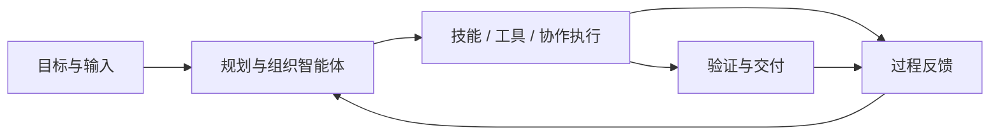
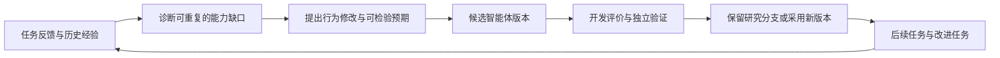

# Nexgent 定位与重构决策

初版：2026-09-16；界面决策：2026-09-22；能力内核修订：2026-09-23。**当前目标以 [RSI 能力内核](rsi-capability-kernel.md) 为准，实施顺序与当前证据见 [仓库计划](../../REFACTOR_PLAN.md)。** 下文的产品边界继续有效，0.8 判断及旧阶段记录按历史解释；新内核、工具／插件开发和真实收益尚未完成。

## 1. 不变的产品要求

> nexgent才是RSI的智能体框架，demo是来证明的！！！nexgent本质上应该是能跑benchmark的框架级智能体架构，你不能这样耦合；目的是这个框架，不是对demo特化

**Nexgent 是在任务执行中开发和改进工具、插件、技能及执行策略，并通过独立任务检验和保留有效变化的通用 RSI 智能体框架。**

通用内核不内置领域阶段或固定角色，任务、记忆和版本通过显式存储管理。可进化对象包括工具／服务插件、技能、上下文／记忆策略、执行循环、协作程序及改进策略。DAG、团队和代码编排是可替换的执行方式；内核后端经等价小样后决定。完整边界见[能力内核决策](rsi-capability-kernel.md)，[无状态说明](stateless-kernel-and-self-designed-teams.md)只解释状态边界。

OpenFOAM 是下一项独立 demo 的执行环境。流体方程、case、求解器、网格、物理判据、参考数据和领域角色都在插件中。科学研究的五阶段流程也不是核心的默认任务定义。移除所有 CFD 插件以后，核心仍应能执行普通任务和其他 benchmark。

用户提供目标、输入和资源约束，通过信息窗口理解进展、交付物、失败与改进。运行器、工具、记忆和恢复机制是内部能力，不能因为不再暴露 code harness 界面而删掉完整任务执行能力。

产品入口采用 **Main 对话优先**：用户先用自然语言说明目标，系统在后台创建 Episode 并组织智能体；运行、成果、证据和项目记忆通过侧栏与可展开信息窗口查看。原始 JSON 合同、预算、工具授权和 RSI 版本保留在高级控制台与 RSI Lab，不作为首屏表单。具体交互决策见 [主对话与信息窗口设计](main-conversation-interface.md)。

## 2. 对 0.8 的重新判断

0.8 是已有的源码自修改与评测基础，不是本次架构目标的完成版本。它实现了领域插件分离、源码版本、实际 solve/improve 进程、配对评价、预算和信息窗口；这些可复用，但不能代表多智能体架构已有效演化。

| 已核实事实 | 重构判断 |
| --- | --- |
| 多角色调用主要发生在研究和修源码阶段；v2 记录中任务 solve 的模型 RPC 为零 | 先建立真正完成任务的智能体执行路径，再评价协作改进 |
| 源码包限定四个文件；元研究分支冻结 workflow 和 roles | 四文件作为旧协议读取，不再定义新框架的行为搜索空间 |
| 源码身份、账本和评测设施比任务技能、协作和记忆更完整 | 执行主体优先；证据设施服务于主体，不继续成为产品中心 |
| 新旧改进器在实际比较中调用同一个普通研究流程 | 新实验必须确认被检验的差异在任务执行中真正生效 |
| 5 个实际任务后代，3 个独立配对收益均为零 | 保留负结果；它们没有检验本次完整编排路线，也不能改写成成功 |

依据：[0.8 架构快照](../architecture-0.8.md)、[实际编排](../../src/nexgent/agents/seed.py)、[源码范围](../../src/nexgent/kernel/programs.py)、[v2 机制审查](../research/framework-mechanism-v2-review.md)。原始模型实验已结束，本轮文档不修改或重跑它们。

## 3. 三层能力与两条循环

### 3.1 三层能力

| 层次 | 行为 | 验证对象 |
| --- | --- | --- |
| 任务内自适应 | 根据中间结果调整分工、调用、验证、重试与停止 | 当前 episode 的真实执行轨迹和交付质量 |
| 跨任务持久改进 | 把可靠反馈转成技能、编排、工具策略或记忆策略的新版本，后续任务实际使用 | 新旧版本在独立任务上的效果、成本及回归 |
| 改进过程的递归更新 | 提出、诊断和检验修改的过程也由可更新的智能体能力执行，并可被修改 | 新旧改进策略在相同任务起点和预算下产生后续改进的能力 |

固定优化器的架构搜索可以有价值；其结果不能自动称为优化器自身变强。每代保持成熟的改进策略也不是失败。RSI 验收不以某个文件是否变化为标准，不要求每一代都修改 meta。

### 3.2 任务循环

这是框架的主路径。普通任务不必先注册为 benchmark；benchmark 适配器把受控任务交给同一执行器并持有独立评价。

### 3.3 跨任务改进循环

修改应影响具体行为，例如哪些证据交给哪个角色、何时创建验证分支、怎样选择工具、怎样整理和检索经验。表示形式可以是技能协议、工作流图、提示或代码模块；修改必须被后续执行消费。只增加日志、重命名角色或保存未加载的文件均不足以证明行为改进。

## 4. 固定的架构决策

| 决策 | 约束与原因 |
| --- | --- |
| D01：以完整任务执行为主体 | 任务 agent 真实组织模型、工具与成果交付；不能只让多个角色替一个算法函数写补丁 |
| D02：显式、可继承的行为包 | 包含技能、角色/操作组件、协作策略、记忆策略、工具适配和改进策略；模块可扩展，旧四文件仅兼容读取 |
| D03：声明式图与代码扩展并用 | 图便于说明角色、依赖和执行差异；代码承载算法与复杂控制。节点、数据依赖和有界循环语义须一致，不规定一套固定角色链 |
| D04：记忆服务于未来决策 | 区分当前任务状态、可复用知识、经验以及记忆管理策略；事件账本不是记忆系统的替代品 |
| D05：同一能力体系承担自改进任务 | 诊断和验证修改也使用 AgentPackage、技能和运行器；避免另有永远写死的高层流程决定一切 |
| D06：宿主保持可信边界 | 权限、资源准入、原始证据、隐藏评价和停止由宿主掌握；不要求评分器与资源规则自修改 |
| D07：任务与评价解耦 | DomainPack 提供领域技能/工具；BenchmarkAdapter 提供任务分布和评价。二者独立于通用编排核心，也可以由同一可选插件分发 |
| D08：更新按证据采用 | 开发反馈允许用于改进；最终验证不反馈到同一冻结研究。研究档案保留失败，部署版本依据预登记规则选择 |
| D09：能力随任务需要配置 | 不要求每个任务必须多人协作，也不要求图越大越好。使用协作时须有真实节点执行、信息依赖和模型/工具调用 |

详细对象、执行边界、迁移表和验收见 [vNext 架构](agent-architecture-vnext.md)。上述名称是设计对象，不是当前已存在的 Python API。

## 5. 文献如何用于这次设计

DeepSeek Harness 提供插件服务、运行时扩展和事件轨迹的参考；AutoSci 提供技能、记忆与编排更新；ADAS/AFlow 提供完整 agent/workflow 的行为搜索；DGM 提供改进后智能体继续执行与探索档案；Hyperagents/STOP 提供改进过程可更新及后代效用检验。新增来源与落地验收见[能力内核决策](rsi-capability-kernel.md)。

不把这些机制重新命名成已获证明的原创算法。当前待检验的问题是：能否用任务失败归因来选择协作、记忆和技能的修改，并让其效果跨任务保留；改进策略本身是否具有可迁移的后代生成效用。等预算固定流程、只积累记忆、固定改进器和去掉目标机制等对照分别检验竞争解释。

具体方法、原文结果边界和可证伪条件见 [研究综合](../research/agent-orchestration-rsi-synthesis-20260916.md)。AutoSci 的 paper 分支和 arxiv-v1 标签需区分；论文主张、实际代码能力和我们拟采用的方法也分别说明。

## 6. OpenFOAM demo 的位置

选择 CPU 可执行、可做物理与网格验证的入门 CFD 场景作为首个完整任务示范，首选二维顶盖驱动方腔。场景细节、版本适配和物理参考全部由 [OpenFOAM demo 设计](../demos/openfoam-cfd-design.md) 定义；本机已核实状态单列 [环境记录](../demos/openfoam-environment-20260916.md)。

该 demo 的任务是由智能体完成 case 准备、运行、分析、验证、失败处理和可复核交付。求解器参数调整属于任务内行为；只有技能、协作或经验使用方式发生持久变化，并在后续任务实际生效，才进入框架改进结论。

必须同时保留一个非 CFD 的 benchmark 验证通用接入。OpenFOAM 多个 case 或 Reynolds 数变化只能支持 CFD 域内结论，不能单独证明跨领域通用性。已有 BBH 两任务的饱和静态基线可作兼容检查，不能作为新编排有效性的主要证据。

本机没有聚变相关环境，不把流体 demo 叙述为聚变、等离子体或多物理场验证。也不预设仿真结果一定构成科学发现；负结果和工程验证同样是有效交付物。

## 7. 重构完成与科研结论分别验收

1. **框架运行验收**：同一执行器完成真实任务与 benchmark；核心不导入领域插件；正常执行、失败恢复、交付和信息窗口可核查。
2. **行为更新验收**：修改后的技能/图/代码/记忆策略被下一任务实际使用；不是只出现文件差异。
3. **改进效果验收**：在冻结任务、版本与资源约束下报告质量、成功率、成本、回归与缺测；公开无效和退化结果。
4. **递归效用验收**：若声称改进策略变强，需实际运行两版改进策略产生后代并检验；不能由单个任务变好推导。
5. **创新验收**：相对文献和公平对照存在已执行、可归因的差异。当前尚未建立该结论。

工程出口不以必须出现正科研结果为前提；但负结果、未完成的能力和未获支持的假设必须明确呈现。不能把目标中尚未实现的完整任务执行或协作能力重新写成“不在范围内”后宣布重构完成。

## 8. 界面与产品形态决策

当前 `TaskWindow` 适合作为高级执行/证据控制台：它能显示节点、调用、工件、记忆、活动、RSI 版本和工具授权，但它把内部控制面放到了第一屏，缺少 Main 对话时间线。因此它不能作为 Nexgent 的默认产品入口。

依照用户要求的单一 Main 对话入口，Nexgent 默认启动 `MainWindow`。Main 对话与 TaskService 使用同一执行路径；OpenFOAM、scientific-discovery、BBH 和其他 benchmark 只通过插件提供任务与评价，不改变主界面或核心状态机。高级控制台仍然可打开，用于审计和研究，不再承担普通用户的第一步交互。

所有面向用户的品牌文本统一写作 `Nexgent`；`NEXGENT` 只作为环境变量、包兼容名和历史记录保留。

## 9. 本轮交付和文档优先级

2026-09-23 本轮交付为重新制定能力内核目标、现状对照、方法映射和阶段计划，并同步各文档入口。此次不实现新运行时，也不运行新的模型实验。旧 OpenFOAM 和 Main 决策保留各自范围，新能力与真实效果须依新计划逐项验收。

阅读优先级：用户不变要求 → 本决策中的产品边界 → [能力内核决策](rsi-capability-kernel.md)与[当前计划](../../REFACTOR_PLAN.md) → [0.9 架构合同](agent-architecture-vnext.md)及专题合同。历史运行记录对历史事实仍然有效；旧 P0–P5 完成标记和 DAG 优先解释不定义新阶段的完成状态。
