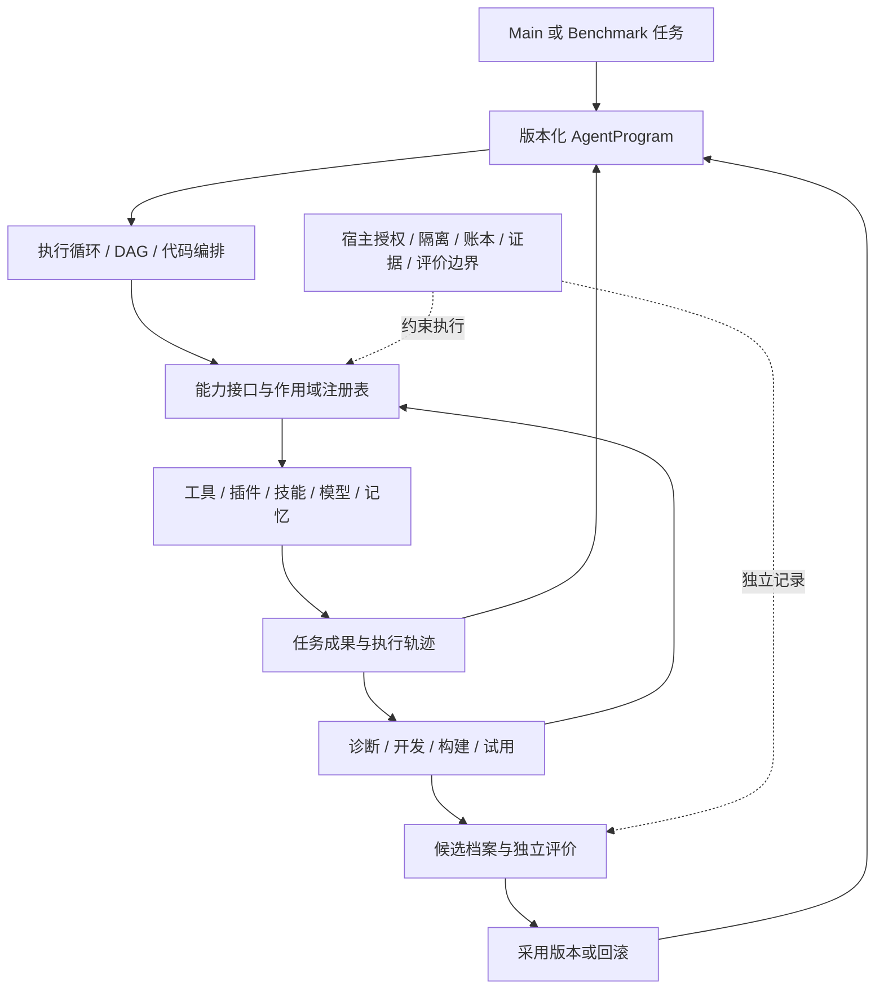

# Nexgent：RSI 能力内核与可演化执行系统

日期：2026-09-23。状态：**目标决策与验收合同，不是当前能力声明。内核后端待阶段 A 小样决定。** 实施顺序及现状以 [REFACTOR_PLAN.md](../../REFACTOR_PLAN.md) 为准；本文件替代以任务专一团队或 DAG 为中心的产品解释。

## 1. 产品能力与参考系统

Nexgent 为任务提供可组合的执行能力，并让模型在使用中开发、检验和改进它们。模型可以完成一次普通任务，也可以发现现有工具或策略的不足，实现一个新工具、插件、技能、编排程序或上下文策略；变化需在执行中被消费，持久采用则需独立任务评价。

[DeepSeek Harness](https://github.com/deepseek-ai/deepseek-harness/blob/master/docs/architecture.md)把服务接口、provider 实现和模型可调用工具分开，以插件承载模型、工具、会话、执行循环、存储等能力。插件作用域、依赖与卸载、事件轨迹、[Creator／插件管理入口](https://github.com/deepseek-ai/deepseek-harness/blob/master/packages/boot/plugin-manager/README.md)是内核参考。其可扩展能力并不自动证明更新获得了独立验证或产生了 RSI 收益。官方 API 仍在变化，接入前须冻结具体版本并实测。

[AutoSci 论文](https://arxiv.org/html/2605.31468)中的 SciFlow 将技能作为带输入、上下文、执行检查和交接的协议；SciDAG 描述算子图、条件路由与复用模板；SciEvolve 从反馈更新记忆、技能和模板。这为行为更新提供参考，但科研阶段不进入 Nexgent 核心。论文设计与发行代码需分别核查：已审查的 arxiv-v1 执行器尚无条件边路由，具体出处见[源码对照](agent-architecture-vnext.md#13-autosci-来源实现边界与借鉴范围)，不能把它称为已实现的能力。

[ADAS](https://arxiv.org/html/2408.08435)与[AFlow](https://arxiv.org/html/2410.10762)支持研究程序化智能体与工作流搜索；[RHI](https://arxiv.org/abs/2607.15524)和[HSI](https://arxiv.org/abs/2608.08466)提示上下文、信息流、执行循环与改进器自身也可以成为更新对象。采用前复核代码、实验设置和结论边界，不将论文主张转写成本地结果。

## 2. 稳定宿主与可变能力



稳定宿主管理身份、权限、凭据、资源准入、持久证据、停止和独立评价。执行策略不因位于“运行时”就自动变成永不可修改的核心。工具实现、子智能体管理策略、调度策略、上下文投影、记忆检索、执行循环和候选开发策略应有清晰的可替换接口。

无状态的要求限定于任务类型无关的状态转换与接口，不要求运行进程没有状态。会话、任务、消息、能力版本、工件和记忆均显式持久化；可恢复性来自存储与副作用收据，不依赖隐藏全局变量。Nexgent 不复制 Manyselves 的团队结构；[先前无状态文档](stateless-kernel-and-self-designed-teams.md)仅解释这一状态边界。

## 3. 统一能力对象

下列是待实现的语义对象，不是现有 API：

| 对象 | 必须表达的内容 |
| --- | --- |
| CapabilityDefinition | 身份与摘要、接口版本、能力类型、输入／输出、依赖、实现入口、效果和资源描述 |
| CapabilityInstance | 使用的定义版本、当前任务／会话作用域、实际授权、生命周期与健康状态 |
| AgentProgram | 所选执行策略、工具／插件／技能依赖、角色与交流、上下文／记忆策略；允许代码或图组合 |
| CapabilityChangeSet | 父版本、触发反馈、新增／修改／移除的对象与兼容关系、开发检查及适用条件 |
| CapabilityRelease | 经采用的依赖组合与版本、评价／晋升记录、实际加载证据和回滚目标 |

能力至少覆盖模型角色、工具／服务插件、受控技能、编排器和记忆适配。O/M/S/R 可以作为分析标签及兼容字段，不充当所有未来能力类型的封闭枚举。依赖解析必须在任务创建、加载和恢复时绑定实际版本，防止同名能力内容悄悄改变。

注册表需提供真实 inventory 和可检查接口。加载与卸载涉及模型工具 schema、provider 实例、事件订阅和依赖清理，不能只改 manifest 字符串或 Python 全局变量。任务内实例可以短暂存在；发布版本的定义和证据应在进程重启后仍可解析。

## 4. 能力开发的执行路径

任务代理可以调用普通开发能力：检查接口、读取／编辑源码、运行构建与公开检查、试装、调用、查看诊断及回滚。开发过程本身由同一模型／工具／任务运行体系执行；不预设一个永久不变的外部 developer 角色。

模型写出的工具／插件必须包含可构建的实现与依赖、接口及效果描述。试装后，运行器把它加入当前允许作用域的 inventory，模型能够重新发现并调用它；实际 handler／策略版本进入收据。构建成功不能替代真实调用，生成一个受限技能也不能自动算作通用插件开发。

当前 `package_worker.py` 使用受限 Python 与审计机制，明确不等同于 OS 文件系统容器。通用插件的文件、网络、进程及依赖执行需要在阶段 A 选定并验证的隔离环境内进行。已有授权能覆盖的作用域试验自动继续；新增外部效果、宿主全局安装或权限扩大单独判断。不能把候选源码直接加载成可信主进程处理器，也不能把所有插件永远限制成纯算术函数。

模型可写自测，宿主另提供公开开发检查与独立任务评价；模型不能通过改自己的测试或评价器获得晋升。接口诊断要给出实际字段、来源、可用 schema 与修复入口。优先增量代码／SDK 修改，避免强迫每次重发整份大 JSON。

## 5. 编排是可进化能力

AgentProgram 可采用直接执行、持续 agent loop、DAG、有界状态机或代码策略。它们通过同一能力接口调用模型、工具、技能和子任务，并共享停止、授权、资源、轨迹与恢复合同。

DAG 后端继续使用已有节点身份、控制／消息边和 pending 图修订。开放式执行后端需要持久输入队列、消息可见性和回合状态；代码后端需要可核查的能力调用与暂停边界。实现不同并不意味着另建不相容的账本或 benchmark 路径。

planner、router、上下文整理、任务分解和修复器均可被版本化替换。运行中的调用保持已准入版本；新的能力或策略用于随后工作，恢复时核查实际执行版本。模型的学习对象可以是一个工具，也可以是使用工具的方法、协作关系或决定何时停止的程序。

验收必须包含真实非 DAG 执行，以及至少一项基于中间反馈发生并被实际执行的策略变化。模型画出图、增加角色或在文本里说“重新规划”均不够。

## 6. 任务内试用与跨任务采用

```text
已存在能力 → 当前任务发现缺口 → 开发与试装 → 当前任务实际使用
                                       ↓
终态 development 反馈 → adoption intent → 候选与开发预检
                                         → 独立 selection
                                         → 预登记 guard / 版本采用
                                         → 新任务选择与调用 / 回滚
```

任务内尝试不要求每次都运行正式 benchmark；候选进入后续任务默认能力集前需要独立证据。演化协调器按已配置策略驱动流程、记住阶段与副作用身份，普通 Main 用户无需手工复制 candidate、trial 或 channel ID。

版本采用必须绑定被比较的父代、模型／环境、实际插件与工具依赖、评分和成本政策。新的普通任务在新进程中解析 adopted release，自行选择并调用其中能力；插件需留下 handler 身份，编排器需留下所用策略，技能需留下模块执行证据。跨任务复用范围依适用条件与评价数据报告，不从一次同类型任务推出普遍迁移。

记忆数据与策略可以独立更新；多个组件协同变化时，需要完整依赖组合与一致快照。实现不能继续把工具插件排除在候选之外，也不能把“记忆文件已保存”称为检索带来收益。

## 7. 递归与实验问题

第一项可证伪问题：在相同模型与资源条件下，自开发并实际调用的能力，是否提高未见任务完成率或减少工作量？冻结框架、额外思考／调用、仅记忆与完整系统用于区分竞争解释。

第二项问题：工具／插件、编排与上下文更新分别贡献什么，是否只是解决了模型接口的格式故障？记录开发失败和修复成本，并用对应消融识别实际激活的机制。

第三项问题：新版改进策略是否更有效地产生有用能力？R0/R1 从共同起点和资源产生后代，再评价后代；新 R 必须被后续开发实际使用。固定宿主、评价器和权限不被候选改写。

当前基线没有上述正向结论。确定性控制面、真实模型执行、跨任务独立效用和递归效用分别记账；论文报道的增益也不替代本机实验。

## 8. 当前资产的迁移与产品表现

保留 Episode、工件、调用账本、AgentPackage、ExecutablePlan、benchmark SDK 和选择／guard 服务的有效合同。阶段 A 确定直接抽取还是后端桥接；后续使用显式版本适配，历史证据只读保留。未提交诊断改动须独立审查，不自动算成此设计的实现。

界面围绕 Main、运行轨迹、能力清单、成果和版本变化呈现。能力开发要显示确切状态：提出、构建、试装、实际调用、候选、采用或回滚；其中任何状态都不能被统称“已进化”。UI 从真实事件投影，和 headless benchmark 使用同一任务身份。

首个产品验收不是固定 demo：真实模型在普通任务中开发并调用一个新工具／插件，随后经独立评价在新任务中复用；另外验证执行／编排策略本身可以替换。完整阶段和协作边界见[仓库计划](../../REFACTOR_PLAN.md)。
