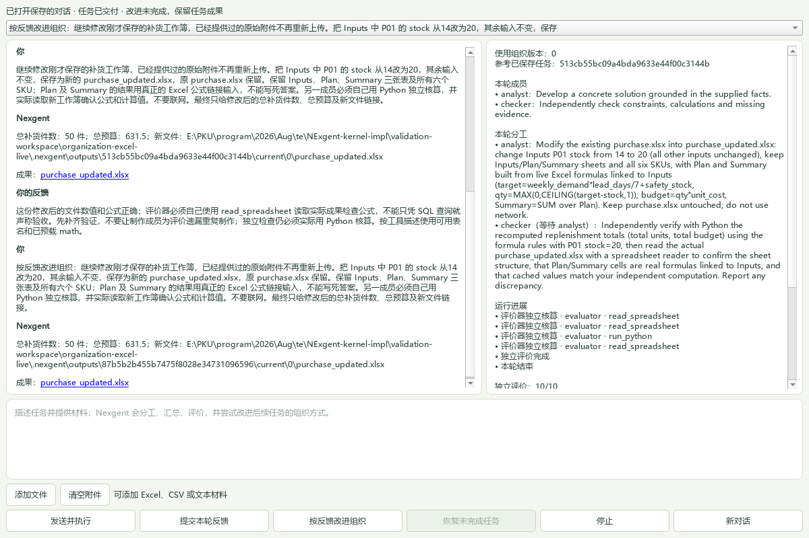
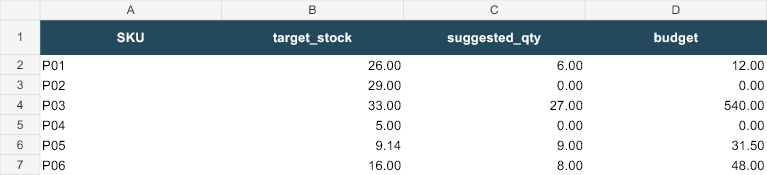

# Main 组织闭环（第一阶段）

普通入口：`nexgent run "任务"` 或 `nexgent-gui`。二者调用同一个
`OrganizationService`。模型配置沿用 `models.json` / `.env`；可用
`--model-root` 从已有工作区读取配置。GUI 使用 `--project` 选择任务工作区，
CLI 使用全局 `--root`。无需配置旧 RSI channel、PackagePatch 或 Episode 合同。

流程：负责人按成员职责分派 → 成员并行执行 → 共享发现并汇总 → 独立调用评价器
→ 改进者修改成员或工作规则 → 重跑候选 → 门控 → 保存组织版本 → 下一任务加载。
默认两名成员；改进者可调整为 1–4 名，并保存最多4项通用计算技能。
评价器和门控不属于可修改的组织数据。
`defaults.evaluator`、`defaults.improver` 可指定不同模型；未指定时沿用 subagent。

门控要求候选通过任务验收、分数不下降。所有比较任务均须满足质量与成本限制，
至少一项在验收、分数、调用数上有实测改善，或完整工作 tokens 降低至少20%；
等分情况下调用数不能增加。当前任务持平时可以依据历史任务的
实测改善采纳。没有不同历史任务且当前任务持平时拒绝，不以提案理由代替测量。
候选评价同时独立判断长期成员与规则是否可用于不同任务；任务专用角色、来源或
文件名不能写入通用组织。此项判断失败或缺失时保留任务成果，拒绝组织修改。
角色与规则在回归期间保持不变，回归复用该候选的可复用性判断，另行检查历史
任务质量和成本；不在每个历史任务上重复索取同一组织定义的通用性字段。
质量相同时调用数不能增加，实报 token 不超过父版的 1.25 倍；修复质量问题时允许
招聘成员，但调用数和 token 均不能超过父版的两倍。有历史成功任务时，
再在最近一项不同输入的任务上重新运行父版和候选检查回归（重复同题不充当回归任务）。
缺少 token 用量时不采纳。门控拒绝的原因会成为后续任务改进者的反馈。
改进失败保留已经完成的答案；并发任务只能更新自己读取的组织版本。
每项任务最多 96 次模型调用，每次输出最多 2400 tokens；改进和复评也计入总用量。

状态保存在工作区 `.nexgent/organization.sqlite3`。新进程自动读取已采纳的组织；
GUI 重启恢复最近对话，CLI 通过 `--conversation` 延续返回的 conversation_id。
运行结果包含使用版本、分工、成员发现、评价、候选、采纳结果和总调用量。

成员现在可以列出项目文件、读取 UTF-8 文件和公开网页、使用 SQLite 查询 CSV/Excel，
并生成文本或带公式的 Excel 成果。Main 用“添加文件”选择材料，CLI 用 `--attach PATH`。
选择材料时仅复制指定文件到 `.nexgent/inputs/<id>/`，不开放所在目录；每任务最多8个
附件，每个最多1 MB，支持 `.xlsx/.csv/.txt/.md/.json`。任务保存输入路径与内容摘要，
按反馈重跑与恢复使用原快照；同对话后续任务保留这些材料引用。
`read_spreadsheet` 返回工作表列表、指定范围的值和原公式；`query_spreadsheet` 用第一行
作为表头，通过现有 SQLite 只读查询核算；表名为 data，也可使用已选工作表名称。`write_spreadsheet` 根据工作表二维数据创建
可编辑的 `.xlsx`，以 formulas 计算公式，再由 XlsxWriter 保存公式及计算缓存；
openpyxl 负责读取。不实现自己的公式引擎。普通范围最多2000格，工作簿最多20000格；
标量公式可跨表引用，缺失工作表、循环、计算错误或不支持的公式不能生成伪结果。
读取不支持的源公式会明确标记缓存未重算，数值查询则失败；可读取原公式后用 Python 核算。
当前不支持宏、外部引用、命名区域、结构化引用和数组公式。
工具描述、参数与结果校验复用现有 ToolRegistry；不再引入新的图执行协议。
每名成员最多调用八次工具，工具错误返回给成员自行调整。纯文本任务仍可直接回答。
CSV 的表名是 `data`，表头作为 TEXT 列；数字计算显式 CAST。

成果保存在 `.nexgent/outputs/<run>/<current|candidate|regression_*>/<member>/`，
父版、候选和回归互不覆盖，也不修改项目源文件。Main 展示可打开的成果链接，
CLI 的 result.artifacts 返回实际路径，文本包含内容，Excel 包含文件摘要、大小和工作表信息。
评价器用只读工具打开真实 Excel 文件和源数据；二进制文件按实际内容摘要确认交付，
无需将工作簿伪装成 UTF-8 文本。评价同时接收实际工具调用结果。
文件读取限制在项目内，排除点目录、models.json 与依赖目录；单文件最多 1 MB，
文本返回最多 30000 字符；CSV 查询最多返回 200 行。成员可使用 run_python 进行受限 Python 计算；预载 math 兼容常见导入写法（在工具适配处转换，不改变执行器权限）；没有通用 shell、其他库导入或外部应用操作。
附件重放读取保存的输入快照；普通项目文件仍读取当前内容，并非全部输入都冻结，
不能解释为严格可重复实验。
成员交付后可以请求追加分工；负责人在汇总时也能依据实际缺口继续组织工作。
复用已有成员或招募新成员，仍由原有依赖调度与工具注册器执行，没有新增消息总线。
每项执行最多追加两轮、累计最多四名活跃成员，已有结果与成果传给后续成员；
同一成员再次执行使用新目录，保留前一轮文件。恢复按轮次与成员缓存工作和计划。
必要求助未解决或本轮要求的实际工具动作缺失时拒绝验收，不把上一轮工具调用
冒充新一轮执行。当前是在成员交付后继续组织，尚不支持打断正在执行的成员、
实时定向邮箱或自由长时运行。数值评价已经接入独立基础工具核算。

这是开发闭环，不是 held-out 实验：同一任务参与改进，历史任务也可能已被看过；
评价器是独立调用，默认不保证使用不同模型。分数和 token 比较只决定开发版本采纳，
不能证明通用 RSI 收益或实际费用节省。独立任务集、多次重复和完整价格核算后续补入。

## 2026-09-29 真实入口验证

真实 API 调用，无离线替身。原工作区模型配置没有修改；验证配置与数据库保存在
忽略的 `validation-workspace/organization-live/`，未将大批收据提交入库。

| 运行（ID 前缀） | 入口 / 模型 | 结果 |
| --- | --- | --- |
| `303de868` | CLI / MiMo v2.5 | 会议安排未通过评价；候选被拒，版本保持 0 |
| `f2b8ad05` | CLI / MiMo v2.5 | 午餐核算完成；改进者保持原组织 |
| `bd440996` | Main / MiMo v2.5 | 任务完成；回归成员返回对象答案，被原字符串检查拦住；已修复为保留结构化内容 |
| `0ce94082` | Main / MiMo v2.5 | 任务完成；回归遇到 90 秒服务超时，未采纳 |
| `dc0230f3` | Main / MiMo v2.6-flash | 任务完成；仅修改“少说话”的规则，没有减少实际调用，被门控拒绝 |
| `6d57db70` | Main / MiMo v2.6-flash | 改进者依据成员重复贡献与历史反馈，将 2 名成员精简为 1 名；自动采纳为版本 1 |
| `eb3bb84d` | 新进程 CLI / MiMo v2.6-flash | 自动读取版本 1，完成不同的三行待办整理，评价通过；改进者 abstain |

采纳任务：12 本笔记本，A 为每本 9 元加运费 8 元，B 为每本 10 元免运费，
预算 130 元。两臂均正确得到 A=116、B=120、剩余 14。父版执行 6 次调用、
2634 tokens；候选执行 3 次调用、1226 tokens；独立模型评价均为 10/10。
整轮学习（包括评价、提案和回归）实际用了 **24 次调用、11042 tokens**，
不能把执行部分的下降当作学习总成本已降低。

该次历史回归选中了较早的同题运行，因此只证明同题回放稳定，不能当独立泛化证据。
随后已修正历史选择，跳过重复输入；测试覆盖选择最近不同任务。
新进程文本整理通过，证明已采纳组织确实用于另一个任务，不证明普遍正迁移。

七次开发实跑合计 102 次调用、实报 45629 tokens；一次超时用量未知，token 总数
是不完整下界。所有失败与拒绝仍在本地数据库中保留。

PR #2 的旧回归同时做了小范围修复：模型分阶段后收据路径的消费者未同步（策略选择、
服务采纳与超时恢复），以及默认规划预算从 4000 提高到 8000 后破坏既有预算。
恢复保守默认；需要更多规划输出时可显式传入预算。两项事件测试改为断言顶层 RPC，
避免把新增的内部模型阶段当作额外的业务调用。

最终验证：全量按文件分组运行（时间敏感的进程看门狗与 deadline 测试先串行），
**1285 passed、2 skipped、0 failed**。最终组织服务与窗口/CLI 的 **12 项测试全部通过**，
包括采纳与新服务复用、回归拒绝、结构化贡献、招募成员、并发版本保护、缺失用量拒绝、
停止、普通窗口/CLI 路由、不同历史任务选择与拒绝反馈继承。
完整日志位于 `.nexgent/suite-1790686337/`。

## 工具执行阶段验证

2026-09-29，新进程普通 CLI 运行 `79e7651b` 自动读取已采纳的版本 1，
读取 sales.csv，用实际 SQL 求各商品销售额并写出 sales-summary.md：
notebook=135、pen=50、folder=20，总额205，最高为 notebook。
独立评价10/10；本轮 abstain，未产生新组织版本。共9次模型调用、10026 tokens。
成果文件已从磁盘核对，不是模型在答案中虚构路径。

本轮测试覆盖真实 CSV 聚合、越界输入拒绝、SQL 附加数据库拒绝、成果落盘、
评价接收执行证据，以及多成员父版与候选输出互不覆盖。

随后通过 Main 窗口填入任务并点击“发送并执行”，运行 `9c29966a` 读取同一 CSV，
生成 quantities.md：notebook=15、pen=20、folder=5，总数40。
继承组织版本1，独立评价10/10，改进者 abstain；10次调用、11285 tokens。
已核对磁盘文件和窗口截图，成果链接显示正常。两次新实跑均未产生组织修改，
不能将它们称作新的采纳证据。本轮15项组织/窗口/CLI/工具测试通过；未重跑旧全量套件。

## 任务内反馈修订

独立评价不通过时，同一组织最多追加一次修订：原答案、成果内容、工具结果与
评价反馈一并进入成员任务。复验仍使用原任务和冻结 rubric，不允许修订提示更改
验收要求。修订成果写入独立的 `<arm>_revision` 目录；不会覆盖草稿。
复验通过或分数不降低时采用修订结果，否则保留原结果并标记 needs_revision。
修订失败保留草稿和错误。每臂的 result.attempts 保存两次结果及其评价。
当前组织、候选组织和历史回归统一使用此流程，比较成本包含所有尝试、复验和
失败调用；运行总预算仍为96次调用。没有通过修订就自动修改长期组织的捷径。

2026-09-30 修订阶段实跑：通过 Main 输入明确的“先草稿、后反馈补齐”任务，
用真实模型验证流程，不把人为要求的不完整草稿称作自然错误改进证据。
首次 `7e6c0c69` 在四次工具后仍请求工具而中止（7次模型调用、6140 tokens）。
修复为额度耗尽后交回已有执行证据，允许评价及修订继续。
第二次 `856be776` 的落盘草稿缺总额和最高商品，被独立评价拒绝（0分）；
原组织收到反馈后写入新目录的完整报告，总额205、最高商品notebook，复验8分通过。
整轮23次调用、48014 tokens；后续候选组织试验遇到模型 JSON 格式错误，
未采纳组织修改，但完整报告保持交付。复验指出缺少首轮读取证据，随后补齐
prior_attempt 的源数据执行证据、草稿和评价传递，避免无必要的重复读取。

最终代码的 Main 实跑 `7e15c43e` 完整走过草稿拒绝→反馈修订→独立复验，
最终报告通过（8分），评价明确核对了首轮 CSV 原始行、草稿与修订成果。
最终成果为 sales-review-final.md，草稿 sales-review.md 保留；数据总额205，
最高商品notebook。15次模型调用、35449 tokens；改进者 abstain，组织保持版本1。
已逐个核对磁盘文件与记录内容。本阶段20项相关测试通过，未重跑旧全量套件。

## 成员依赖与成果续用

分工支持可选 depends_on，直接使用标准库 graphlib.TopologicalSorter 调度。
无依赖的成员并行工作；依赖成员在上游交付后启动，收到其发现、工具证据和成果。
下游可用 read_text/query_csv 读取明确交接的成果路径，不能因此访问整个内部目录。
成员角色、工作规则仍由组织改进门控决定；每次任务的具体依赖由 Main 根据目标安排。

同一对话最近四次交付的成果随上下文传入，重启后的 CLI --conversation 和 Main
续聊可以读取旧成果并另存修改版。GUI 展示本轮分工、依赖和成员执行进展，重启
恢复对话时也恢复成果链接。候选与回归仍走同一执行流程和独立输出目录。

互评不再强制执行：规划器可在下游已完成核验时跳过额外互评；组织规则可以影响
这个选择，成本门控按实际调用比较。成员每次尝试允许八次工具调用，整轮仍限96次
模型调用，给读取、计算、写出与核验留出空间。Main 在任务通过评价后立即展示成果，
可选组织比较继续运行；最终有更优交付时显示更新版本。

验收 rubric 同时列出用户明确要求的输出文件名。宿主核对交付记录、磁盘内容和
这些文件名，缺失时拒绝交付并进入修订，不能靠模型在答案中声称“已生成”。
评价也接收每名成员的分工和执行证据，明确禁止把上游调用误认成下游独立检查。

### 2026-09-30 依赖协作真实运行

- `a06df0a7`（Main，28次调用、42809 tokens）：依赖顺序生效，checker 查询了
  analyst 的真实 CSV，但没有写出报告；模型评价误判完成。候选后来因 JSON 格式
  错误失败。此次不是完整交付成功；据此加入输出文件的实际落盘检查。
- `83a7cd04`（Main，34次调用、87545 tokens）：CSV 和报告真实生成，净数量分别
  为 notebook=13、pen=20、folder=4，净销售额117、50、16，总计183。父版模型评价
  9分，但把 analyst 的查询误认成 checker 的独立查询，不能将父版视为完整协作
  验收成功。候选修订中 checker 确实查询了 analyst 的 CSV；但候选把指定文件名
  改为 net-sales-revised.csv，被新增交付检查拒绝（父版10次、候选22次执行及复验
  调用），未采纳。随后明确评价中的调用归属，并提示修订目录已隔离，应保留
  用户要求的文件名；工具额度由4增至8，整轮总额度不变。

两次失败/误判均保留，不能只引用模型评分证明真实协作成功。

新进程 Main 续聊 `0e791448` 使用同一 conversation_id，明确要求读取上一轮 CSV，
增加净销售额占比并另存 management-report-v2.md。analyst 实际 read_text 读取上一轮
net-sales.csv 并写报告；checker 等待后 read_text 新报告，再独立 query_csv 原交付
CSV 核对占比。未读取 orders.csv。最终10分通过：总额183，notebook/pen/folder 占比
63.93%/27.32%/8.74%，报告已逐字核对落盘。11次模型调用、47748 tokens。
改进提案因附加 reason 元数据被旧的严格字段检查拦住，未采纳；随后改为只提取
受支持的 members/instructions 与 name/role，忽略解释性字段，仍验证值并走原门控。
这个任务证明真实依赖协作、跨轮成果续用和用户反馈修改，不能证明新组织采纳。

只读续问 `d5db6d39` 的旧运行在输入文件误分类后被诱导写文件，且评价器忽略了
原任务“不生成文件”约束，错误采纳为版本1。整轮43次调用、196167 tokens。
此采纳不作为有效改进证据；它只发生在忽略的验证工作区。随后增加两项纠正：
要求评价器独立确认输出文件，仅对 rubric 与评价一致的输出项检查交付；对明确
禁止写文件的任务，冻结 artifact_policy=read_only，工具目录不授予 write_artifact。

最终代码的新进程 CLI 实跑 `b8913bc5` 加载该工作区版本1，实际读取已交付报告，
回答“总额：183.0；最高商品：notebook”，10分通过，实际只有 read_text 调用，零写入。
7次模型调用、27915 tokens；组织 unchanged。此运行证明新进程状态复用及只读
执行纠正，不追认前述错误采纳的有效性。

最终相关测试91项通过（组织、协作、修订、工具、窗口与旧UI），未重跑旧全量套件。

## 按任务创建与选择成员

Main 可为任务临时招募有独立职责的成员，本轮实际参与者最多四人；未被选中的默认成员不占本轮名额。
规划器选择本轮需要的人并安排依赖，其余成员不执行。临时组队属于当前任务的
执行决策；长期默认成员和规则仍须通过改进门控才能保存。运行结果同时记录长期
组织版本与本轮实际组织，窗口显示实际成员、临时加入者和分工。

交付文件的引用独立于最近四轮文字上下文保留：同一对话从最近100次运行收集
最多50个已交付文件路径，成员按需实际读取；没有复制更多历史执行设施。
文件引用和任务中的临时成员也用于修订、候选与后续真实任务。

临时组队阶段首次 Main 实跑 `676750be`（2次调用、6929 tokens）中，模型创建
report-writer/verifier，却未给默认 reader 分派工作，旧检查阻止了执行。随后允许
规划器选择实际参与者，其余成员空闲；仍限制成员数量、唯一身份和合法依赖。

最终 Main 实跑 `f349c0ef` 从长期单成员版本1出发，实际创建 summary-writer 和
verifier，默认 reader 本轮空闲。summary-writer 读取历史 net-sales.csv 并生成
 audit-summary.md；verifier 等待后实际 read_text 新报告并独立 query_csv 原 CSV，
核对 notebook=13/117、pen=20/50、folder=4/16，总额183、最高商品notebook。
未读取 orders.csv。最终独立评价10分，成果已实际落盘并在 Main 展示。
模型据此提出长期组织规则候选并真实试跑，候选同为10分，但执行及复验调用
由9增至10，门控拒绝，长期默认组织仍保持版本1；不是新的有效采纳。
整轮21次调用、123903 tokens。阶段相关测试94项通过，未重跑旧全量套件。

## 实际算法执行与用户反馈

run_python 直接复用 PR #1 已有的 AgentPackage 和 run_package 进程执行器，
只添加成员工具适配。代码定义 execute(payload, context)，返回 JSON 值；
内置数据结构、循环和 math 可用，不授予 RPC、文件、网络或库导入权限。
取消事件与任务共用，运行上限30秒；写文件仍使用原 write_artifact。
工具说明列明受限语法，错误作为真实工具结果交回成员修正。

Main 的“提交本轮反馈”和 CLI `nexgent feedback RUN_ID "意见"` 共用存储，
记录目标任务、原任务与意见。反馈不调用模型、不直接修改组织。同对话后续任务
读取意见，改进者跨任务参考最近反馈并提出通用修改；仍需真实试跑和原门控。
回归重放使用当时已有的反馈，避免把后来的意见当成早先任务的新要求。

Main 初次采购任务 `e2039ed4` 已有实际穷举、DP、写报告和读取报告，但额外
成员互评返回无效 JSON，整轮未完成（16次调用、80232 tokens）。随后纠正：
可选互评格式失败保留原成果，继续汇总与独立评价，不把它当成验收通过。

再次 Main 实跑 `6f1d5c8b` 实际求解预算17的0/1选择问题，两种算法确认唯一最优
组合 B+C+E，总价17、收益30；checker 实际读取新 procurement-plan.md。
报告已逐字核对落盘，独立评价10分通过。候选调用数14降至11，但评分10降至9，
门控拒绝，长期版本仍为0。整轮27次调用、172568 tokens。

新进程 Main 实际点击反馈按钮保存“简短结论、代码留在文件、避免重复互评”。
预算18任务 `7cc3b12a` 读取该反馈，规划 peer_review=false，实际求出全部最优
组合 A+C+E 与 B+C+D，各总价18、收益32。但其原分工把 writer/checker 设为
并行，checker 未读取新报告。评价器反馈承认缺项却仍返回 accepted=true：
这项原验收无效，不作为闭环成功证据。候选实际补齐读取，但后续回归模型格式
错误，未采纳；整轮44次调用、408824 tokens。

由这次实际失败补齐两项当前闭环所需的纠正：规划明确新报告读取者必须依赖
写作者；评价必须逐项返回必需条件是否满足，任一 false 会由宿主强制拒绝并
进入修订，不能用高分或 accepted=true 抵消遗漏。评价缺少检查表也不能通过。
后续重跑 `88f77d64` 的三个新成员被两个空闲默认成员误占名额阻止，随后改为
只限制实际参与成员数量，临时团队仍不自动写入长期组织。

逐项检查重跑 `3132356a` 仍出现评价器把 solver 的 read_text 误归给 checker 的
情况；原执行记录只有 solver 执行了读取。即使模型检查表全为 true，验收仍无效。
在候选/回归阶段主动停止了该旧逻辑验证进程，未将它作为成功或采纳证据。
随后分工增加 required_tools，执行器在成员提前返回时要求完成自己的必需工具。
工具只按实际执行者统计，未完成者会记录 unfulfilled_actions；即使评价器给出
accepted=true，宿主仍强制拒绝并进入修订。检查表负责语义判断，工具完成检查
负责动作是否真的发生；仍不声称可以机械证明所有自然语言要求。

最终 Main 任务 `a1d130e1` 的 solver 已完成计算，但 report_writer 在写文件后
收到真实 API 限流，尚未完成其成员交付，整轮失败（8次调用、62751已知 tokens，
用量不完整）。新增 Main“恢复未完成任务”与 CLI `run-resume`，基于同一任务ID
保存的验收、分工和成员成果恢复；复用已交付的完整成员，未完成者使用新的输出
目录，保留旧尝试。调用记录跨恢复累计，不用“本次重试成本”冒充完整成本。

新进程 Main 实际点击恢复按钮继续 `a1d130e1`：solver 的两次真实计算复用，
report_writer 在新目录实际执行计算并写 procurement-plan-v4.md，checker 随后
实际运行不同算法，并对该新文件实际 read_text。文件内容已逐字与记录及读取
结果核对；宿主外另用标准 Python 全子集穷举核对22个可行解、最大收益32，以及
完整的两个并列最优组合 A+C+E、B+C+D，各总价18。必需工具缺项为空，独立
评价10分通过；正文采用已保存反馈，算法与代码留在报告。改进者 abstain，长期
组织仍为0；不是新的正向 RSI 证据。累计17次调用、224121已知 tokens；原限流
调用用量未知继续保留 tokens_complete=false，不能以此跨过组织修改成本门。

反馈可在已交付任务的后台组织改进期间提交；恢复也可在新进程完成，不依赖原
窗口。Main 显示实际交付团队，拒绝候选不再误显示为已交付组织。

## 公开资料与反馈后的后续任务

fetch_url 通过 requests 读取公开 HTTP/HTTPS 来源，Beautiful Soup 将 HTML 转为
可读正文；支持文本与 JSON，返回实际最终 URL、标题和分页位置。单页最多1 MB，
每次正文最多30000字符；不运行 JavaScript，也不是搜索引擎。拒绝携带凭证的 URL
及解析为非公网地址的目标，逐次检查跳转，不使用环境代理或 .netrc 凭证。
这不构成操作系统网络隔离。网页正文是来源数据，不是执行指令。

Main 实跑 `4e2f4df1`：source_reader 实际读取 Python 官方教程和 collections
文档（含分页），guide_writer 写 queue-guide.md，independent_verifier 自己读取
两个来源，再实际读取新报告。首次在汇总时重复携带网页正文，超过240000字符
模型输入上限；随后去除成员贡献中重复的工具记录，将真实证据单独传给汇总、
互评和评价，改进者读取各尝试的结果与评价摘要。完整执行记录仍保存在数据库。

新进程 Main 实际点击恢复，复用三名完整成员后完成汇总与独立评价，10分通过。
已核对每名成员的实际来源请求、验证者读取的新文件路径，以及两份报告与磁盘
内容的一致性。两份同名报告内容重复，这是可优化的真实问题。交付阶段累计
17次工作调用、426049 tokens；完整任务包含后续未完成改进28次调用、584086
已知 tokens，用量不完整，不能作为成本收益证据。

改进者提出的长期成员角色绑定了本次 Python 来源与 queue-guide.md，因此主动
终止该验证进程的可选改进，保留已交付成果，长期版本仍为0。随后在已有候选
评价中加入 organization_reusable 与理由：独立检查长期角色/规则是否绑定当前
主题、答案、数值、URL或输出名。缺失判断或判定不可复用时不能采纳；任务成果
的验收独立保留。该检查仍是模型判断，不声称机械证明泛化。

另一新进程 Main 实际点击反馈按钮，指出重复报告、按需选成员、长期角色保持
通用；再发送只读取旧报告、两句话回答、不联网、不写文件的新任务 `0e62bb4e`。
本轮实际只选择 analyst，checker 空闲；唯一工具调用是 read_text 上轮 writer 的
准确文件路径，零网页请求、零写入。两句话说明复杂度与原因，评价10分通过，
7次模型调用、35014 tokens，改进者 abstain，长期版本仍为0。这证明用户反馈
和成果在新进程后续任务中实际生效，不是新的正向组织采纳或通用 RSI 收益证明。

本轮恢复/反馈/计算修改后的完整回归1323项通过、2项跳过；后续网页与去重复
上下文、候选可复用性修改的组织相关测试57项通过。最终追加旧记录恢复时按
实际工具记录重查必需动作，恢复与旧UI/CLI相关94项通过；未重新声称全量覆盖
后加的修改。

## 查看历史并继续原对话

Main 顶部列出最近100次运行中的不同对话，选择后恢复该对话的原任务、成果链接、
反馈、评价、实际参与者和用量；继续发送沿用所选对话的上下文。新对话仍独立，
执行时暂不可切换对话。CLI `run-list [--conversation ID]` 列出普通任务，
`run-show RUN_ID` 读取完整运行和该任务的全部用户反馈，不调用模型。
改进者使用最近20条意见，历史展示按任务读取保存的全部意见，较早反馈不会
仅因为超出改进上下文窗口而从历史查看中消失。

真实新进程 Main `d3aceeb6` 完成三行待办，10分通过、无工具调用。通用单成员
候选同为10分，可复用性通过，当前任务工作调用5降至4；历史只读报告回归实际
执行完成，但候选评价遗漏重复要求的组织通用性字段，改进失败，版本仍为0。
整轮21次调用、63971 tokens；不追认采纳。由此将不可变候选的通用性判断只做
一次，历史任务独立评价只比较成果与成本，仍须门控。测试验证没有通用性结论
的候选无法采纳，而后续回归可复用已经通过的同一候选判断。

Main 随后实际切换到旧报告对话，恢复反馈、两句回答和可打开报告链接，窗口已
查看确认。CLI run-list/run-show 也实际读取同一数据库。另一新进程 Main
`68f136fc` 从独立对话提取姓名与邮箱，10分通过，未联网/写文件，改进者 abstain；
随后再次切换回旧对话验证，长期版本仍为0。

历史与反馈/恢复、旧UI/CLI相关106项通过；最终组织/工具/回归/历史相关61项
通过。两组有交集，不能相加成新的全量测试数量。

当前构建的新进程 CLI `9402d0a6` 自动读取此前有效采纳的组织版本1，实际 Python
计算平方列表 [9,25,64,169] 与总和267，交付单个 JSON，验收通过；无联网或写文件，
改进者 abstain。首次工具提交缺少 execute 入口，连续六次相同错误后才修正，
累计13次模型调用、18569 tokens。工具现在接受以 return 结束的普通 Python
语句并自动包装；完整 execute(payload, context) 仍兼容，复用原执行器和权限限制。
随后同一普通 CLI 入口重跑 `818fd245`，模型直接提交普通语句，首次工具调用
成功，10分通过；7次调用、8121 tokens，版本仍为1，abstain。这是减少入口格式
摩擦的一次真实对照，不是新的组织采纳，也不代表跨任务的稳定成本收益。
Python/组织/反馈/历史相关31项通过，涵盖普通语句和原完整函数路径、禁用导入。

普通 start.ps1 支持 -ModelRoot，任务工作区与已有模型配置可以分开，不复制凭证。
已实际启动 start.ps1 到 Main；正式 ui.app.main 入口也按 --project/--model-root
启动，确认服务采用指定配置目录，实际切换旧对话恢复反馈和成果，再正常关闭。
本机此工作树的忽略目录 .venv 复用原仓库的现有解释器；原仓库代码和配置未改写。

## 显式反馈学习与后续协作（2026-10-02）

Main 的“按反馈改进组织”先保存输入框中的意见，再对最近交付的任务启动学习；
CLI `nexgent learn RUN_ID` 可选择任意已评价任务。复用 OrganizationService 的
任务执行、独立评价、候选和门控流程，不另建学习协议。学习生成新的任务ID与
learning_source_id，冻结原任务的输入、对话上下文、可引用成果和验收要求，使用
最新反馈及当前长期组织重跑；原任务、评价和文件不改写。原项目文件仍读取当前
内容，不声称是文件快照。反馈不能解除原要求、工具限制或采纳门控。未交付且未
评价的任务不能用作学习来源；学习中断可沿用普通恢复入口，成本跨恢复累计。

实际 Main 选择已保存的待办对话 `d3aceeb6`，输入减少重复贡献、默认单分析员、
按需招募不同专长、长期规则不绑定本次题目的意见并点击学习。新运行 `97e29c54`
的父版与候选均10分、工作调用均4次。原门控只检查当前任务必须改善，因此拒绝，
未运行历史对照，版本保持0。修正为每项均满足限制、至少一项实测改善后，才继续
下面的真实验证；不追认之前的拒绝为采纳。

新进程普通 CLI `learn d3aceeb6...` 运行 `b9199a5a`：当前任务父版与候选均10分，
工作调用均4次；不同历史联系人任务 `68f136fc` 两版均10分，工作调用5降至4，
实报 tokens 4765降至3547，用量完整。候选通用性判断通过，组织版本0→1真正
保存。整个学习过程18次模型调用、23475 tokens，不把单次任务工作减少当作总
学习成本节省。原待办任务记录逐项核对未变。

新组织默认一名通用 analyst，规则是在任务需要不同专长或独立核验时招募额外
成员，并减少重复互评。随后新进程 Main 发起不同的 CSV 任务 `68d703de`，自动
读取版本1，实际招募 verifier 并设置其依赖 analyst。分析员 query_csv 原始
orders.csv、写 net-report.csv；核验者自己 query_csv 同一原始数据，随后
read_text 分析员刚生成的准确文件路径。宿主另外用 Decimal 重算，核对原文件
未变、磁盘内容与写入记录及核验者读取逐字相同：folder 4/16、notebook 13/117、
pen 20/50，总净额183，最高商品 notebook 117。全部必需项通过、无缺失动作。
评价9分（评价器额外扣了路径较长的风格分），改进者 abstain，组织仍为1；整轮
12次调用、23994 tokens。Main 窗口已查看，成果链接、版本、成员和分工可见。

这验证了反馈触发学习、跨任务实测门控、持久采纳与新进程按需协作的产品闭环。
单次小任务比较不是独立任务集或通用 RSI 收益证明。学习/门控/组织/工具/历史
及旧UI/CLI相关测试162项通过；不把此前全量回归当作覆盖这轮新增修改。
Main 的交付版本和成员直接读取保存的交付成果，避免相似的历史复评分工覆盖展示。

## 通用计算技能与独立工具评价

可选 organization.skills 是最多4项计算能力，每项包含 name、description、code。
代码最多8000字符，描述说明通用用途及 JSON payload 的输入格式；允许普通 Python
语句或完整 execute(payload, context)。代码复用现有 AgentPackage 校验与执行器，
不另建解释器、图协议或能力租约系统。旧的无技能组织兼容。工具名为 skill_<name>，
成员、规划器都会看到通用描述；实际执行记录与普通工具保持同样结构和成本计数。
计算代码没有文件、网络、导入或主机调用权限，读取输入与交付文件仍由基础工具完成。

改进者可参考最近两条有界的成功计算实例，提出参数化算法。技能随候选一起试跑，
角色、规则、代码均接受独立通用性评价；新建或修改的代码必须在当前或不同历史
任务的候选交付中实际成功执行，否则拒绝。试跑成功不自动采纳：质量和调用限制
继续适用，还须实测改善。等分、同调用数时，完整工作 tokens 减少至少20%也可
作为成本改善，避免仅因省下生成代码的 tokens 而没有少一次调用就一律拒绝。
20%是开发采纳阈值，不是统计显著性或实际费用证明。学习总用量依旧完整记录。

评价器可独立使用 read_text、query_csv、run_python，最多4次工具请求；禁止写入、
联网及调用候选技能。若成员实际执行了 Python、CSV 或保存的计算技能，评价器
必须自己成功运行一次基础计算工具才能给出验收。verification_evidence 保存其
核算记录；这不替代原任务明确要求某个成员执行的动作，也不计作该成员完成。
纯文本任务仍可直接评价，其他任务也可主动调用本地工具。独立调用与实际执行
改善了依据，仍不能机械证明评价器的所有语义判断或核算算法都正确。

### 真实入口验证

MiMo v2.6-flash，仍使用原配置的临时环境变量引用。第一轮 Main `2f0500a2` 的
两名成员实际计算总体方差21.889，但无工具评价器错误地认定20.556正确，并把
错误反馈交给改进者；任务记为 needs_revision、候选未采纳。宿主另行用标准库
statistics 核对原成员的计算正确。这项误判不作为任务失败或策略改善的效用证据；
整轮32次调用、133966 tokens，保留原始结果与错误评价。

加入独立工具后，新进程 Main `f6d39efc` 自己计算出21.889，并指出冻结评分说明的
数值示例20.222错误；按原用户要求验收通过，9分，改进者保持组织0。整轮12次
调用、30617 tokens。另一数列 Main `bc072ee7` 交付10分，但可选历史复评的工具
名返回嵌套对象，进度界面抛异常，进程未完成采纳，仍为0；33次调用、76550 tokens。
保留其已交付结果、原调用记录和未完成说明，不追认采纳。随后修复类型检查与
显示，错误工具反馈给评价器调整，不再导致窗口退出。

Main 实际点击反馈学习 `84535494`，首次评价器持续请求计算、未返回评定，11次
调用、40310 tokens 后未完成。补上最后一步移除工具、要求返回完整评定，新进程
普通 CLI run-resume 复用已完成成员并完成交付，10分；累计35次调用、121127 tokens。
其改进仅在角色文字里声称有 descriptive_statistics 技能，没有提供源码；历史
规划引用不存在的工具，改进失败，未采纳。由此精简改进提示，使用一个一致的
完整组织示例，要求实际技能定义；规划和汇总只接收技能用途，不重复携带源码。
这项角色文字提案不计作获得技能。

更新后的 Main 反馈学习 `78d2f79e`，新任务ID、原输入/上下文/验收要求不变：
生成参数化 descriptive_stats，输入 data 与可选 round_to，覆盖任意非空数列的
数量、和、均值、中位数、总体方差、最值。代码在候选成员中实际执行，独立评价
核算，并确认通用角色、规则及代码可复用。当前父版与候选都10分，完整工作调用
18→9、tokens 127053→46453；不同历史输入都10分，调用17→9、tokens
84991→19976。包括提案在内整轮54次调用、289711 tokens，全部用量已知。
组织0→1真正保存：单分析员、按需招募检查者、通用计算代码。来源任务记录未改写。

新进程 Main `417d1b07` 自动加载版本1，对未在该技能代码中出现的另一组7个数
[1,5,6,12,16,21,25]，实际调用 skill_descriptive_stats，未重新提交源码。交付
严格7键 JSON：n=7、sum=86、mean=12.286、median=12、population_variance=67.347、
min=1、max=25。独立评价自己运行基础 Python 计算，10分通过；宿主另外用
statistics 核对全部数值、键集合、保存代码一致和实际新输入调用。没有写文件或
联网。可选改进随后遇到 ModelError（响应不是有效 JSON），保留交付与技能版本1；
整轮10次调用、26174 tokens。不是又一次组织采纳，也不隐藏该失败。

最终相关176项通过；完整回归1359项通过、2项跳过，串行与4个测试分片退出码均0。
该验证是同一统计任务族的开发对照与新数据复用，不是跨领域泛化、反复稳定收益
或改进器自身递归进化的证据。下一阶段仍需任务内动态协作、更多工作工具、退化
处理，以及对长期反馈和改进策略的连续任务验证。

## 2026-10-02 动态协作与后续任务验证

执行不再只能按初始分派走到底。成员可以在完成已有工作后请求后续分工；负责人
也能在原有汇总调用中发现缺口并继续派工，避免完全依赖成员填写求助字段。复用
原有 TopologicalSorter、成员执行循环与 ToolRegistry，最多追加两轮，不增加简单
任务的协调调用。成员能看到本轮完整分工，已有发现与成果传给后续成员；每次
改派保留独立输出目录与该轮实际工具记录。临时招募不直接改变长期组织。

恢复保留初始与追加计划，缓存按“轮次、成员”区分；负责人已决定的追加工作不会
因恢复时重新判断而消失。本轮要求的工具动作必须本轮真正执行，上一轮记录不
能代替。必要求助未解决则验收失败。默认流程仍是成员交付后重新组织，尚不支持
实时打断成员、定向邮箱或无限协作。

真实 Main 使用 MiMo v2.6-flash，配置和证据保存在忽略的验证工作区：

- `00b15890`：初版模型预先排出了发现→计算→检查依赖链，不计作动态协作成功；
  后来连接失败，24次调用、89023已报tokens，用量不完整，未形成验收与采纳。
- `de43ab12`：只分派发现，但成员把求助写在正文，未返回求助字段；初版负责人
  过早汇总，没交付文件。修订仍不合格，4分；候选也4分，调用27→48且用量不
  完整，拒绝。整轮77次调用、473842已报tokens，不计作成功。这推动了负责人
  在汇总时自主选择继续派工的修改。
- `2c48cff4`：更新后 Main 真正先派一名发现成员读取 routing.md，再根据其求助
  追加计算和报告成员；报告完成后，负责人在汇总中发现缺少独立检查，第二次
  追加 checker。其本人查询原 CSV 并读取实际生成的报告，评价器另用基础 Python
  核算。按订单最大版本去重、排除取消、保留退款负号后，pen数量/金额=10/20，
  paper=7/28，book=4/80，总净金额128。宿主从原 CSV 独立计算并核对报告表格、
  文件内容和检查者动作，父版10分通过。

`2c48cff4` 的组织候选再次完成同题并获10分；父版工作调用28次、119892tokens，
候选20次、76523tokens，均完整。门控采纳组织0→1，实际保存发现、计算、报告、
检查职责及工作规则；未新增计算技能。整轮含提案50次调用、203217tokens。父版
动态执行记录和文件保留。此次没有不同历史成功任务，是当前题的开发比较，不能
单独证明组织跨领域收益、反复稳定省钱或递归改进。

新进程 Main `ef66699f` 自动读取版本1，并用新对话完成另一类整数排程：两个机器
执行A/B/C/D，约束含最早开始、时长、截止和机器互斥。只选择计算与检查成员，
两人各自实际运行 Python；没有读取项目文件、创建报告、联网或追加发现阶段。
JSON交付 makespan=3，A=[0,2]、B=[2,3]、C=[0,2]、D=[2,3]；独立评价10分，
宿主穷举6个可行方案确认最优。原任务记录不变。整轮10次调用、34608tokens，
用量完整。可选改进代码用了不支持的 Nonlocal，提案失败，交付与组织版本1保留。
已把失败提案的具体错误接入后续改进者反馈，避免只传采纳/拒绝理由而遗漏失败；
回归覆盖真实代码验证失败及下一轮接收到错误。

重新打开 Main 可恢复两个对话、实际交付版本与成员、文件链接和反馈学习按钮；
普通 CLI run-list 也读取到两项已完成任务。动态协作全量回归1369项通过、2项
跳过；补充失败反馈连接后相关187项通过，动态协作与失败学习11项均包含其中。
下一步优先扩展实际工作工具与可复用能力，并在连续不同任务上处理退化和评价
反馈；当前改进者、评价和门控代码仍固定，不宣称改进器本身已递归进化。

## 2026-10-02 附件与可编辑 Excel 任务

这一阶段扩展用户可以交付的工作：Main 直接选择附件，成员读取真实 Excel，生成
带输入、公式和计算值的工作簿；独立检查和评价打开实际文件。续聊及按反馈学习
使用已保存材料，保留原文件及早期成果。工具复用成熟表格库和现有 SQLite 查询，
没有新增执行协议。SQL 可以使用 data 或已选工作表名，错误包含表名与列提示；
预载 math 兼容常见导入写法，不改变现有 Python 执行器权限。

评价器必须实际读取交付的 Excel，含公式的工作簿还须独立计算；仅有二进制摘要
或模型口头声称检查不足以验收。如果评价遗漏了读取，先在剩余四次工具预算内
提示其补齐自身检查，再决定验收，避免因评价遗漏重做有效成果。

真实 Main／MiMo v2.6-flash 使用项目外选取的 inventory.xlsx，六项 SKU 包含无需
补货的商品。原始库存、周需求、交期、安全库存、单价保存在 Inputs；Plan 用
跨表公式计算目标库存、向上取整补货量和预算，Summary 公式汇总。记录在忽略的
`validation-workspace/organization-excel-live/`，模型配置和完整收据不入库。

| 记录 | 普通入口结果 | 组织修改 |
| --- | --- | --- |
| `f01c5942` | Main 附件选择 → 协作制作 purchase.xlsx → 检查 → 修订与评价，10分；56件、643.50预算；整轮77次调用、670252tokens | 候选工作53→22次，但新增技能未实际调用，拒绝 |
| `513cb55b` | 新进程 Main 续聊，把 P01 库存14改20，生成 purchase_updated.xlsx；数值正确但评价只查询未读取公式，需修订；后续评价输出达到2400-token限制；整轮48次调用、482210tokens | 候选未通过全部门控，拒绝 |
| `87b5b2b4` | Main 保存反馈并点击“按反馈改进组织”，按原输入与上下文重跑；检查者自己执行 Python 并读工作簿，评价器另执行 Python 并读取三张表；10分通过，50件、631.50；整轮17次调用、193764tokens | 改进者返回无效提案（缺少合规的非空文本），失败；已交付成果和版本0保留 |

首次读取还发现不含预写工作表尺寸的 Excel 兼容问题；已修复并覆盖回归，初次
未完成的尝试不计作成功。最终13项新增回归包含真实库读写、计算缓存、修改输入
重算、非法公式、无尺寸文件、附件快照、反馈重放、评价补读、Main 和 CLI 入口；
最终全套1383项通过、2项跳过。

宿主从原附件独立计算并比对六项输入、逐项补货和汇总，确认原文件、源运行及
已交付文件保持不变。实际导出的文件由另一套表格引擎打开、重算及逐表渲染：
库存14→20时汇总56/643.50→50/631.50；新工作簿库存20→26时又变为44/619.50，
恢复输入后回到50/631.50，未发现公式错误。没有验证 Excel 桌面应用行为。

这是新增文件任务能力及失败纠正的验证；三轮任务范围与状态不同，调用数不能
用于宣称组织收益。本阶段未采纳新的组织版本，不能称为 Excel 组织进化成功。
下一步优先接入项目代码修改与实际运行验收，继续扩大同一闭环能完成的任务。
