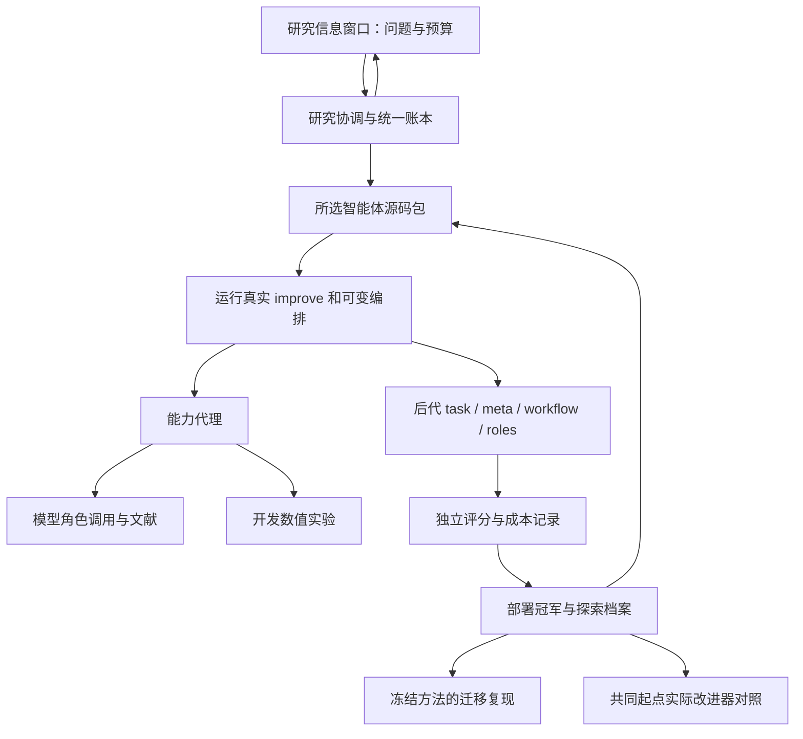

# 0.7 科学 demo 原型设计记录（历史版本）

本文记录 0.7 阶段冻结实验的原设计，保留以解释六组历史实验。
其中把科学发现耦合到产品核心的定位已被纠正，不能用作当前框架合同。
0.8 的通用 RSI 架构及独立 benchmark 边界见 [当前架构](../architecture.md)；
科学发现的工具、数据、提示与算法现归独立 `benchmarks/scientific_discovery` 包。

## 1. 研究问题与设计选择

核心问题是：能否让科研智能体改写自己的科学方法和提出改进的方法，并由后代实际继承执行；这种继承是否比固定改进器、更多模型推理或单纯任务搜索带来额外收益？

系统将两个问题分开检验。源码身份与执行回执证明发生了自应用；强基线、文件范围消融、父代选择消融和实际后代试验检验效果。一个源码 diff、一次分数上涨或一份生成报告均不足以单独回答第二个问题。

## 2. 文献如何改变实现

| 一手研究机制 | 本系统的具体实现 | 可以观察或否定的证据 |
|---|---|---|
| [STOP](https://arxiv.org/pdf/2310.02304)：改进器作用于自身源码 | `ProgramRunner` 从所选 bundle 加载 `improve`；生成源码全部继承 | 下一轮 `execution.source_digest` 必须指向已产生的后代源码 |
| [DGM](https://arxiv.org/pdf/2505.22954)：档案、非贪心祖先 | 部署 `active_program` 与 `research_program`/archive 分开；源码可定义 `select_parent` | `greedy` 对照；失败祖先、实际选择与子代结果完整保留 |
| [Hyperagents](https://arxiv.org/html/2603.19461v1)：task/meta共同可改，实际 imp@k | 四文件源包；`evaluate_improvers` 固定两版真实改进器，从同一起点生成后代 | 开发选优、独立转移、实际模型调用与源执行身份；不用宿主变异代理 |
| [HGM](https://arxiv.org/html/2510.21614v1)：后裔生产率 | 档案提供 children、实际 descendant_gain，供可演化选择器读取 | 计入全部分支与预算；不能把累计幸运后代当因果优势 |
| [SINDy](https://doi.org/10.1073/pnas.1517384113)：稀疏方程识别 | 可组合表达式、平滑、求导、积分估计、拟合与独立积分评价 | 新初值和较长时域预测，噪声和非多项式族反例 |
| [AI Scientist-v2](https://arxiv.org/html/2504.08066v1)：研究过程关联 | 源码编排文献、竞争解释、开发实验、反例与后续修订 | 资料、模型分析、实际工具回执、源码和测量以工件关联 |

具体阅读位置、成本核对、发表状态和已存在的先例见两份 `reboot-*` 研究报告。`research/library.py` 把核实过的摘要笔记输入真实研究程序；当次检索成功或失败另行记录。

## 3. 系统分层

宿主控制的是执行和测量条件。初始研究流程由 agent source 实现，后代可以更改角色数量、串并行安排、实验时机、父代选择与提示内容。数值求解程序可以定义新函数、表达式、模型比较和控制流，不再从有限 policy 字典中选择。

## 4. 源码、能力与身份

源包包含 `task.py`、`meta.py`，可含 `workflow.py`、`roles.json`。内容摘要识别程序，父代摘要与内容共同识别版本；组件摘要支持精确 diff。`Store.put_bundle` 核实已存在父代与代数，原源码不能被原地覆盖。

每次科学求解与改进使用新进程。生成 Python 没有文件、网络、导入、反射、私有属性和进程能力；审计钩子在可信依赖加载后封闭这些操作。Windows 使用 Job 内存限制；源码指令上限由不可捕获的进程终止执行。宿主代理控制模型、检索和开发实验，敏感凭证只交给模型工作进程。

这是一种受限 Python 能力运行时，并非操作系统级完整容器。对于新的恶意代码威胁模型，应另加容器/用户隔离；当前不作这种隔离已存在的声明。

## 5. 研究账本与恢复

SQLite 统一保存研究、源包、事件、调用、测量和工件。事件具有前序摘要，调用先登记上限再发送；终止回执不能降低原始预留。源码、评价器、协议、依赖、模型身份进入注册记录。

测量键包含源、评价器、运行内核、split、seed和数值上限。跨研究缓存命中仍计相同逻辑评价与工作额度，实际计算工作另列；同一研究复用同一测量不重复计数。

能力事件保存实际 request/result 工件 ID 及输入上下文引用。界面只展示存储的事件和谱系关系，不根据角色名推测未记录的协作边。智能体 `log` 只能产生带来源的 `agent_log`，不能伪造宿主晋升或模型账单事件。

停止同时传播到源码进程和模型/数值能力。未提交后代的中断调用保留用量，恢复不会静默重发；已提交候选可继续评价。冻结实现发生变化时注册新研究。

## 6. 科学任务与独立验证

观测问题不提供方程族标签、生成参数或未来轨迹。智能体提交表达式及系数，宿主用独立数值积分从新初值检验。通常任务包含多项式动力学与不同噪声；迁移评价增加摆、饱和衰减、三角系统和有理增长。

强基线采用多表达式族、导数/积分估计组合、整条观测轨迹留出选择与重拟合。它优于弱线性初始方法，且已有发散与跨族失败，是需要认真改进的控制。

固定工程晋升规则是质量增益至少 .002 且最坏案例下降不超过 .12；或平均下降不超过 .002、最坏下降不超过 .05且数值工作最多为参考的 .85。新提交还必须全部数值有效。这是部署规则，不是显著性阈值。没有晋升的程序仍可进入探索档案。

数值发散作为真实方法失败计入；外部超时、中断或预算不足标记缺测。缺测的数值占位符不能当作性能观察。模型输出中声称做过的实验与宿主数值工具回执分别标注。

## 7. 实际元能力和创新假设

`evaluate_improvers` 对初始/演化的真实改进器分别执行固定源码，从共同 task 起点生成至多 k 个后代；按 development 选择，再报告未暴露的 meta_transfer。每个种子交替运行顺序，记录生成失败、源码投影和全部成本。joint edits中非task变化会显式投影回被测版本，避免被测improver在测量期间漂移。

另外做 task×非task 四格源码互换，观察共享函数依赖或交互。它只执行 solve，不能被解释为元生产率；真实后代试验才回答后者。

本项目检验三个组合假设：实际后代证据帮助选择可继续研究的祖先；可反驳的数值失败能促使程序改进研究组织；模块互换与实际后代比较能分离任务算法和研究程序的收益。相关单项机制已有先例，本项目不以命名声称首次提出。小样本阳性结果也不能自动证明普适递归增长。

## 8. 产品边界与验收

安装入口、窗口、CLI、测试与文档均属于同一个科研系统。原 Harness 的聊天、终端、脚本教学与其它业务示例不再进入安装包。

最终验收依次核对：真实资料进入研究、假说对应源码变化、源码真实执行、失败被下一轮读取、继承的改进程序实际产生后代、强控制与消融、封存迁移复现、窗口与账本一致。运行完成或软件测试通过只覆盖其中一部分。
