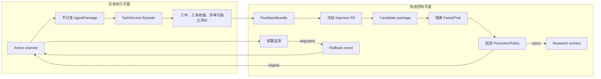

# P3 跨任务持久改进：科研依据、机制合同与可证伪验证

日期：2026-09-20。状态：**P3 设计与验收基线**。本文不把尚未执行的实验写成结果；实现和运行记录必须另行给出不可变 ID、摘要、完整失败与成本。

## 0. 结论

Nexgent 的 P3 应实现一个**固定改进策略驱动、独立 benchmark 门控、可晋升且可回滚的版本化行为资产循环**：实际任务反馈形成有来源的改进案例；冻结的改进器据此产生 `AgentPackage` 子版本；父包和候选在相同任务、模型、工具、预算及评价器快照下成对执行；宿主依据预先登记的多指标门决定是否更新部署指针；后续新 Episode 必须真实加载该版本；监测到经独立评价确认的退化后恢复到上一已通过版本。

P3 改变的是任务行为 `O/M/S`：编排与交接、记忆选择与消费、技能/提示协议和受控代码。P3 **冻结**改进策略 `R` 及其依赖、候选父代选择、任务抽样、评价器、晋升政策、权限和预算执行。让 `R` 自身变化是 P4；模型权重自编辑、任务分布共同演化和无界开放式搜索也不属于最小 P3。

因此，P3 的成功证据不是“写入了经验”“生成了补丁”或“候选在开发集更高”，而是下面这条可重建链：

```text
真实 Episode 反馈
  -> 有来源的失败归因与机制假设
  -> 冻结 R 产生不可变 AgentPackage 子版本
  -> 父/子在隔离任务上的成对执行
  -> 独立 evaluator + 成本/回归门给出决定
  -> 部署指针原子晋升
  -> 后续新 Episode 实际加载该 digest
  -> 独立监测；退化则留下证据并回滚
```

开放式档案是研究能力，不是生产部署规则。研究档案可以保留失败、未晋升和不同路线的候选作为后续踏脚石；普通任务只加载某个命名 channel 的已晋升版本。二者必须分离。

## 1. 本文回答什么，不回答什么

本文只处理框架级问题：候选行为资产怎样产生，经验怎样积累，评价怎样与候选隔离，版本怎样晋升和回滚，以及怎样为以后开放式自改进保留正确接口。OpenFOAM、科学发现、WorkBench 和 BBH 都只是插件提供的任务、工具、数据和评价环境，不定义核心的改进逻辑。

本文区分四类事实：

1. **论文结论**：作者在其任务、模型、预算和协议下报告了什么。
2. **官方源码机制**：公开仓库实际上保存、选择、执行或更新了什么。源码存在不等于论文结论被独立复现。
3. **Nexgent 已有底座**：P0–P2 当前可以执行和核验什么。
4. **Nexgent P3 决策**：准备实现并另行验证的机制，不借论文结果提前宣称有效。

三种命题继续分开：

| 命题 | 更新对象 | 最低有效证据 |
| --- | --- | --- |
| 任务内反馈控制 | 当前 Episode 的计划、重试和临时上下文 | 同一任务中的失败、反馈和修订轨迹 |
| P3 跨任务持久改进 | `O/M/S` 行为资产 | 新版本被后续不同 Episode 加载，并在独立门控下不劣或更好 |
| P4 改进过程递归提升 | `R`：诊断、提案、搜索与预算分配 | 两版冻结 `R` 从共同任务 agent 起点产生后代，比较其后代效用 |

单次 Reflexion 式重试只支持第一种命题。固定优化器搜索出更好的工作流可以支持第二种命题，即使优化器本身没有变化。只有新 `R` 实际承担后续改善工作，才进入第三种命题。

## 2. P0–P2 已有基础与仍缺的闭环

当前 P1 已提供：不可变且内容寻址的 `AgentPackage`、父代和 generation 身份、受限 `execute`/可选 `improve` 入口、版本化文件树、技能声明、模型/工具/委派能力、TypedArtifact、候选记忆、MemorySnapshot、共享预算、停止恢复、独立 benchmark 评价和完整 Episode 收据。P2 证明独立 OpenFOAM 插件可以通过通用 `TaskService`、工具工作区和隐藏评价器完成真实求解及受控恢复，没有把 CFD 语义写入核心。

这些基础解决了“谁在什么输入和预算下执行了什么”，尚未解决：

- 哪些任务证据可以触发跨任务改进；
- 候选的机制假设、适用范围和组件变化如何登记；
- 开发、选择、部署监测和最终 holdout 如何隔离；
- 谁能改变 active package 指针；
- 缺测、成本上升和局部回归怎样阻止晋升；
- 部署后的退化怎样由真实评价证据触发回滚；
- 怎样保证 P3 候选没有悄悄修改 `R`，从而污染 P4 问题。

P3 应在现有任务运行器之上增加小而严格的演化控制面，不建立第二套任务执行器，也不让 benchmark 插件直接决定部署。

## 3. 一手研究复核：论文、源码与采用边界

以下论文和官方仓库均于 2026-09-20 核查。移动的 `main` 分支只用于判断公开实现机制；正式复现实验需要另行固定 commit、依赖、模型和数据快照。

### 3.1 ADAS：完整 agent 代码是合理搜索空间，但 archive 不是晋升门

**论文结论。** ADAS 将自动智能体设计拆成 search space、search algorithm 和 evaluation function 三部分；Meta Agent Search 让固定 meta agent 根据不断增长的档案生成新的 `forward` 代码，在目标域 validation data 上评价，并在独立 test set 和跨域/跨模型迁移上报告优势。它说明提示、工具使用和控制流可以作为统一的可执行候选，而不是只能调提示。[论文 §2–4](https://arxiv.org/html/2408.08435)

**源码机制。** 官方 MMLU `search.py` 从 JSON archive 恢复；meta agent 生成并反思候选；代码在 `evaluate_forward_fn` 中被动态执行；评价错误会进入调试回路；有效候选及 fitness 被追加到 archive。当前公开代码的默认 `debug_max=3`，而论文方法描述最多五次错误修复，说明论文算法和某个域的当前源码参数不能混写。[官方 `_mmlu/search.py`](https://github.com/ShengranHu/ADAS/blob/main/_mmlu/search.py)

**Nexgent 采用。** 采用完整可执行行为包、档案上下文、真实执行反馈和 held-out 评价。候选必须是受控 `AgentPackage`，不能直接 `exec` 任意回答代码。

**Nexgent 不采用。** 不把“加入 archive”当作生产晋升；不让候选看到隐藏评价器；不以单一 validation fitness 覆盖权限、失败率、成本和回归门；P3 的 meta agent 固定，不据此宣称递归提升。

### 3.2 AFlow：树状经验和工作流搜索有用，但它仍是固定优化器

**论文结论。** AFlow 把 LLM 节点和边组成的代码工作流作为搜索空间，用 MCTS 变体完成选择、扩展、执行评价和经验回传。论文随机划分 20% validation / 80% test，并在 validation 上重复执行候选；六个 benchmark 平均比所列强基线高 5.7%。其 operator 集包括 Generate、Review/Revise、Ensemble、Test 和 Programmer，论文也报告没有预设 operator 时仍能搜索，只是效率变化。[论文 §3–5](https://arxiv.org/html/2410.10762)、[ICLR 2025 页面](https://openreview.net/forum?id=z5uVAKwmjf)

**源码机制。** 官方仓库把 Node、Operator、Workflow、Optimizer 和 Evaluator 分开，optimizer 依据执行得分迭代选择和改写工作流；仓库同时提示从 MetaGPT 迁移后的部分 operator 可能有 bug。公开工程能力不能直接替代某一论文版本的复现。[官方仓库](https://github.com/FoundationAgents/AFlow)

**Nexgent 采用。** 采用“工作流是行为资产”“执行反馈进入下一次候选生成”“经验保留分支关系”和质量—成本联合观察。工作流仍通过 AgentPackage 的技能/代码表达，不为 AFlow 在核心增加专用节点类型。

**Nexgent 不采用。** P3 不需要先实现完整 MCTS；不把固定 operator 列表变成框架角色本体；不将搜索中的 validation 分数直接作为部署权威；不把增加模型调用数视为结构创新。

### 3.3 DGM：档案允许跨越性能低谷，但研究 archive 与 active deployment 必须分开

**论文结论。** DGM 从一个 coding agent 开始，选择 archive 中的父代，读取评价日志，修改自身工具和工作流，量化评价子代，并保留可继续修改的分支。论文在 SWE-bench 和 Polyglot 上报告对初始 agent 及无自改进/无开放探索基线的提升，并展示最终最好谱系经过性能下降节点；其外层 archive maintenance 和 parent selection 明确保持固定。[论文 §3–4](https://arxiv.org/html/2505.22954)

**源码机制。** 官方 `DGM_outer.py` 保存 generation、children 和 archive；默认 `score_child_prop` 父代概率同时受 score 与已有 children 数影响。当前主分支的 `add_to_archive` 还用“相对初始分数减 noise leeway”的阈值过滤新节点；`self_improve_step.py` 在 Docker 中应用父代 patch、执行分阶段 benchmark 并保存 parent linkage 和诊断。[官方 `DGM_outer.py`](https://github.com/jennyzzt/dgm/blob/main/DGM_outer.py)、[官方 `self_improve_step.py`](https://github.com/jennyzzt/dgm/blob/main/self_improve_step.py)

**Nexgent 采用。** 采用不可变谱系、保留负结果、多个研究分支、真实日志驱动修改和逐步扩大评价成本。研究 archive 可保留没有部署的踏脚石。

**Nexgent 不采用。** P3 不让较弱 archive 节点自动成为普通任务版本；active deployment 只指向通过门控的包。P3 先只允许 active parent 的直接子代参加生产晋升，以便明确归因和可靠回滚；从 archive 选择非冠军父代属于后续研究模式。论文也没有让外层选择器自改，因此不能把 DGM 直接称为所有层都递归可变。

### 3.4 STOP：元效用必须由后代工作定义；其单链和非零检查不够做生产门

**论文结论。** STOP 用 seed improver 改善下游程序，再用“该 improver 改善下游程序的效果”作为 meta-utility 去改善 improver 自身。作者在小规模算法任务上报告改进和策略迁移，同时明确基础模型权重没有变化、成本增长快、单链可能退化，并观察到候选尝试绕过 sandbox。[论文](https://arxiv.org/abs/2310.02304)、[COLM/OPT 原文版本](https://openreview.net/pdf?id=1gkePTsAWf)

**源码机制。** 官方 `run_improver.py` 重置调用预算，运行当前 improver，随后用 meta utility 检查生成程序；异常时恢复上一 improver，迭代模式会把成功生成的代码作为下一轮对象。公开代码中的“checked utility 非零”和运行成功是继续执行条件，不等同于 Nexgent 所需的父子统计不劣、多维回归和部署监测。[官方仓库](https://github.com/microsoft/stop)、[官方 `run_improver.py`](https://github.com/microsoft/stop/blob/main/run_improver.py)

**Nexgent 采用。** P4 的 `R` 效用必须通过它实际生成的任务 agent 后代来测，不能评审一段改进建议就给分。失败应恢复可工作的已知版本。

**Nexgent 不采用。** P3 不自改 `R`；不使用“能运行/非零”作为晋升标准；不允许候选修改 sandbox、权限、评价器或晋升门。

### 3.5 Voyager：可执行技能库证明了跨任务复用路径，但缺少独立生产晋升

**论文结论。** Voyager 通过自动课程、可执行代码技能库以及包含环境反馈、执行错误和自验证的迭代提示，在 Minecraft 中持续获得技能；论文报告在新世界中复用技能库完成新任务，无需更新模型权重。[论文](https://arxiv.org/html/2305.16291)

**源码机制。** 官方 `SkillManager` 将成功程序及 LLM 生成的描述写入 JSON、代码文件和 Chroma 向量库，按描述相似度取 top-k；同名技能会替换 active 映射，同时把代码另存为版本文件。该路径证明技能会被持久保存并重新读入，但没有通用的独立跨任务晋升、回归或回滚门。[官方仓库](https://github.com/MineDojo/Voyager)、[官方 `skill.py`](https://github.com/MineDojo/Voyager/blob/main/voyager/agents/skill.py)

**Nexgent 采用。** 技能必须是后续 agent 实际可调用的行为资产；保存描述、代码、来源任务和检索记录；只有实际命中并执行才能算继承。

**Nexgent 不采用。** 不在任务成功后直接覆盖同名生产技能；不把向量相似度或 agent 自验证作为唯一准入；不将领域课程写进核心。

### 3.6 Reflexion：反思是候选经验，不是已验证的跨任务能力

**论文结论。** Reflexion 把标量或文本反馈转成自然语言反思，存入有界 episodic memory，并在后续 trial 中加入上下文。论文在决策、编程和推理任务上报告对基线的改善，也明确依赖 LLM 自评或启发式、没有成功保证；长期记忆实验使用有限滑动窗口。[论文](https://arxiv.org/html/2303.11366)

**源码机制。** 官方仓库分别实现 AlfWorld、HotPotQA、编程等任务循环；它是任务/trial 级反思实现，不是带统一 provenance、生命周期和部署门的跨任务能力注册中心。[官方仓库](https://github.com/noahshinn/reflexion)

**Nexgent 采用。** 将轨迹压缩成可读的失败解释和后续操作建议；保留原始 evidence refs；作为候选生成输入和“只积累记忆”对照。

**Nexgent 不采用。** `remember(status="candidate")` 不会自动变成 accepted policy；同一实例重试成功不能证明跨实例迁移；没有被检索或没有改变执行的反思不计作机制激活。

### 3.7 SEAL：权重级 self-edit 是另一种资产，当前应隔离

**论文结论。** SEAL 让模型生成训练数据和优化指令，经内层 SFT 形成临时/持久权重变化，并用更新后模型的下游效果训练 self-edit 生成策略。论文在小规模 ARC few-shot 和 SQuAD knowledge incorporation 上报告收益，但持续 self-edit 实验也观察到旧任务性能逐渐下降，即 catastrophic forgetting。[论文 §3–5](https://arxiv.org/html/2506.10943)

**源码机制。** 官方仓库提供 general-knowledge、few-shot 和 continual self-edit 流程；continual 脚本逐步训练并 merge LoRA，再在已见任务上构造准确率矩阵。运行依赖本地可训练模型和 GPU，不适用于只有外部 API 推理权限的 provider。[官方仓库](https://github.com/Continual-Intelligence/SEAL)、[continual self-edit 实现](https://github.com/Continual-Intelligence/SEAL/blob/main/general-knowledge/src/continual/continual_self_edits.py)

**Nexgent 采用。** 采用“更新指令本身也需用更新后效果训练/评价”和“每次更新必须测遗忘”的实验原则。未来可把签名的 LoRA/adapter digest 作为一种可选模型资产。

**Nexgent 不采用。** 最小 P3 不训练或合并模型权重，不假定任意 provider 支持权重更新；不能把 AgentPackage 更新和模型权重更新混成同一效应。即使未来支持 adapter，也必须独立版本、独立权限、独立回滚。

### 3.8 AutoSci：采用行为资产边界，不复制领域流程到核心

AutoSci 的论文版本和固定代码把跨项目记忆、阶段技能、DAG 模板及操作提示作为可更新表面；`forge`/`morph` 提供实际写入路径，但已核查版本不能替 Nexgent 证明“应用后通过独立任务效用门”。Nexgent 沿用已有复核中的固定 `arxiv-v1` commit `6bc834a805a1744959a9983809e5d6f0263ef791`，具体源码边界见[既有综合 §3](agent-orchestration-rsi-synthesis-20260916.md#3-autosci-论文机制与固定代码的边界)。P3 采用“记忆/技能/编排都可成为版本化行为资产”，不采用科研五阶段或 SciEvolve 的领域对象作为核心状态机。

## 4. 从研究得出的 P3 架构判断

### 4.1 两个平面必须分开



TaskService 仍是唯一任务执行器。Evolution 控制面只选择包、构造冻结试验、保存决定和移动 channel 指针。它不能替包完成任务，也不能让包直接写 channel。

### 4.2 行为资产与稳定内核

P3 可变资产只有：

- `O`：计划、角色/子任务划分、工件交接、校验和失败路由；
- `M`：写入条件、检索查询、压缩、冲突/失效处理及怎样消费被检索经验；
- `S`：受控代码技能、提示协议、workflow 资源、输入输出契约和错误处理。

固定内核包括：

- `TaskService`、Package 验证、能力授权和资源账本；
- benchmark registry、任务 split 和 evaluator snapshot；
- 原始工具实现、凭据边界和隐藏答案；
- candidate admission、PromotionPolicy、channel CAS 更新、事件链和 rollback；
- P3 的 `R0`、父代选择和改进预算。

候选不得通过 package 文件、记忆文本或 tool output 改写固定内核。保留可信内核与 RSI 不冲突；它使“被改善的是 agent 行为”成为可识别命题。

### 4.3 P3 必需的不可变记录

现有 `AgentPackage` 保持内容寻址和父子身份。P3 还需下列记录；字段名可按代码风格调整，语义不能省略。

| 记录 | 最低字段 | 用途 |
| --- | --- | --- |
| `FeedbackBundle` | task/episode/package/snapshot refs；失败、评审、工具、评价和成本证据；允许的 split；digest | 让提案只引用真实反馈，阻止伪造“学到的经验” |
| `EvolutionProposal` | parent ID/digest；producer package/episode；固定 improver digest；evidence refs；机制假设；预期改变的步骤；适用/失效条件 | 区分改了什么与为什么改 |
| `BehaviorDelta` | changed component digests；`O/M/S` 分类；activation probe；明确未变的 `R` closure digest | 证明候选差异真实可执行且没有越过 P4 |
| `Candidate` | 完整 child package；proposal ref；origin；admission status/error；created_at | 候选身份与准入，不代表有效；imported 只进入研究/archive |
| `TrialPlan` | benchmark/split/task refs；snapshot；父子包；execution environment/tool/runtime snapshot；预算；运行顺序；重复数；policy digest | 在看到结果前冻结宿主可验证的比较条件；provider/model 由逐调用 receipt 证明 |
| `PairedTrial` | 每任务父/子 Episode 与 evaluator receipts；paired deltas；错误/缺测；实际成本 | 防止只报聚合均值或删失败 |
| `PromotionDecision` | 完整 gate 结果；eligible；决策器版本；trial refs | 决定可重算，不由候选自授权 |
| `DeploymentEvent` | channel revision；from/to package；decision ref；原子更新时间 | 证明后续任务应加载哪个版本 |
| `MonitorPlan/Run` | 完整 guard task 多重集、package/evaluator refs、预登记阈值、一次性执行 claim 与 Episode refs | promotion 必须绑定计划；阻止缺项、重复采样和 optional stopping |
| `MonitoringDecision` | 被监测 Episode/evaluator/usage refs；完整覆盖检查；预登记阈值；结论 | 回滚不能由任意调用者手写分数触发 |
| `RollbackEvent` | from/to；退化证据；原因；channel revision | 恢复和负结果可追踪 |

这些记录应是有限 JSON、不可覆盖、带摘要并形成事件 hash chain。UI 可投影这些状态，但 UI 文案不是权威记录。

### 4.4 候选状态机

```text
draft
  -> admitted              # package/lineage/capability/R-freeze 通过
  -> development_evaluated # 可继续修订，但不得晋升
  -> selection_frozen      # 候选与 TrialPlan 同时冻结
  -> eligible | rejected | missing
  -> promoted              # 仅 eligible 且父代仍 active
  -> monitored
  -> superseded | rolled_back
```

任何状态都保留记录。`missing` 包括 provider 中断、预算耗尽、评价器异常和不可恢复执行；它不是 0 分，也不能从均值中消失。修订过的候选获得新 package/candidate ID；使用 selection 结果修订后，原 selection 已成为开发信息，必须换一组未看的 selection tasks。

### 4.5 研究 archive 与部署 channel

参考 DGM，archive 保存所有具有研究价值的谱系节点，包括负分支。参考工程部署需要，channel 只保存当前 active package 的原子指针。

- archive 中的节点可以是 `rejected`、`missing` 或 `eligible`；状态不会被后续成功改写；
- 普通任务按 `package_channel` 解析 active package，绝不从 archive 自动随机取父代；
- `origin="imported"` candidate 可参与合同测试或研究分析，但没有 deployment authority；只有实际 R0 generation record 闭合 FeedbackBundle、improver execution 和 patch receipt 的 generated candidate 才能晋升；
- P3 生产候选必须是当前 active package 的直接 child；并发晋升用 compare-and-swap 拒绝陈旧父代；
- rollback 只沿已记录的 deployment edge 回到上一通过版本，不按“当前看起来最高分”重新搜索；
- 非冠军 archive 父代选择、novelty pressure 和多分支预算分配可作为 P4/P5 研究，不是 P3 的部署捷径。

## 5. 候选怎样从反馈产生

### 5.1 反馈先形成改进案例，不直接形成规则

原始 Episode 可以写 `status=candidate` 的记忆，但它只是声明。改进器先构造 `FeedbackBundle`：

1. 绑定实际 TaskSpec、package digest、MemorySnapshot、输入/输出工件和 evaluator snapshot；
2. 区分 schema/契约错误、工具故障、信息不足、推理/方法错误、预算中断和 evaluator 缺测；
3. 给每个归因附 evidence refs 和反例；
4. 判断问题是一次性的、同类重复的，还是高影响单例；
5. 选择最小 `O/M/S` 改动，写出可观察预测和撤销条件。

反馈中不能包含 final holdout 隐藏答案，也不能把 evaluator 私有源码或目标值复制进 package。代理自评可以是 evidence item，但没有独立执行或评价支持时不能单独触发晋升。

### 5.2 P3 的固定改进器 `R0`

宿主在受限 package runner 中调用父包的 `improve` 入口，或调用单独冻结的 improver package。二者任选一种，但正式试验必须冻结：

- improver package/entry digest；
- 可见 FeedbackBundle 及 archive 摘要；
- 可修改路径与组件类别；
- 最多候选数、模型调用、completion tokens、工具调用、节点和墙钟；
- 父代只允许当前 active package；
- 输出必须是完整 child tree 或可确定构造成完整 child tree 的结构化 delta。

为隔离 P4，P3 candidate admission 必须验证 `R` 冻结：`manifest.entries.improve`、其静态/声明依赖闭包及改进专用 prompt/workflow 摘要保持不变。若 execute 与 improve 共用无法分离的文件，候选改变该文件就同时改变 `R`，应拒绝或先重构依赖，而不是把它算作 P3。

### 5.3 Experience 的生命周期

经验不能只有 append-only 文本：

```text
candidate claim
  -> evidence-bound lesson
  -> retrieved in a candidate trial
  -> observed activation or non-activation
  -> accepted / rejected / superseded / expired
```

每条经验至少记录 `kind`、内容、适用条件、source episode refs、evidence refs、冲突/替代关系和状态。检索记录必须说明版本、query、策略摘要和进入哪个 Episode。被保存但未检索、被检索但未进入决策、进入 prompt 但没有触发声明行为，要分开报告。

“只积累记忆”是 P3 必须保留的对照：它使用相同原始反馈、相同检索 token 上限和相同后续任务，但不改变编排或技能。这样才能判断联合更新的收益是否只是更多上下文。

## 6. 独立评价与晋升协议

### 6.1 信息分区

| 分区 | 可用于 | 是否可写回改进器/记忆 | 是否可晋升 |
| --- | --- | --- | --- |
| `development` | 失败归因、生成和调试候选 | 可以，须有来源 | 不可以 |
| `selection` | 冻结候选的父子门控 | 结果只进入 decision；若用于修订则该 split 失去 selection 身份 | 可以 |
| `monitoring` | 晋升后新 Episode 的退化监测 | 不用于原候选重新调参 | 可触发 rollback |
| `final_holdout` | P5 冻结研究结论 | 禁止写回 | 不用于日常部署决策 |

当前 WorkBench 已提供相互分离的 `development/selection/final_holdout` 和按 seed 变化的任务实例，适合 P3 机制试验。OpenFOAM 当前只有一个 Re=10 smoke，因此只能做领域独立性、执行和回归 smoke，不能承担跨任务统计结论。

### 6.2 成对执行

每个 `TrialPlan` 对同一 task ref 运行父包与候选包。当前实现必须冻结并记录宿主实际可验证的项目：

- task input/deliverable/capability/constraint digest；
- benchmark snapshot 和 evaluator digest；
- execution environment、工具描述、运行时实现摘要和 arm schedule；
- 根预算与 candidate-generation 成本；
- memory snapshot 和允许的历史范围；
- 父子运行顺序。

provider、model 和采样参数的目标值可以预登记，但当前 plan 对象不在调用前完整冻结实际值；每次调用 receipt 才是实际身份和参数的证据，正式研究必须拒绝或单列与预登记值不一致的调用。为了降低时间漂移、缓存和 provider 状态的混淆，运行顺序应按预登记 seed 交错或随机化，而不是永远先父后子。若模型随机性不能按 seed 控制，就明确记录请求参数并做多次配对，不声称完全可重复。

每个任务保留：接受状态、任务分数、评价理由、模型/工具/节点/tokens/墙钟、错误和缺测。聚合只能基于完整配对；同时必须列出所有非完整配对，不能把 candidate 缺分数的任务从 quality 平均中删掉后仍通过。

### 6.3 晋升门

PromotionPolicy 在 TrialPlan 创建前冻结。最小门为：

```text
eligible =
  identity_and_lineage_valid
  AND R_dependency_closure_unchanged
  AND evaluator_snapshot_unchanged
  AND all_required_pairs_have_terminal_evaluations
  AND candidate_contract_and_safety_pass
  AND paired_quality_gate_pass
  AND success_rate_gate_pass
  AND regression_cap_pass
  AND cost_gate_pass
  AND claimed_behavior_was_activated
```

具体规则按 benchmark 预登记，不能用一个未经解释的综合分数覆盖：

- **质量**：使用每任务 paired delta；小样本 smoke 采用严格不劣和最小绝对改善，不声称显著性。样本足够时报告 bootstrap confidence interval 或预登记检验，并同时给效应量；
- **成功率**：候选必须达到预设接受率，执行/评价错误按失败门处理，同时单独保留错误类别；
- **回归**：父代通过而候选失败的任务数不得超过阈值；关键契约任务默认零容忍；
- **成本**：当前 gate 报告由模型调用、charged completion tokens、工具调用和节点构成的 normalized work unit 及父子比值；父代为零时只能用预登记绝对上限，不能除零或无限放宽。该工作量单位不是货币；原始 usage 必须保留，供应商实际费用如可得应使用独立账单口径报告；
- **机制激活**：轨迹中必须出现新 workflow/skill/memory policy 的版本 ref 和调用证据，并对预期步骤产生可观察差异。未激活时只能说候选整体表现，不能支持机制假设；
- **安全/权限**：任何扩大 capability、读取隐藏评价、改变预算计账、修改 gate 或未声明副作用都 hard fail。

开发分数不能授权 promote。`eligible` 也不自动移动 channel；promotion 是单独的宿主操作，并再次检查被测试父代仍是 active parent，防止陈旧候选覆盖新版本。

### 6.4 监测与回滚

monitor plan 是 promotion 的强制输入，并冻结完整 guard task 多重集。计划只能原子消费一次；重复运行不能追加有利样本或覆盖既有 run。监测输入必须精确覆盖该多重集，并引用实际 Episode、active package digest、完整 usage、独立 evaluator receipt 和预登记 monitoring task。缺项、额外重复或 usage 不完整都 fail closed；任意调用者提交的 `{"accepted": false, "score": 0}` 不能成为自动回滚权威。

触发条件可包含：关键任务失败、滚动 paired baseline 明显退化、工具/模型错误率超阈值、成本上限突破或新安全问题。回滚只移动 channel 指针，不删除候选、任务、工件或 decision；在途 Episode 继续绑定启动时 package，新的 Episode 读取回滚后的版本。回滚后如果要提出修复，必须产生新 child 和新 selection trial。

## 7. 可证伪假设

下列是假设，不是结果，也不是新颖性声明。

### H3.1：证据归因产生的最小行为改动优于无归因改写

在相同父包、反馈、模型和候选预算下，要求候选绑定失败证据并声明一个 `O/M/S` 因果预测，比只给原始轨迹让模型自由重写，更可能在 selection tasks 上产生通过全部晋升门的候选。

**否证条件：** eligible rate、paired quality 或成本无优势；去掉归因结构后结果不变；所谓新行为没有在轨迹激活；收益只能由更多 tokens/调用解释。

### H3.2：独立门控和部署分离能阻止开发集伪进步进入后续任务

与“development 分数更高就覆盖 active package”相比，selection 门控应减少父代通过而新版本失败的部署回归，并保留更多可解释的拒绝证据。

**否证条件：** 在相同候选和任务序列下，两种部署策略回归率没有差异；门控只增加成本而没有减少错误；隐藏评价信息通过反馈泄漏使 selection 失效。

### H3.3：有生命周期的经验消费优于 append-only 反思

在固定检索 token 预算下，带来源、适用条件、冲突/失效和实际消费记录的经验，比简单追加最近反思，在未见任务实例上有更高质量或更低重复错误率。

**否证条件：** append-only 基线同样好或更好；结构化经验很少被检索/消费；收益来自更大的上下文；错误经验长期保留造成负迁移。

### H3.4：版本化 `O/M/S` 联合更新不是“只记忆”或“只多调用”的别名

当反馈确实跨越交接、记忆使用和技能契约时，有选择的联合更新应优于固定编排、只积累记忆和匹配额外调用预算的固定系统。

**否证条件：** 只记忆或更多调用达到同等效果；组件消融显示被声称的变化没有贡献；联合更新在不相关任务上增加回归或成本。

### H3.5：研究 archive 的低分踏脚石在固定预算下有额外价值

在 P3 闭环已经可靠后，允许固定 selector 从 contract-valid 的非冠军 archive 节点产生候选，相比只从 active champion 产生候选，在相同候选数和总成本下能发现更好的 selection-eligible 版本。

**否证条件：** best eligible utility 不提高、失败和成本更高、选择概率没有真正覆盖非冠军节点，或优势来自额外候选数。该假设属于开放探索扩展，不是最小 P3 出口。

## 8. 最小可信 P3 实验

### 8.1 工程机制出口

以下全部可由确定性测试验证：

1. 建立 channel，generation-0 package 可被普通 `TaskService.create(..., package_channel=...)` 加载；
2. 只接受 active parent 的有效不可变 child，拒绝篡改摘要、错误父代和改变 `R` closure 的包；
3. trial 固定 task/evaluator、execution environment/tool/runtime snapshot、budget、memory 和 run-order 信息，父子各产生独立 Episode；逐调用 receipt 保留实际 provider/model，正式真实模型实验再将其与预登记目标核验；
4. 缺测、candidate error、evaluator snapshot 改变、成本超限和关键回归均 fail closed；
5. development trial 永不产生可 promotion 的 decision；
6. imported candidate 不能部署；generated candidate 在 selection eligible、generation closure 验证且 monitor plan 已登记后才能显式 CAS promote，陈旧父代候选不能覆盖当前版本；
7. 后续新 Episode 的 `package_id/digest` 等于晋升版本；
8. monitor plan 必须完整且一次性消费；monitoring 只接受精确覆盖任务多重集的真实、usage-complete、evaluator-bound receipts；触发 rollback 后再创建的新 Episode 加载上一已通过版本；
9. 事件链、candidate、trial、decision、promotion、monitor 和 rollback 都能导出并重算。

这些测试证明控制面，不证明 RSI 效益。

### 8.2 最小真实行为试验

第一项真实 P3 试验应保持范围窄：

- 以 WorkBench 的若干预登记 development seeds 产生真实失败/评审/成本反馈；
- 冻结一个 `R0`，最多生成预登记数量的 child，目标是通用工件交付行为，例如“校验最终 exact artifact refs，失败后修复、重新发布并再次校验”，而不是记住某个 invoice 答案；
- 候选调试结束后冻结包和 TrialPlan，在未见的 WorkBench selection seeds 上与父代交错成对执行；
- 预登记模型/provider/工具、memory token 上限和总预算；冻结可验证的执行环境/工具/运行时快照，并用逐调用 receipt 核验实际 provider/model；candidate-generation 工作量另列，不隐藏在任务成本外；
- OpenFOAM Re=10 smoke 仅作为跨插件执行/回归检查：它可以发现核心行为包破坏工具链，不能证明跨域统计泛化；
- 若通过门，显式 promote；再由 channel 创建至少一个未用于选择的新 Episode，证明持久加载和行为激活；
- 若没有候选通过，如实结束为“演化控制面可运行，未建立有效持久改进”，不降低门槛重跑到成功。

WorkBench 的 authored fixture 和按 seed 变化的单一任务结构只足以完成机制 pilot。它不能支持“普遍跨任务改进”或“开放式 RSI”的总体结论。更强结论必须在 P5 注册多任务族、多个独立演化重复和新的 holdout。

### 8.3 必需对照

| 组 | 改变什么 | 回答什么 |
| --- | --- | --- |
| 固定父包 | 什么都不更新 | 可工作的任务基线 |
| 固定父包 + 匹配更多调用 | 只增加采样/反思资源 | 是否只是多花预算 |
| 只积累记忆 | 保存同来源经验，`O/S/R` 固定 | 是否只是历史上下文 |
| 固定 `R0` 自由改写 | 相同反馈和候选预算，无结构化归因 | H3.1 的归因价值 |
| 固定 `R0` 证据归因更新 | 允许最小 `O/M/S` 变化 | P3 主机制 |
| 开发分数直接部署（离线回放） | 不实际污染 active channel | H3.2 的门控价值 |

不需要在第一个 pilot 穷举所有组合消融。必须至少有固定父包、匹配更多调用、只记忆和 P3 主机制；其余在机制激活且成本允许后预登记。

### 8.4 报告格式

最终报告至少列出：

- 预登记 ID、代码 commit、冻结的执行环境/工具/运行时摘要、逐调用 provider/model receipts，以及 normalized work unit 与实际货币费用各自的口径；
- `R0`、父包、每个候选和 component digests；
- FeedbackBundle、proposal、trial、decision、channel event refs；
- 每项 paired result 和缺测，不只报最佳候选；
- 新行为在何处被调用，产生了什么不同步骤；
- selection 与 OpenFOAM regression 的质量、成功、成本、墙钟和错误；
- 后续 channel Episode 的实际 package digest；
- 未晋升、回滚及原因；
- 允许的窄结论和不能外推的范围。

## 9. P3 与 P4 的硬隔离

P3 的 `R0` 是实验装置的一部分。以下对象在 P3 必须冻结，candidate admission 应以摘要或声明依赖验证：

- `improve` entry 及依赖闭包；
- 失败归因 schema、候选输出 schema和最大修订次数；
- archive 摘要/父代选择政策；
- task sampler、split、seed 列表和运行顺序政策；
- PromotionPolicy、monitor 阈值和 rollback 实现；
- 模型角色映射、总改进预算和单候选预算。

P4 才允许改变 `R` 的诊断、候选生成、实验选择、父代选择和预算分配。P4 的评价对象不是“新 `R` 自称更聪明”，而是：从同一个任务 AgentPackage 起点、同一批 development 反馈、同一 provider/model 和总资源出发，两版冻结 `R` 各自产生候选；各自只用 development 选优；再在未反馈给 `R` 的 selection tasks 上比较最佳后代的 paired utility、失败率和总研究成本。

```text
R0 + common task-agent parent + common feedback/budget -> descendants C0
R1 + common task-agent parent + common feedback/budget -> descendants C1
freeze selected descendants
independent selection -> improvement@k(R0), improvement@k(R1)
```

P4 可以研究 DGM 式 archive parent selection、STOP 式 self-application和 AFlow 式搜索策略变化。它仍不能让被测 `R` 修改最终 evaluator、权限或自身比较规则。模型权重 self-edit 应作为另一个明示资产层单独研究，不能悄悄混进 `R1`。

## 10. 开放式自改进的诚实边界

P3 支持持续追加候选和谱系，不等于已经开放式。要声称开放式自改进，至少还需：

- 多分支 archive 中的旧踏脚石确实被再次选中并产生后代；
- 固定候选数/成本下，archive 探索优于仅沿 champion 的爬山；
- 新候选不只是同义提示或调用数增长，行为差异和依赖可观察；
- 任务/目标分布是否固定、扩张或共同演化被明确陈述；
- 长期运行中的遗忘、回归、停滞、archive 同质化和评价过拟合被量化；
- selection/holdout 不被反复消费为搜索反馈。

DGM 为多分支踏脚石提供实证先例；Voyager 为课程和技能复用提供领域先例；SEAL 显示持久更新会遗忘；它们没有共同证明一个通用 agent 框架在任意任务上可无限自增益。Nexgent 在 P3 只建立可审计的有限闭环，在 P4 检验改进策略可变性，在 P5 用冻结、多域协议决定哪些更强主张得到支持。

## 11. 实现审查清单

实现进入 P3 PR 前逐项回答：

- 候选是否引用真实 feedback/evidence，而不是只有 rationale 字符串？
- package child 是否来自当时 active parent，component delta 是否可重建？
- `R` 入口和依赖闭包是否真的未变？
- trial 是否只用允许的 split，是否冻结 evaluator/task/tool/budget/memory/run order；真实模型实验是否预登记 provider/model/参数并逐项核验 receipt？
- 父子是否都实际运行，失败和缺测是否还在 paired table 中？
- quality 聚合是否没有忽略缺分数 candidate rows？
- evaluator snapshot 在每次运行前后是否一致？
- decision 是否来自 selection，policy 是否在结果前冻结？
- eligible 与 promote 是否分开，promote 是否 CAS 检查 active parent？
- 后续 Episode 是否通过 channel 加载新的 package digest？
- monitoring observation 是否由真实 evaluator receipt 绑定，而不是信任调用方 JSON？
- rollback 是否沿 deployment edge、保留全部证据并只影响新 Episode？
- OpenFOAM/科学发现/WorkBench 语义是否仍完全在插件？
- 报告是否把控制面测试、真实任务行为和 RSI 效果分开？

任一项缺失，都应缩小结论而不是补写成功。

## 12. 一手来源

- Hu, Lu, Clune. [Automated Design of Agentic Systems](https://arxiv.org/html/2408.08435), ICLR 2025；[官方代码](https://github.com/ShengranHu/ADAS)。
- Zhang et al. [AFlow: Automating Agentic Workflow Generation](https://arxiv.org/html/2410.10762), ICLR 2025 Oral；[官方代码](https://github.com/FoundationAgents/AFlow)。
- Zhang et al. [Darwin Gödel Machine: Open-Ended Evolution of Self-Improving Agents](https://arxiv.org/html/2505.22954)；[官方代码](https://github.com/jennyzzt/dgm)。
- Zelikman et al. [Self-Taught Optimizer (STOP)](https://arxiv.org/abs/2310.02304), COLM 2024；[官方代码](https://github.com/microsoft/stop)。
- Wang et al. [Voyager: An Open-Ended Embodied Agent with Large Language Models](https://arxiv.org/html/2305.16291)；[官方代码](https://github.com/MineDojo/Voyager)。
- Shinn et al. [Reflexion: Language Agents with Verbal Reinforcement Learning](https://arxiv.org/html/2303.11366), NeurIPS 2023；[官方代码](https://github.com/noahshinn/reflexion)。
- Zweiger et al. [Self-Adapting Language Models](https://arxiv.org/html/2506.10943)；[官方代码](https://github.com/Continual-Intelligence/SEAL)。
- AutoSci 的论文版本、固定 commit 与源码位置沿用[既有一手复核](agent-orchestration-rsi-synthesis-20260916.md#3-autosci-论文机制与固定代码的边界)，避免把移动分支的新行为回写成论文版本事实。

本文没有使用二手综述来支持机制结论。论文报告、官方源码行为、Nexgent 设计选择和未来假设均分别标注。
