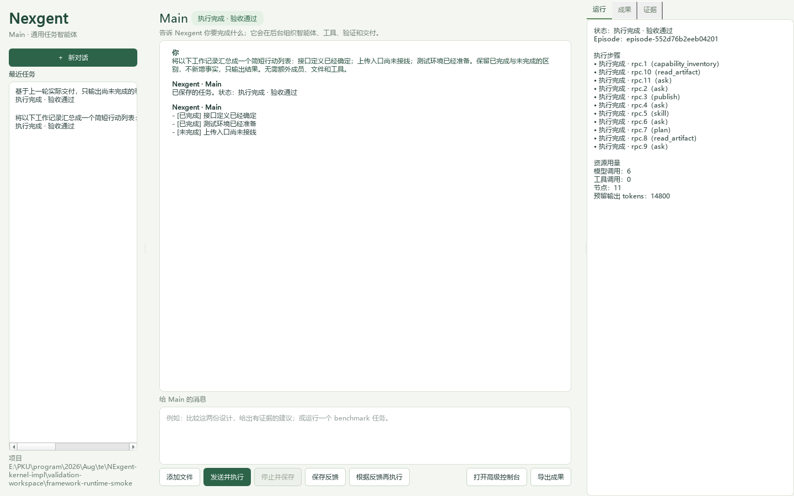
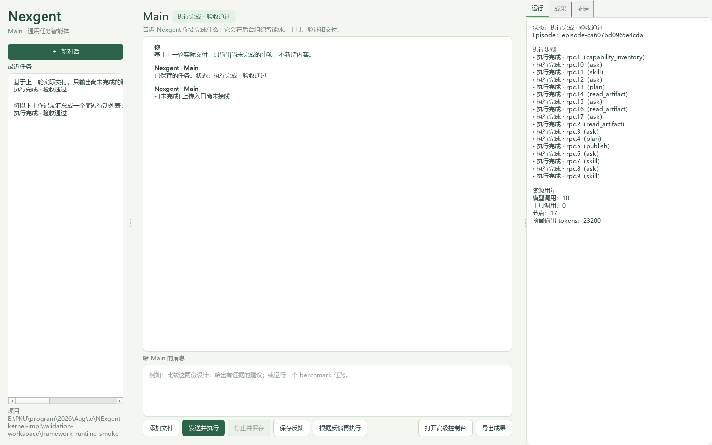

# 通用入口验证，2026-10-02

本轮验证框架组合与默认入口。组织提案未作为能力上限或验收目标。
实现说明见[通用运行框架](../framework-runtime.md)，
机器可读结果见[运行记录](framework-runtime-20261002.json)。

## 实际默认 Main

使用已配置的 MiMo v2.6-flash，点击普通 Main 的发送按钮：

- `episode-552d76b2eeb04201`：汇总工作记录，保存实际交付，由另一份固定宿主
  评价程序核对原要求，验收通过。任务使用 Python 策略，未创建额外成员或文件。
- 新进程重开 Main，保存用户反馈，再发送同对话的后续要求。
  `episode-ca607bd0965e4cda` 从已保存交付中只返回未完成项；独立评价通过。
  任务接收真实前轮交付与已保存反馈。

这些任务没有配置跨任务候选发布。`auto_evolution.configured=false`，包版本未变；
反馈续用是上下文适应，不能称为策略发布或完整 RSI。

## 多成员与能力开发的真实尝试

同样通过 Main 发起“成员求解、创建通用工具、另一成员实际核算”的任务：

- `episode-d17a70eddaf74145`：发现默认智能体没有完整的委派参数说明，反复提交
  错误结构，未创建成员；随后模型连接失败。已补齐通用动作说明及宿主参数校验。
- `episode-499c391754134070`：首次模型请求即达到 90 秒限制，无已知完成结果。
- `episode-5bebb816fed249be`：已创建真实委派成员；发生成员输出格式错误和
  模型连接失败，验证程序达到十分钟上限后停止。未完成整轮，没有评价或发布。

失败和停止记录保留。不能以机制测试通过或创建了成员替代真实整轮成功。

## 机制与入口检查

`test_application.py` 验证同一运行时中的可替换 Python 程序、版本化工具提供者、
独立评价器、实际委派任务与成果汇总、持久反馈、CLI/Main 同入口，以及无需 UI
协调器即可驱动既有项目自动改进策略。配置路径采用确定性模型边界，实际推进到
`no_change`，保留包版本；这验证接线，不证明自主发布或收益。

最终全量回归：1392 项通过、2 项跳过。此结果验证回归兼容性，不能替代上面的
真实模型运行记录，也不表示完整 RSI 已实现。

下一项主线是让工具、服务和执行策略候选通过统一门控发布并由后续任务加载。
