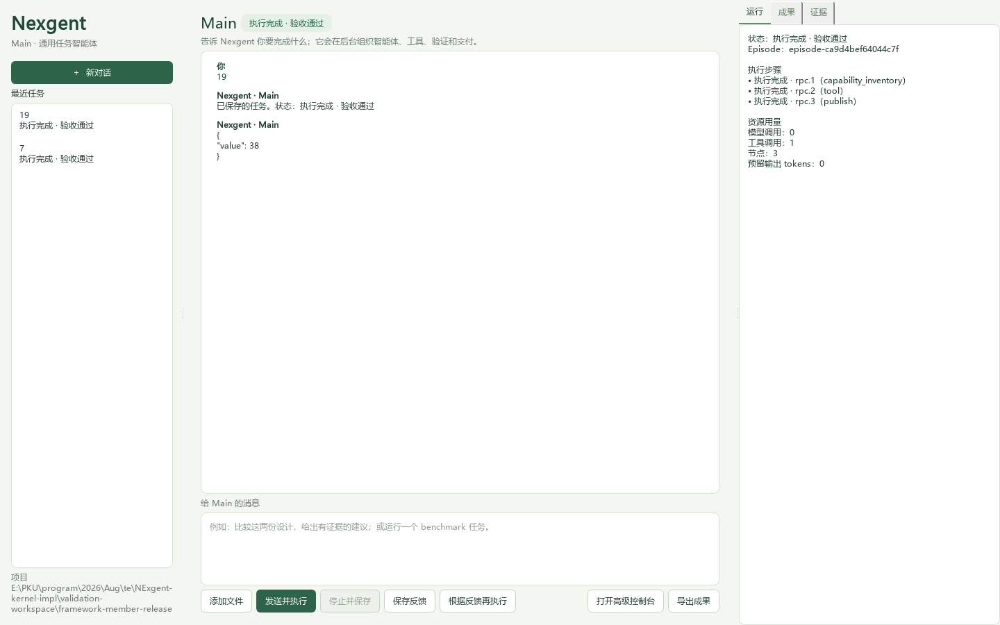

# 成员贡献发布验证，2026-10-02

自动改进原来只查主任务定义的能力，成员开发出的工具和上下文服务没有进入
候选流程。本轮让同版本、开发边界内的实际成员贡献进入已有 FeedbackBundle、
候选生成、独立 selection、guard、发布和新任务加载流程，没有新增发布协议。

## 普通 Main 的实际入口

使用公开 `Nexgent(package=..., evaluator=..., benchmarks=...)` 组合一个 Python
数值应用，再点击 Main 的发送按钮。应用策略和宿主改进器均为确定性 Python；
没有真实模型调用，不代表模型自主产生改进，也不用于证明通用能力收益。
这个插件只验证框架扩展接口与发布数据流，框架实现没有数值题目判断。

- `episode-6bb9aa8a2b894910`：输入 `7`。实际委派 builder 成员，成员创建并调用
  一个纯计算工具，主任务读取成员交付并返回 `14`。独立评价通过后，工具候选
  经过 parent/candidate 比较和 guard，任务包由 revision 0 晋升至 1。
- 结束进程，重新打开 Main，`episode-ca9d4bef64044c7f`：输入 `19`。新任务加载
  已发布包，实际调用其中的工具并返回 `38`；没有重新创建工具或成员，独立评价
  通过。改进器返回 `no_change`，版本保持为 1。

机器可读记录见[入口与门控收据](member-capability-release-20261002.json)。

## 回归与边界

`test_member_capability_evolution.py` 用相同公开组合接口验证工具和上下文服务两种
成员贡献的发布、重启复用，以及独立 guard 拒绝时恢复父版本。服务所用模型边界
为确定性替身；任务执行、成员、worker、门控、版本和加载均走实际实现。
发布链路及既有入口相关回归 76 项通过；最后的 Main 展示与组合回归 19 项通过。
本轮前一提交的全量回归为 1392 项通过、2 项跳过，不能将其当作之后改动的全量结果。

普通任务默认提供有限 worker 计算额度，否则新发布的工具会被旧默认零额度阻止。
显式传入的预算（包括零额度）保持优先；评价任务继续使用项目策略的冻结预算。

真实模型的复杂多成员能力开发与自主发布整轮仍未通过，原有失败记录仍见
[通用入口验证](framework-runtime-20261002.md)。下一项重点是默认 Python 策略下
真实任务的自主候选生成、独立验证和跨任务复用，并继续复用同一发布链路。
